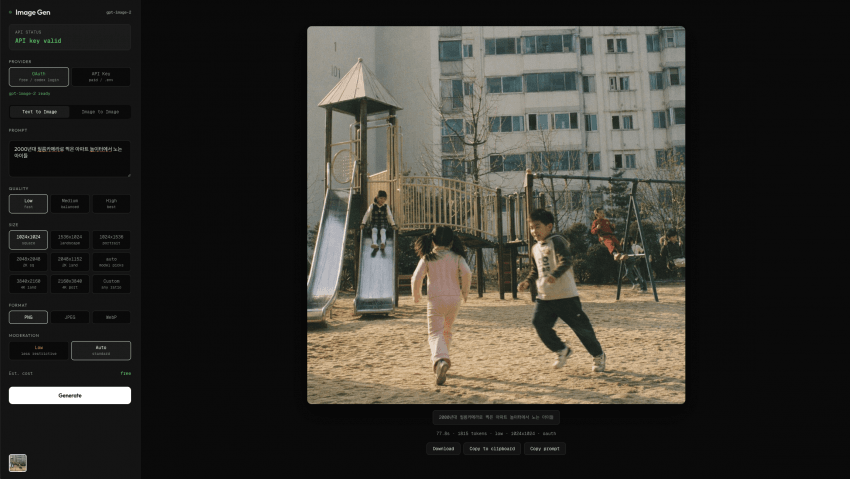

# ima2-gen

[](https://www.npmjs.com/package/ima2-gen)
[](https://nodejs.org/)
[](LICENSE)

> **Read in other languages**: [한국어](docs/README.ko.md) · [日本語](docs/README.ja.md) · [简体中文](docs/README.zh-CN.md)

`ima2-gen` is a local CLI + web studio for OpenAI image generation through the ChatGPT/Codex OAuth route. It includes a React UI, headless CLI commands, persistent history, reference uploads, production node-mode branching, and safe request observability.

Generation is currently **OAuth-only**. API keys can still be configured for auxiliary developer paths such as billing/status checks and style-sheet extraction, but image generation endpoints reject `provider: "api"` with `APIKEY_DISABLED` unless the provider policy is intentionally changed in code.



---

## Quick Start

```bash
# Run instantly with npx
npx ima2-gen serve

# Or install globally
npm install -g ima2-gen
ima2 serve
```

The first run opens setup:

```text
1) API Key  — save an OpenAI API key for supported auxiliary paths
2) OAuth    — log in with a ChatGPT/Codex account for image generation
```

For the current release, choose OAuth for generation. If Codex is not logged in yet, run:

```bash
npx @openai/codex login
ima2 serve
```

The web UI opens at `http://localhost:3333` by default.

---

## What Works Now

### OAuth Generation

- Text-to-image through `/api/generate`
- Image edit / image-to-image through `/api/edit`
- Up to 5 reference images per root generation
- Quality controls: `low`, `medium`, `high`
- Moderation controls: `low`, `auto`
- PNG/JPEG/WebP output
- Parallel count: 1, 2, or 4 from the UI; CLI/server cap is 8
- Size presets aligned to `gpt-image-2` constraints

### UI Workflow

- Prompt composer with drag/drop and Cmd/Ctrl+V image paste
- Current-image reuse from the canvas
- Gallery strip and full gallery modal
- Delete/restore for generated assets
- Settings workspace opened from the header gear
- Theme and account/status settings moved out of the crowded sidebar
- Right sidebar now contains only generation details
- In-flight jobs survive refresh and reconcile back into the UI

### Node Mode

Node mode is available in the packaged web UI and can be opened from the mode switch next to the composer.

- SQLite-backed graph sessions
- Branching child generations
- Duplicate branch / new-from-here flows
- Node-local reference attachments for root nodes with drag/drop, paste, and file picker support
- Reference count metadata in node sidecars and history responses
- Session style sheets that can prepend a house style to node/classic prompts
- Gallery grouping by session title instead of raw server IDs

### Observability

- Safe structured logs for generation, edit, node, OAuth, session, history, and in-flight lifecycle
- Correlation by `requestId`
- Active-only `/api/inflight` by default
- Optional recent terminal jobs via `/api/inflight?includeTerminal=1`
- Logs avoid raw prompts, effective prompts, revised prompts, tokens, auth headers, cookies, request bodies, reference data URLs, generated base64, and raw upstream response bodies

---

## CLI Commands

### Server Commands

| Command | Alias | Description |
|---|---|---|
| `ima2 serve` | — | Start the local web server |
| `ima2 setup` | `login` | Reconfigure saved auth |
| `ima2 status` | — | Show config and OAuth session status |
| `ima2 doctor` | — | Diagnose Node, package, config, and auth state |
| `ima2 open` | — | Open the web UI |
| `ima2 reset` | — | Remove saved config |
| `ima2 --version` | `-v` | Print package version |
| `ima2 --help` | `-h` | Print help |

### Client Commands

These require a running `ima2 serve`.

| Command | Description |
|---|---|
| `ima2 gen <prompt>` | Generate image(s) from the CLI |
| `ima2 edit <file> --prompt <text>` | Edit an existing image |
| `ima2 ls` | List history, table or `--json` |
| `ima2 show <name>` | Show/reveal a generated asset |
| `ima2 ps` | List active in-flight jobs |
| `ima2 ping` | Health-check the running server |

The server advertises its port at `~/.ima2/server.json`. Client commands auto-discover it. Override with `--server <url>` or `IMA2_SERVER=http://localhost:3333`.

### Exit Codes

`0` OK · `2` bad arguments · `3` server unreachable · `4` `APIKEY_DISABLED` · `5` 4xx · `6` 5xx · `7` safety refusal · `8` timeout.

---

## API Endpoints

```text
GET    /api/health
GET    /api/providers
GET    /api/oauth/status
GET    /api/billing
GET    /api/inflight
GET    /api/inflight?includeTerminal=1
POST   /api/generate
POST   /api/edit
GET    /api/history
GET    /api/history?groupBy=session
DELETE /api/history/:filename
POST   /api/history/:filename/restore
GET    /api/sessions
POST   /api/sessions
GET    /api/sessions/:id
PATCH  /api/sessions/:id
DELETE /api/sessions/:id
PUT    /api/sessions/:id/graph
GET    /api/node/:nodeId
POST   /api/node/generate
```

### OAuth Generation Request

```bash
curl -X POST http://localhost:3333/api/generate \
  -H 'Content-Type: application/json' \
  -d '{
    "prompt": "a shiba in space",
    "quality": "medium",
    "size": "1024x1024",
    "moderation": "low",
    "provider": "oauth"
  }'
```

### API-Key Configuration And Activation Notes

Current behavior:

- `provider: "oauth"` is the supported generation path.
- `provider: "api"` returns `403` / `APIKEY_DISABLED` in `routes/generate.js`, `routes/edit.js`, and `routes/nodes.js`.
- `OPENAI_API_KEY` or `~/.ima2/config.json` can still be used for non-generation helpers such as billing probes and style-sheet extraction.

Configure an API key for those auxiliary paths:

```bash
export OPENAI_API_KEY="sk-..."
ima2 serve
```

or:

```json
{
  "provider": "api",
  "apiKey": "sk-..."
}
```

saved at `~/.ima2/config.json`.

To intentionally reopen API-key image generation as a developer, audit and change the explicit `provider === "api"` guards in:

- `routes/generate.js`
- `routes/edit.js`
- `routes/nodes.js`

Then wire the OpenAI SDK generation/edit implementation, update tests for both OAuth and API-key paths, and update this README. Do not simply remove the guards without adding the API implementation and billing/error tests.

---

## Configuration

Config priority is:

```text
environment variables > ~/.ima2/config.json > built-in defaults
```

| Variable | Default | Description |
|---|---:|---|
| `IMA2_PORT` / `PORT` | `3333` | Web server port |
| `IMA2_OAUTH_PROXY_PORT` / `OAUTH_PORT` | `10531` | OAuth proxy port |
| `IMA2_SERVER` | — | CLI target override |
| `IMA2_CONFIG_DIR` | `~/.ima2` | Config and SQLite location |
| `IMA2_GENERATED_DIR` | `~/.ima2/generated` | Generated image directory |
| `IMA2_NO_OAUTH_PROXY` | — | Set `1` to disable auto-starting the OAuth proxy |
| `IMA2_INFLIGHT_TERMINAL_TTL_MS` | `30000` | Retention for opt-in terminal in-flight debug jobs |
| `VITE_IMA2_NODE_MODE` | enabled | Set `0` at UI build time to hide node mode |
| `OPENAI_API_KEY` | — | API key for supported auxiliary paths |

---

## Architecture

```text
ima2 serve
  ├── Express server (:3333)
  │   ├── route modules in routes/
  │   ├── OAuth image calls via lib/oauthProxy.js
  │   ├── generated/ image + sidecar JSON storage
  │   ├── SQLite sessions via better-sqlite3
  │   └── ui/dist React app
  ├── openai-oauth proxy (:10531)
  └── ~/.ima2/server.json for CLI discovery
```

The server uses ES modules, centralized config in `config.js`, and route helpers under `lib/`.

---

## Development

```bash
git clone https://github.com/lidge-jun/ima2-gen.git
cd ima2-gen
npm install
npm run dev
npm test
npm run build
```

`npm run dev` builds the UI and starts `server.js` with `--watch`. Node mode is now a normal product surface in both dev and packaged builds. Set `VITE_IMA2_NODE_MODE=0` only when you intentionally need a classic-only bundle.

Test coverage currently includes CLI behavior, config loading, history pagination/delete/restore, reference validation, OAuth parameter normalization, prompt fidelity, in-flight tracking, safe logging, and route health checks.

---

## Troubleshooting

**`ima2 ping` says the server is unreachable**
Start `ima2 serve`, then check `~/.ima2/server.json`. You can override discovery with `ima2 ping --server http://localhost:3333`.

**OAuth login does not work**
Run `npx @openai/codex login`, confirm `ima2 status`, then restart `ima2 serve`.

**Images fail with `APIKEY_DISABLED`**
You are trying to generate with `provider: "api"`. Use OAuth for generation in the current release.

**An API key is configured but generation still uses OAuth**
That is expected. API keys are currently recognized for auxiliary status/extraction paths, not for image generation.

**Port is unexpectedly `3457`**
Your shell may have inherited `PORT=3457` from another local tool. Run `unset PORT` or start with `IMA2_PORT=3333 ima2 serve`.

---

## Recent Changelog Highlights

- Node mode enabled in packaged builds
- Node-local references and branch duplication for node mode
- `refsCount` metadata for node reference usage
- npm package includes modular `routes/` server files
- Settings workspace with account/theme controls
- Prompt fidelity and revised prompt capture
- OAuth quality handling for `low`, `medium`, `high`
- Safer structured request logs and terminal in-flight debug snapshots
- Session-title gallery grouping
- Cross-platform CLI fixes for Windows process spawning

## License

MIT
