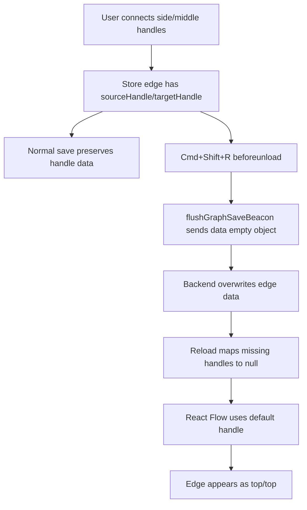
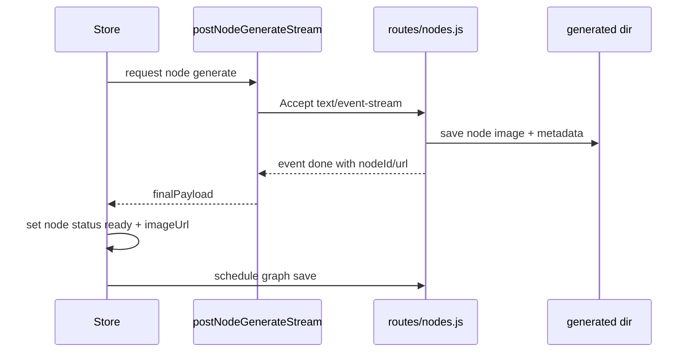
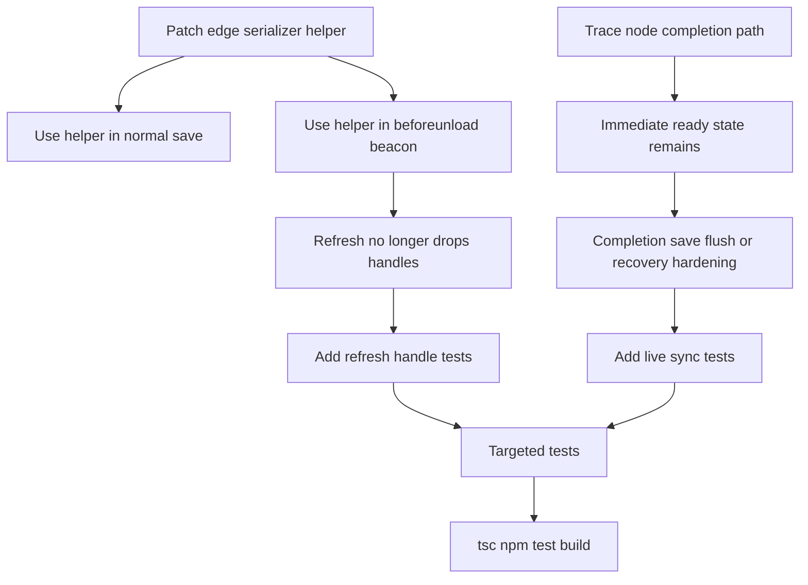

# PRD — Refresh Handle Persistence + Live Node Sync

## 1. User Report

Reported symptoms:

```text
cmd shift r 하면 다시 상단 노드로 복귀되고
중간 커넥터 끼리 연결한것도 상단 노드로 바뀌어

+

노드 생성때 바로 반영이 안되고 새로고침해야지 노드에 반영되는 문제
```

This PRD is a revision under the existing `0.09.34-node-connect-regression`
lane. It does not replace the 4-direction handle plan. It adds the follow-up
work needed after the first 4-way handle implementation.

## 2. Investigation Summary

### 2.1 Frontend employee audit

Frontend read-only audit returned `done`.

Key finding:

- `flushGraphSaveBeacon()` serializes every edge as `data: {}` during
  `beforeunload`.
- Normal graph save preserves `data.sourceHandle` and `data.targetHandle`.
- Therefore browser refresh can overwrite a good saved graph with handle-less
  edges.
- On reload, `mapSessionToGraph()` sees no handle data and sets both handles to
  `null`.
- React Flow then anchors the edge to its default handle, which appears as the
  top connector in the current 4-way handle order.

Frontend also noted that programmatic child edges intentionally use no handle
ids, and that hidden target handles can make user drops produce
`targetHandle: null`. Those are secondary UX issues, not the main refresh
regression.

### 2.2 Backend employee audit

Backend dispatch failed before returning findings:

```text
cli-jaw dispatch --agent "Backend" ...
=> Error: fetch failed
```

Because dispatch failed, backend conclusions below are based on direct local
file inspection by Boss.

### 2.3 Local file evidence

Normal async save path:

- `ui/src/store/useAppStore.ts:2355-2363`

Behavior:

```ts
const edges = graphEdges.map((e) => ({
  id: e.id,
  source: e.source,
  target: e.target,
  data: {
    sourceHandle: e.sourceHandle ?? null,
    targetHandle: e.targetHandle ?? null,
  },
}));
```

Reload / unload beacon path:

- `ui/src/store/useAppStore.ts:2465-2470`

Current behavior:

```ts
const edges = s.graphEdges.map((e) => ({
  id: e.id,
  source: e.source,
  target: e.target,
  data: {},
}));
```

Session load path:

- `ui/src/store/useAppStore.ts:407-416`

Behavior:

```ts
sourceHandle: typeof data.sourceHandle === "string" ? data.sourceHandle : null,
targetHandle: typeof data.targetHandle === "string" ? data.targetHandle : null,
```

Session store backend:

- `lib/sessionStore.js:97-139`
- `lib/sessionStore.js:142-213`

Observed behavior:

- Backend normalizes graph parent relationships from edges.
- Backend stores `edge.data` by JSON stringifying the incoming `data`.
- Backend does not independently recover missing `sourceHandle` /
  `targetHandle`.
- If the client sends `data: {}`, the backend faithfully persists `{}`.

## 3. Root Cause Map



The problematic part is not React Flow randomly moving edges. The app destroys
the anchor metadata during the unload save path.

## 4. Scope

### In scope

- Preserve edge handle metadata in the unload/beacon save path.
- Add regression tests for beacon save payload shape.
- Add a contract test that saved edge data must include
  `sourceHandle`/`targetHandle` in both normal and beacon serializers.
- Investigate and patch the live node sync path so generated node results appear
  without requiring browser refresh.
- Add a regression test for the live node completion path or, if the current
  tests are source-contract style only, a source contract that pins the required
  immediate state update + persistence behavior.

### Out of scope

- Replacing React Flow.
- Rewriting graph schema.
- DB migration for handle columns.
- Automatic parent replacement.
- Full node UX redesign.
- Changing the 4-direction handle ids.

## 5. Implementation Plan

### Slice A — Beacon Save Must Preserve Handles

Modify:

- `ui/src/store/useAppStore.ts`

Change the `flushGraphSaveBeacon()` edge serializer to match the normal
`doSave()` serializer.

Current:

```ts
const edges = s.graphEdges.map((e) => ({
  id: e.id,
  source: e.source,
  target: e.target,
  data: {},
}));
```

Target:

```ts
const edges = s.graphEdges.map((e) => ({
  id: e.id,
  source: e.source,
  target: e.target,
  data: {
    sourceHandle: e.sourceHandle ?? null,
    targetHandle: e.targetHandle ?? null,
  },
}));
```

Reason:

- `beforeunload` is the path used by `cmd+shift+r`.
- It must not be a lower-fidelity graph save than the normal debounced save.

### Slice B — Add Shared Edge Serialization Helper

Modify:

- `ui/src/store/useAppStore.ts`

Instead of duplicating edge serialization in `doSave()` and
`flushGraphSaveBeacon()`, extract a local helper:

```ts
function serializeGraphEdgesForSave(graphEdges: GraphEdge[]): SessionGraphEdge[] {
  return graphEdges.map((e) => ({
    id: e.id,
    source: e.source,
    target: e.target,
    data: {
      sourceHandle: e.sourceHandle ?? null,
      targetHandle: e.targetHandle ?? null,
    },
  }));
}
```

Use it in:

- `doSave()`
- `flushGraphSaveBeacon()`

Reason:

- The bug happened because the two serializers drifted.
- A helper makes future graph fields harder to drop from one path.

### Slice C — Preserve User-Selected Target Anchor

Review / modify:

- `ui/src/components/ImageNode.tsx`
- `ui/src/index.css`
- `ui/src/components/NodeCanvas.tsx`
- `ui/src/store/useAppStore.ts`

Current risk:

- Source handles are visible.
- Target handles exist but are hidden with `opacity: 0; pointer-events: none`.
- Context7 / React Flow docs allow hidden handles as long as they are not
  `display: none`.
- However, if a drop lands on the node body rather than an exact target handle,
  `params.targetHandle` can be `null`.
- If `targetHandle` is `null`, React Flow renders to its default target handle,
  which can look like top.

Plan:

1. First fix Slice A/B and verify whether the reported refresh issue is fully
   gone.
2. If side/middle reconnect still becomes top without refresh, instrument
   `onConnect()` during local manual smoke to inspect `params.sourceHandle` and
   `params.targetHandle`.
3. If `targetHandle` is consistently null, add a deterministic fallback:
   infer nearest target handle from connection pointer position relative to the
   target node bounds, or make target handles connectable without adding a
   duplicate visible dot.

Preferred fallback:

```text
visual dot = source handle
hidden target handle = still measurable, not display:none
if targetHandle missing, infer by nearest side:
  pointer above node center -> target-top
  pointer right of node center -> target-right
  pointer below node center -> target-bottom
  pointer left of node center -> target-left
```

Do not implement this fallback unless Slice A/B is insufficient. It is more
logic and should not be shipped without a rendered smoke check.

### Slice D — Live Node Completion Must Update Current Graph Immediately

Modify after confirming exact failure path:

- `ui/src/store/useAppStore.ts`
- `ui/src/lib/nodeApi.ts` only if SSE final event parsing is incomplete
- `routes/nodes.js` only if the final SSE payload lacks required fields

Current expected path:



Observed user symptom:

```text
generation succeeds, but node UI does not show the result until refresh
```

Hypotheses to verify:

1. The final `done` SSE event arrives, but a later graph save conflict reload
   restores an older empty/pending node before recovery runs.
2. The final `done` SSE event is not parsed in some browser path, while the file
   is still written to disk and appears after refresh.
3. `imageUrl` is updated but React Flow/node rendering does not refresh because
   another state update replaces the node with stale data.
4. The node was created and generated quickly before its initial empty-node
   graph save completes, causing version conflict/reload timing to hide the
   result until `recoverGraphNodesFromHistory()` runs on refresh.

Required behavior:

- On final `done`, current active graph must immediately show:

```ts
status: "ready"
serverNodeId: res.nodeId
imageUrl: res.url
pendingRequestId: null
recoveryRequestId: null
partialImageUrl: undefined/null
```

- The graph save after completion should be either immediate enough for node
  generation completion or resilient to a conflict reload.

Recommended patch direction:

1. Keep the existing immediate `set({ graphNodes: ... ready ... })`.
2. After successful node completion, use `void get().flushGraphSave("node-complete")`
   or add a specific `GraphSaveReason` to persist completion immediately.
3. If conflict reload happens, ensure `recoverGraphNodesFromHistory()` can repair
   the node in the same turn by matching `requestId` or `(sessionId,
   clientNodeId)`.
4. Add source/runtime tests for this contract.

Important:

- Do not remove the existing debounced graph save queue.
- Do not block the UI while the save flush runs.
- Do not make node completion dependent on history polling.

### Slice E — Tests

Modify / add:

- `tests/node-ui-contract.test.js`
- `tests/node-edge-disconnect-contract.test.js`
- New if cleaner: `tests/node-refresh-handle-contract.test.js`
- New if cleaner: `tests/node-live-sync-contract.test.js`

Required assertions:

1. `flushGraphSaveBeacon()` serializes:

```ts
data: {
  sourceHandle: e.sourceHandle ?? null,
  targetHandle: e.targetHandle ?? null,
}
```

2. Normal save and beacon save use the same helper, not duplicated serializers.
3. `mapSessionToGraph()` continues restoring `sourceHandle` and `targetHandle`
   into top-level React Flow edge fields.
4. `runGenerateNodeInPlace()` sets a successful node to `ready` using
   `res.nodeId` and `res.url`.
5. Node completion schedules or flushes a graph save with a reason that is not
   a generic debounce-only path.

## 6. Verification Plan

Targeted tests:

```bash
node --test tests/node-ui-contract.test.js tests/node-edge-disconnect-contract.test.js
```

If new files are added:

```bash
node --test tests/node-refresh-handle-contract.test.js tests/node-live-sync-contract.test.js
```

Static / full checks:

```bash
cd ui && npx tsc --noEmit
npm test
npm run ui:build
```

Manual smoke:

```text
1. Create two nodes.
2. Connect A right -> B left.
3. Cmd+Shift+R.
4. Edge remains right -> left.
5. Connect A bottom -> B top after disconnect.
6. Cmd+Shift+R.
7. Edge remains bottom -> top.
8. Generate an empty node.
9. When generation completes, node image appears without refresh.
10. Refresh after completion.
11. Node still shows the generated image and edge handles remain unchanged.
```

## 7. Implementation Flow Visualization



## 8. Open Decisions

1. If `targetHandle` is null on manual drops even after the beacon fix, decide
   whether to:
   - keep target side as auto/default; or
   - infer the nearest target side; or
   - expose target handles during connection only.

Recommendation:

- Ship Slice A/B first because it directly fixes the refresh regression.
- Then manually smoke `params.targetHandle`.
- Only add target-side inference if the issue remains without refresh.

2. For live node completion, decide whether node completion should flush graph
   save immediately.

Recommendation:

- Add a non-blocking `flushGraphSave("node-complete")` after success. Generation
  completion is a high-value graph mutation and should not wait behind ordinary
  movement/text debounce.

