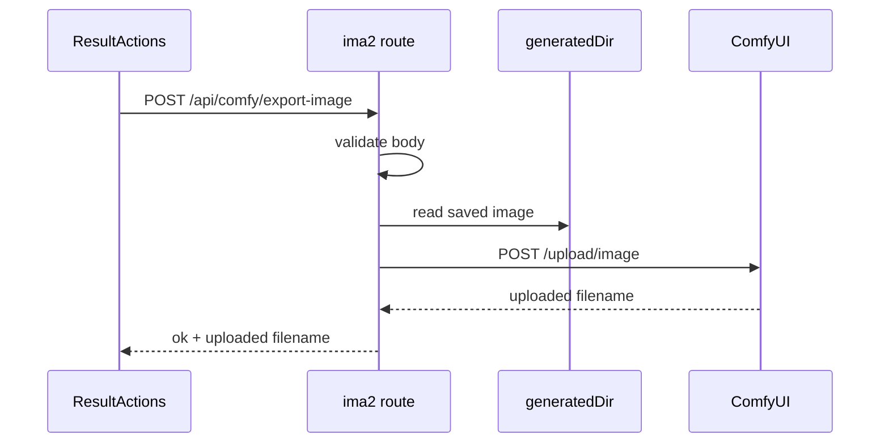

# 01 — Export Current Image to ComfyUI

## Flow



## API Contract

Route:

```text
POST /api/comfy/export-image
```

Request:

```json
{
  "filename": "1740000000000_abcd1234.png"
}
```

PR1 UI sends only `filename`. The server uses `ctx.config.comfy.defaultUrl`.
Tests may call the module with an injected local mock ComfyUI origin, but the
browser-facing PR1 contract does not expose arbitrary `comfyUrl`.

`POST /api/comfy/export-image` must reject any browser-provided `comfyUrl`,
`subfolder`, `overwrite`, `prompt`, workflow field, or raw path. PR1 route
behavior is filename-only.

The request body must contain exactly one top-level property:

```json
{ "filename": "1740000000000_abcd1234.png" }
```

Any additional top-level key is a schema violation.

Default config:

```js
config.comfy.defaultUrl // env IMA2_COMFY_URL, config.json comfy.defaultUrl, fallback http://127.0.0.1:8188
```

Success:

```json
{
  "ok": true,
  "sourceFilename": "1740000000000_abcd1234.png",
  "uploadedFilename": "ima2_1740000000000_abcd1234.png"
}
```

Errors:

| Code | Meaning |
|---|---|
| `COMFY_URL_NOT_LOCAL` | URL is not loopback HTTP |
| `COMFY_IMAGE_INVALID` | filename is empty, unsafe, or not an image |
| `COMFY_IMAGE_NOT_FOUND` | generated file does not exist |
| `COMFY_UPLOAD_FAILED` | ComfyUI rejected or did not respond |

HTTP status mapping:

| Code | HTTP |
|---|---:|
| `COMFY_URL_NOT_LOCAL` | 400 |
| `COMFY_IMAGE_INVALID` | 400 |
| `COMFY_IMAGE_NOT_FOUND` | 404 |
| `COMFY_UPLOAD_FAILED` | 502 |

## Server Design

New module:

```text
lib/comfyBridge.js
```

Responsibilities:

- Normalize and validate ComfyUI URL from `ctx.config.comfy.defaultUrl` only in
  the browser-facing PR1 route.
- Allow test/mock ComfyUI origins only below the route boundary, through module
  dependency injection or local test server setup, not browser JSON.
- Reject non-loopback hosts.
- Resolve generated filenames safely.
- Verify file remains inside `config.storage.generatedDir` by comparing
  `realpath(config.storage.generatedDir)` and `realpath(candidate)`.
- Reject symlink escapes even when the apparent path starts inside
  `generatedDir`.
- Sniff image type by magic bytes.
- Build multipart upload payload.
- Upload to ComfyUI `/upload/image` with redirect handling disabled or manual.
- Use `redirect: "manual"` and reject every 3xx response in PR1.
- Bound upload time with `AbortController` using `config.comfy.uploadTimeoutMs`.
- Bound upload size with `config.comfy.maxUploadBytes`.
- Return a small public response.
- Make only one upstream request per export: `POST {origin}/upload/image`.

Upload contract:

```text
POST {normalizedComfyOrigin}/upload/image

multipart/form-data:
  image = saved ima2 file bytes, filename=<sanitizedDestinationFilename>
  type = input

Do not send:
  subfolder
  overwrite
  prompt
  workflow
  client_id
  extra_data
  API keys/tokens
```

ComfyUI response handling:

- Parse ComfyUI JSON field `name`.
- Return it as `uploadedFilename`.
- Treat non-2xx, 3xx, timeout, connection refusal, invalid JSON, or missing
  `name` as `COMFY_UPLOAD_FAILED`.
- The ComfyUI `/upload/image` contract is a pre-merge verification gate. Local
  repo audit cannot prove it; before B completion, manual smoke or upstream
  confirmation must verify multipart `image`, `type=input`, and response JSON
  field `name`.

New route:

```text
routes/comfy.js
```

Responsibilities:

- Parse request body.
- Call `exportImageToComfy`.
- Map expected failures to stable error codes.
- Avoid logging image bytes, base64, or full prompt metadata.

## UI Design

Existing surface:

```text
ui/src/components/ResultActions.tsx
```

Add item inside the existing More menu:

```text
Send to ComfyUI
```

Korean label:

```text
ComfyUI로 보내기
```

The handler and visibility condition must use `actionImage.filename`, not
always `currentImage.filename`, so modal or override contexts do not export the
wrong item or hide a valid override.

Required component shape:

```tsx
const actionImage = imageOverride ?? currentImage;
if (!actionImage) return null;

const canExportToComfy = Boolean(actionImage.filename);
```

The export action calls:

```ts
exportImageToComfy({ filename: actionImage.filename })
```

This line order is required. `ResultActions` must not keep the existing
`if (!currentImage) return null` before `actionImage` is computed, because
`imageOverride` contexts may have no `currentImage`.

Delete/permanent-delete behavior must not silently target a different image
than the ComfyUI action. If `ResultActions` is rendered with `imageOverride`,
delete actions either target `actionImage` consistently or are hidden in that
override context.

The More menu filename gate must also use `actionImage.filename`, not
`currentImage.filename`.

Exact UI/i18n keys:

```text
result.sendToComfyUI
result.sendToComfyUITitle
toast.comfyExported
toast.comfyExportInvalidUrl
toast.comfyExportInvalidImage
toast.comfyExportImageNotFound
toast.comfyExportFailed
```

## Settings Decision

PR1 does not add a Settings panel. The default is configured in `config.js`
as `config.comfy.defaultUrl`, with fallback `http://127.0.0.1:8188`.
`.env.example` documents `IMA2_COMFY_URL`.

`config.comfy` also owns:

```js
defaultUrl // env IMA2_COMFY_URL, config.json comfy.defaultUrl, fallback http://127.0.0.1:8188
uploadTimeoutMs // env IMA2_COMFY_UPLOAD_TIMEOUT_MS, config.json comfy.uploadTimeoutMs, fallback 30000
maxUploadBytes // env IMA2_COMFY_MAX_UPLOAD_BYTES, config.json comfy.maxUploadBytes, fallback 50 * 1024 * 1024
```

`.env.example` documents:

- `IMA2_COMFY_URL`
- `IMA2_COMFY_UPLOAD_TIMEOUT_MS`
- `IMA2_COMFY_MAX_UPLOAD_BYTES`

Exact defaults:

```js
config.comfy.defaultUrl = "http://127.0.0.1:8188"
config.comfy.uploadTimeoutMs = 30000
config.comfy.maxUploadBytes = 50 * 1024 * 1024
```

Invalid, zero, or negative timeout/max-size env or config values fall back to
the defaults. `http://127.0.0.1:8188/` with a lone trailing slash is accepted
and normalized to origin. Any non-root path, query, fragment, credentials,
missing port, or non-loopback host is rejected.

If users ask for non-default ports, add a Settings field in a follow-up.

## Files

| Type | Path |
|---|---|
| NEW | `lib/comfyBridge.js` |
| NEW | `routes/comfy.js` |
| MODIFY | `routes/index.js` |
| MODIFY | `config.js` |
| MODIFY | `.env.example` |
| MODIFY | `ui/src/lib/api.ts` |
| MODIFY | `ui/src/components/ResultActions.tsx` |
| MODIFY | `ui/src/i18n/en.json` |
| MODIFY | `ui/src/i18n/ko.json` |
| NEW | `tests/comfy-bridge-contract.test.js` |
| NEW | `tests/comfy-export-ui-contract.test.js` |
