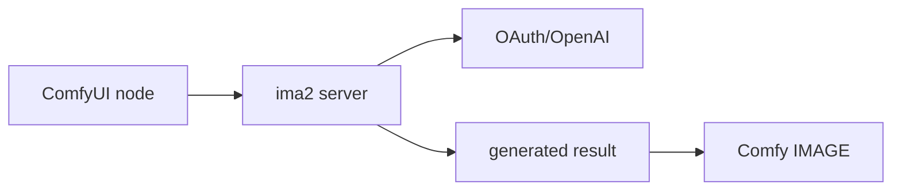

# 02 — ComfyUI Custom Node Follow-Up

## Purpose

This is not PR1. It documents the follow-up direction so PR1 does not expand
into a broad integration.

The custom node lets ComfyUI call a running ima2 server.



## Recommended Transport

Use direct HTTP to the ima2 server.

Avoid default subprocess execution:

```text
ComfyUI node -> ima2 gen subprocess
```

Reasons:

- shell quoting risk
- path discovery risk
- timeout handling is harder
- file output parsing is brittle
- security posture is weaker than direct HTTP

Subprocess may be kept as an explicit debug fallback only after the HTTP path is
stable.

## Node Pack Layout

Suggested path:

```text
integrations/comfyui/ima2_gen_bridge/
  __init__.py
  nodes.py
  README.md
```

Initial node:

```text
Ima2 Generate
```

Inputs:

| Input | Type | Notes |
|---|---|---|
| `prompt` | STRING | multiline |
| `server_url` | STRING | optional, default auto-discovery |
| `model` | enum | optional, default server config |
| `quality` | enum | low/medium/high |
| `size` | STRING | `1024x1024`, etc. |
| `moderation` | enum | auto/low |
| `timeout` | INT | bounded |

Outputs:

| Output | Type |
|---|---|
| `image` | IMAGE |
| `metadata` | STRING |

## Server Discovery

The node should mirror the ima2 CLI discovery order where practical:

1. explicit `server_url`
2. `IMA2_SERVER`
3. `~/.ima2/server.json`
4. `http://127.0.0.1:3333`

Only loopback URLs are valid.

## Exclusions

- No OpenAI API key field.
- No Codex/OAuth token file reads.
- No API-key provider selection.
- No runtime package install.
- No ComfyUI server route registration.
- No arbitrary local file reads.
- No workflow JSON manipulation.

## Later / Uncommitted Image Input Node

This is not PR1 or PR2 scope. It remains an uncommitted later follow-up unless
user demand makes image input from ComfyUI back into ima2 worth prioritizing.

After `Ima2 Generate` is stable:

```text
Ima2 Edit / Reference Generate
```

It must:

- convert ComfyUI `IMAGE` tensors to temp PNG/JPEG
- call ima2 `/api/edit` or `/api/generate` references
- decode ima2 result data URL
- return ComfyUI `IMAGE`
- clean temp files
