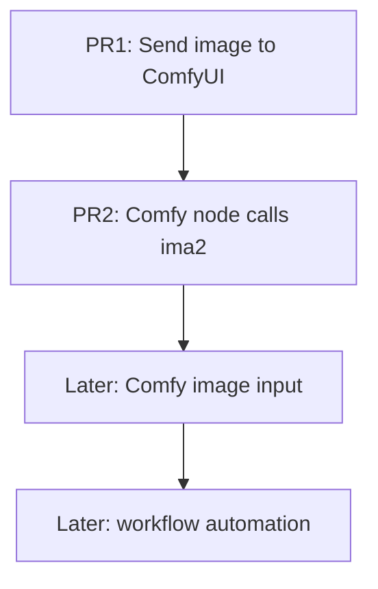

# PRD — ComfyUI Bridge

## Problem

Users who already use ComfyUI want to continue ima2-gen outputs in local
ComfyUI workflows such as image-to-image, inpaint, zimage, anima, upscale, or
other custom model chains.

The current ima2-gen app keeps generated assets locally and has a strong
gallery/history experience, but it does not provide a first-class way to hand a
generated image to ComfyUI. GitHub #15 also raised the inverse idea: a ComfyUI
node that can call ima2 generation.

## Product Shape

The bridge has two directions, but they should not ship together in one large
PR.

## PR1 User Story

As an ima2-gen user, I can open the generated image More menu and send the
current saved image to a running local ComfyUI instance so I can continue work
there.

## PR1 Acceptance Criteria

- The current image More menu has a `Send to ComfyUI` action.
- The action appears only when the selected image has a saved `filename`.
- The browser calls ima2-gen, not ComfyUI directly.
- The browser sends only the saved ima2 `filename`; it does not send
  `comfyUrl`, raw file paths, or workflow parameters in PR1.
- Request body must contain exactly one property: `filename`.
- Any additional browser-supplied field is rejected, including `comfyUrl`,
  `subfolder`, `overwrite`, `prompt`, workflow fields, raw paths, `client_id`,
  and `extra_data`.
- ima2-gen uploads the saved image file to ComfyUI `/upload/image`.
- The default ComfyUI URL is `http://127.0.0.1:8188`.
- The default URL lives in `config.js` as `config.comfy.defaultUrl`, with
  `IMA2_COMFY_URL` documented in `.env.example`.
- Upload timeout and max upload size live under `config.comfy`.
- `.env.example` documents `IMA2_COMFY_URL`,
  `IMA2_COMFY_UPLOAD_TIMEOUT_MS`, and `IMA2_COMFY_MAX_UPLOAD_BYTES`.
- Only localhost loopback ComfyUI URLs are accepted.
- Success toast includes the uploaded ComfyUI filename.
- Failure toast covers ComfyUI not running, invalid URL, invalid filename, and
  upload failure.
- No ComfyUI workflow is queued in PR1.

## PR2 User Story

As a ComfyUI user, I can install a small `ima2-gen` custom node and call a
running ima2 server from inside ComfyUI without entering OpenAI keys into
ComfyUI.

## PR2 Acceptance Criteria

- Custom node pack lives outside the core runtime path.
- The node calls the ima2 local HTTP server directly.
- Server discovery follows ima2's advertised server file behavior where
  practical.
- The node has no OpenAI API key fields.
- The node does not read Codex/OAuth token files.
- The node does not shell out by default.
- The node returns a ComfyUI `IMAGE` tensor.

## PR1 Non-Goals

- No `/prompt`.
- No `/history`.
- No queue management.
- No workflow JSON editing.
- No ComfyUI Manager installation flow.
- No remote/LAN ComfyUI server support.
- No raw local path export from browser input.
- No browser-provided `comfyUrl` in PR1.
- No `subfolder` or `overwrite` exposure.

## Required Backend Contract Details

- Upload fetch must use manual redirect handling or reject all redirects.
- The bridge must compare generated directory and candidate image with
  `realpath` before reading.
- Symlink escapes are invalid even if the path string starts under
  `generatedDir`.
- Upload to ComfyUI uses multipart `image` plus `type=input` only.
- ComfyUI response field `name` is returned publicly as `uploadedFilename`.
- Timeout, connection refused, non-2xx, 3xx, invalid JSON, or missing `name`
  all map to `COMFY_UPLOAD_FAILED`.
- Request schema violations, unsafe filenames, non-image bytes, directories,
  and oversize files all map to `COMFY_IMAGE_INVALID` with HTTP 400.
- Response shape is fixed:
  - success: `{ ok: true, sourceFilename, uploadedFilename }`
  - error: `{ ok: false, error: { code, message } }`
- The ComfyUI `/upload/image` contract is a pre-merge verification gate:
  before B completion, manual smoke or upstream confirmation must verify
  multipart `image`, `type=input`, and JSON response field `name`.

## Product Decision

PR1 is the only PABCD build target for this lane. PR2 remains the documented
custom-node follow-up. Image input and workflow automation are later,
uncommitted follow-ups so the architecture does not drift while implementing
the small bridge.
