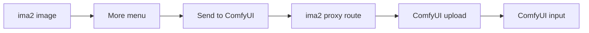

# 0.09.44 — ComfyUI Bridge

Status: planning
Source: GitHub #15
Owner: PABCD planning lane

## Goal

Build a narrow, localhost-only ComfyUI bridge without turning ima2-gen into a
ComfyUI workflow manager.

The first implementation PR should only send the current saved ima2 image to a
running local ComfyUI instance. ComfyUI workflow execution and custom ComfyUI
nodes stay as follow-up slices.

## Scope Map

## Documents

| File | Purpose |
|---|---|
| `PRD.md` | Product decision, user value, scope boundary |
| `01-export-to-comfyui.md` | First PR: ima2 image More menu export |
| `02-comfyui-custom-node.md` | Follow-up: ComfyUI node pack calls ima2 |
| `03-security-contract.md` | Localhost, file path, upload, logging constraints |
| `04-test-plan.md` | Contract, route, UI, and smoke verification |
| `ORACLE-AUDIT.md` | External Oracle review summary and adopted decisions |

## Implementation Order

1. PR1: `ima2 -> ComfyUI` image upload only.
2. PR2: ComfyUI custom node calling a running ima2 server.
3. Later: ComfyUI image input node for ima2 edit/reference workflows.
4. Later: workflow execution/import/export if repeated demand appears.

## Non-Goals

- Do not call ComfyUI `/prompt` in PR1.
- Do not poll ComfyUI `/history`.
- Do not import or export full ComfyUI workflow JSON.
- Do not install ComfyUI or custom nodes automatically.
- Do not expose OpenAI, Codex, or OAuth credentials to ComfyUI.
- Do not support remote ComfyUI URLs in the first version.
- Do not hardcode the ComfyUI default URL outside `config.js`.
- Do not implement path checks without `realpath`.
- Do not expose browser-provided `comfyUrl` in PR1.
- Inject test/mock ComfyUI origins below the browser-facing route, not from
  browser JSON.
- Do not follow redirects from ComfyUI upload requests.
- Do not expose ComfyUI `subfolder` or `overwrite`.
