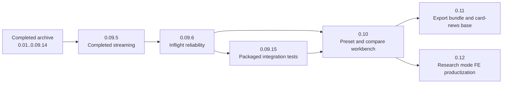

# ima2-gen 통합 로드맵

현재 로드맵은 Node mode productization 이후 reliability를 닫고 기능 확장으로 넘어가는 한 줄 흐름이다. 이미 구현된 큰 덩어리는 `_fin`에 있다. `_plan`에 남은 항목은 inflight persistence, integration test/FAQ/ops hardening, feature expansion, research mode 제품화뿐이다.

`0.09.5-node-streaming`은 완료되어 `_fin/260424_0.09.5-node-streaming`으로 이동했다. Node mode 생성 중 partial image 표시, sidecar/history `requestId`, reload recovery matching, animated node border glow가 구현됐다.

가장 먼저 닫아야 할 것은 `0.09.6-inflight-reliability`이다. 이 작업은 inflight 레지스트리를 SQLite로 영속화하고 cross-tab merge의 metadata 손실을 막는 안정화 트랙이다. `0.09.15`는 packaged tarball/install smoke와 route packaging regression을 CI에 올리는 테스트 트랙이다.

그 다음은 `0.10-feature-expansion`이다. 이 단계는 이미지 생성기를 재사용 가능한 작업대처럼 만드는 방향이다. prompt preset, batch compare, export bundle, card-news가 여기에 묶인다. 단, `0.10`의 첫 구현은 preset과 compare MVP로 제한한다. card-news는 export bundle이 잡힌 뒤에 이어간다.

`0.12-research-mode`는 별도 축이다. 서버의 OAuth 경로에는 web_search와 image_generation 조합이 들어와 있다. 남은 일은 UI에서 언제 research를 켜고, 얼마나 오래 걸릴 수 있는지 알려주고, 결과에서 web search 사용량을 보여주는 제품화이다.

---

## Roadmap lane

## Active status

| Cycle | 상태 | 지금 의미 | 다음 조건 |
|---|---|---|---|
| 0.09.5 | done | Node partial_image streaming + sidecar requestId + animated node border glow. | `_fin/260424_0.09.5-node-streaming`에 archive. |
| 0.09.6 | queued | Inflight registry SQLite 영속화 + `reconcileInflight` metadata 보존. | 다음 PABCD 대상. |
| 0.09.15 | queued | Packaged integration tests. | 0.09.6 전후 어느 때나 가능. |
| 0.10 | queued | preset + compare MVP | 0.09.6 또는 0.09.15 이후 시작. |
| 0.11 | future | export bundle + card-news 기반 | 0.10의 preset/compare 데이터 모델을 재사용한다. |
| 0.12 | partial | research mode FE productization | backend always-on research 상태를 UI에서 명확히 드러낸다. |

## 완료된 기반

| 기반 | 현재 코드 증거 | 후속 영향 |
|---|---|---|
| React migration | `ui/src`, `ui/dist`, React/Vite/TS/Zustand | 모든 UI 기능은 React 컴포넌트 기준으로 만든다. |
| API key block | `/api/generate`, `/api/edit`, `/api/node/generate`의 `APIKEY_DISABLED` | OAuth-only UX로 설명한다. API Key는 disabled affordance로만 둔다. |
| Node mode foundation | `NodeCanvas`, `ImageNode`, `/api/node/generate`, `lib/nodeStore.js` | graph workflow의 중심이다. |
| Session DB | `lib/db.js`, `lib/sessionStore.js`, `/api/sessions/*` | preset/compare/card-news도 SQLite 패턴을 따른다. |
| UX chrome | `RightPanel`, fixed `HistoryStrip`, `GalleryModal`, size preset test | Classic UI를 기능 확장의 안정된 shell로 본다. |
| CLI integration | `bin/commands/*`, `bin/lib/*`, `/api/health` | batch/preset/export 기능은 CLI mirror를 고려한다. |
| Cross-platform | `bin/lib/platform.js`, `.github/workflows/ci.yml` | Windows/Linux/macOS를 깨지 않게 유지한다. |
| Stability/Gallery | history pagination, soft delete/restore, grouped gallery | export와 compare가 history asset을 안정적으로 참조할 수 있다. |

## 0.09.4 exit criteria

- [x] pending/reconciling 상태가 session DB에 영구 저장되지 않는다. (A sanitize)
- [x] reload 뒤 history/sidecar에서 node image를 복구한다. (R helper)
- [x] active session guard로 다른 세션 graph를 오염시키지 않는다. (E guard)
- [x] `GenerateItem`과 in-flight metadata가 `sessionId`, `nodeId`, `clientNodeId`를 보존한다. (F 확장)
- [x] conflict reload 뒤에도 recovery helper가 호출된다. (CR)
- [x] 서버와 OAuth relay를 건드리지 않는 제약을 지킨다.
- [ ] 사용자 reload smoke (UI 빌드 후 수동 확인) — 미수행.

## 0.09.5 scope

- [x] Node mode `/api/node/generate`를 SSE 중계로 전환 (Accept negotiation으로 JSON fallback 유지).
- [x] OAuth relay의 `response.image_generation_call.partial_image` 이벤트를 서버가 캡처해 프런트로 포워딩.
- [x] `ImageNode`가 partial image를 skeleton 위에 점진 렌더.
- [x] sidecar meta와 `/api/history` 응답에 `requestId` 필드 추가.
- [x] R helper의 matching 우선순위를 `requestId` → `(sessionId, clientNodeId, createdAt)` 순서로 승격.

## 0.09.6 scope

- [ ] `lib/inflight.js`를 better-sqlite3 기반으로 영속화 (서버 재시작 생존).
- [ ] 서버 부팅 시 10분 초과 stale job purge.
- [ ] `/api/inflight` 응답의 `kind/meta` 필드를 타입 보강.
- [ ] `reconcileInflight`의 server-only merge에서 `kind/sessionId/clientNodeId`를 복원.
- [ ] 프로세스 재시작 + cross-tab 시나리오 테스트 2건 추가.

## 0.10 scope

- [ ] Prompt preset: named preset, recent prompt, pin/search/apply/delete.
- [ ] Batch compare MVP: 2-4 variants, winner mark, promote current, save as preset.
- [ ] Server storage: `lib/db.js`와 `sessionStore.js` 스타일을 재사용한다.
- [ ] Classic first: Node mode는 read-only 연결이나 promotion 정도만 둔다.
- [ ] CLI mirror는 처음부터 command naming을 남겨둔다.

## 0.12 scope

- [ ] UI에 research 상태를 보여준다. 서버는 현재 OAuth 경로에서 web_search tool을 포함한다.
- [ ] long-running generation 경고를 넣는다.
- [ ] `webSearchCalls`를 결과 metadata와 badge로 보여준다.
- [ ] Node mode popover 또는 RightPanel에서 research UX를 어떻게 둘지 결정한다.
- [ ] smoke evidence는 `_fin/260423_smoke-ws-v2`를 참조한다.

## Reference docs

| 문서 | 사용법 |
|---|---|
| `backend-node-mode.md` | Node/backend cleanup 아이디어를 가져올 때만 본다. 그대로 active spec으로 쓰지 않는다. |
| `frontend-node-mode.md` | React/Node UI 설계 원문으로 본다. 현재 구현과 다르면 현재 구현을 우선한다. |
| `_legacy/phase-*` | 오래된 0.2~phase-3 백로그이다. 직접 실행하지 않는다. |
| `_fin/260423_*` | 완료 검증과 회고용 archive이다. |

## 변경 기록

- 2026-04-23: 과거 queued 로드맵을 현재 구현 상태 기준으로 재정렬한다.
- 2026-04-23: 0.09.4 구현/정적 감사 완료. 0.09.5(스트리밍+sidecar requestId)와 0.09.6(inflight 영속화)를 follow-up 트랙으로 추가.
- 2026-04-24: 0.09.11~0.09.14 완료/대체 항목을 archive로 이동하고, 0.09.5를 다음 PABCD 대상으로 승격.
- 2026-04-24: 0.09.5 node streaming 완료. `_fin/260424_0.09.5-node-streaming`으로 archive하고 0.09.6을 다음 PABCD 대상으로 승격.
