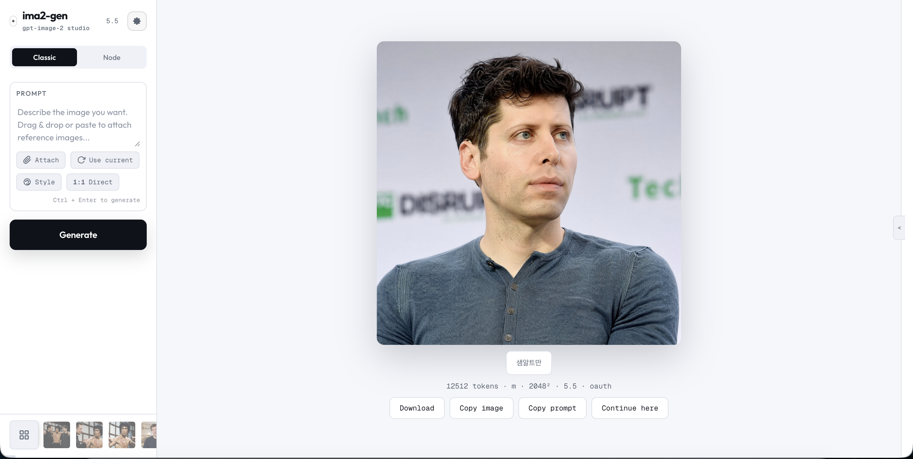
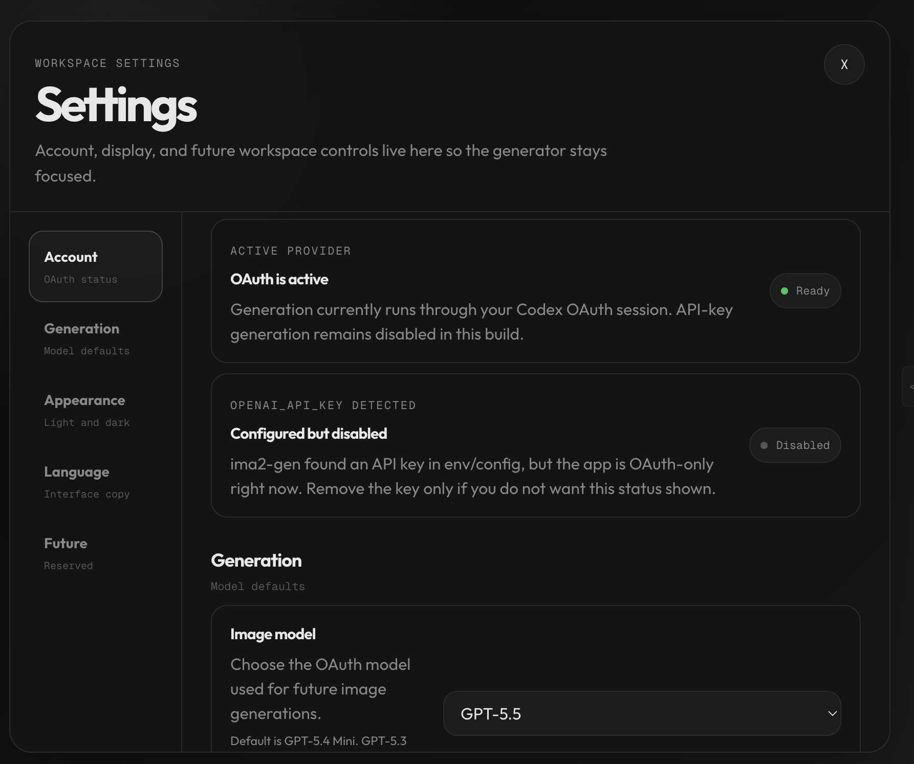
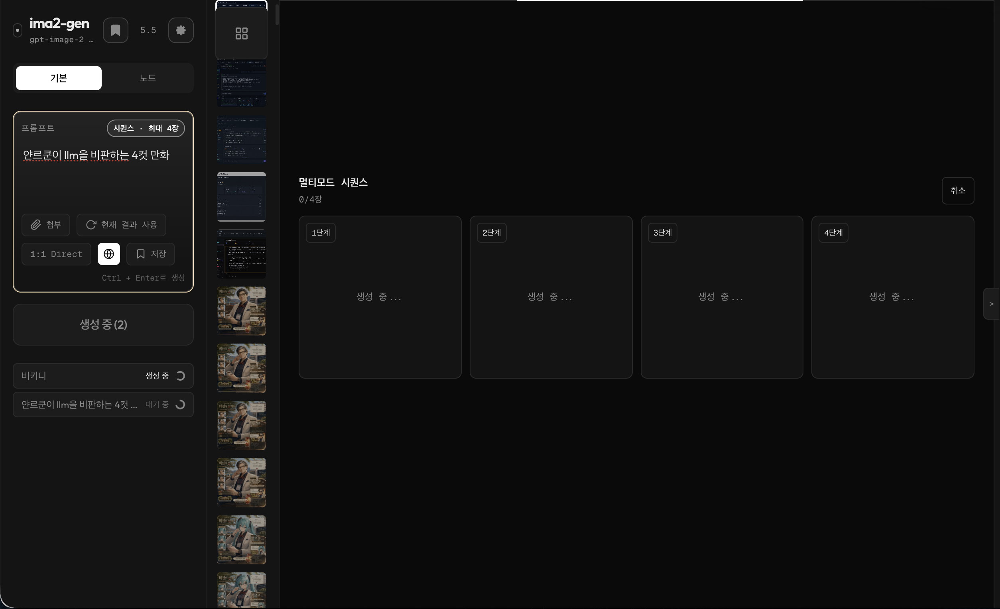
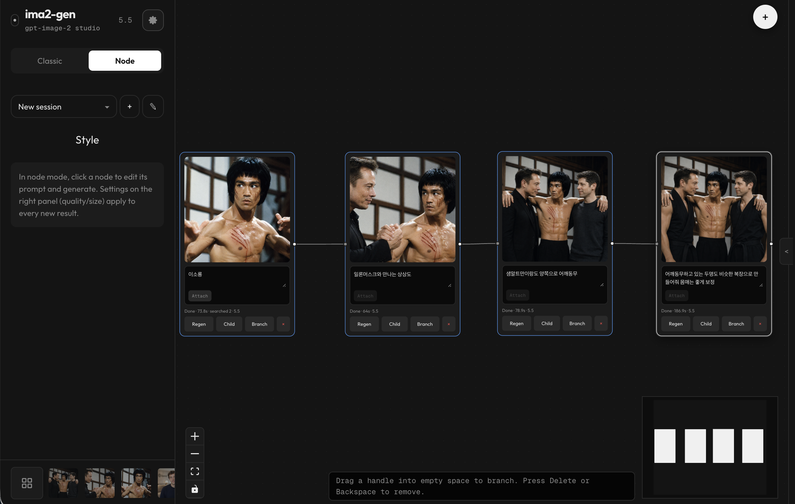
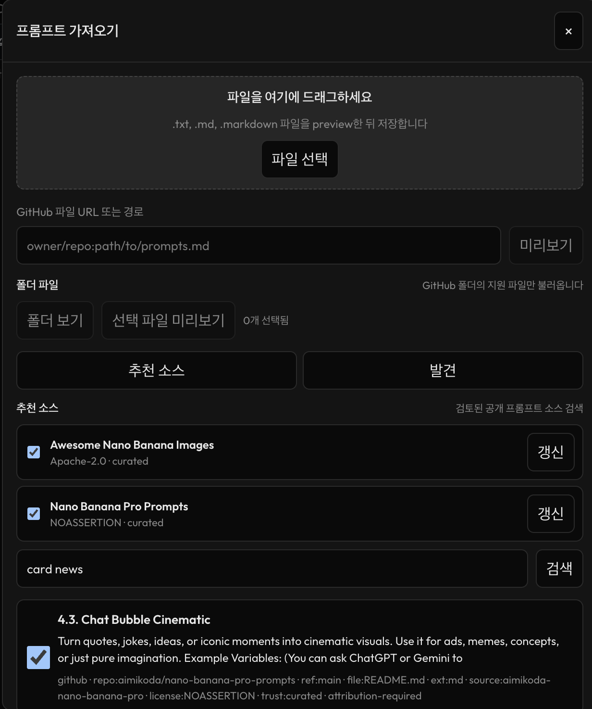
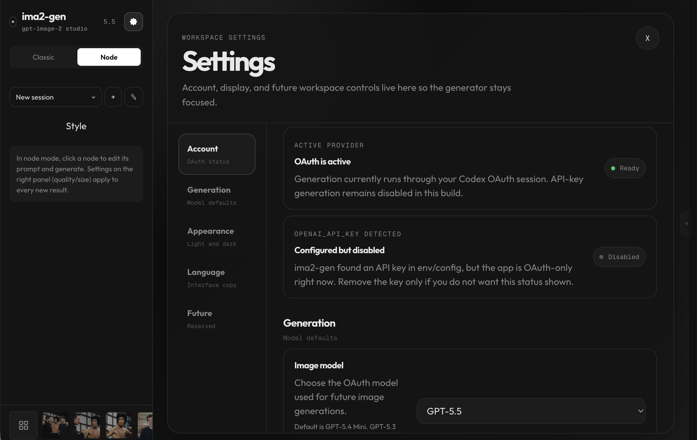
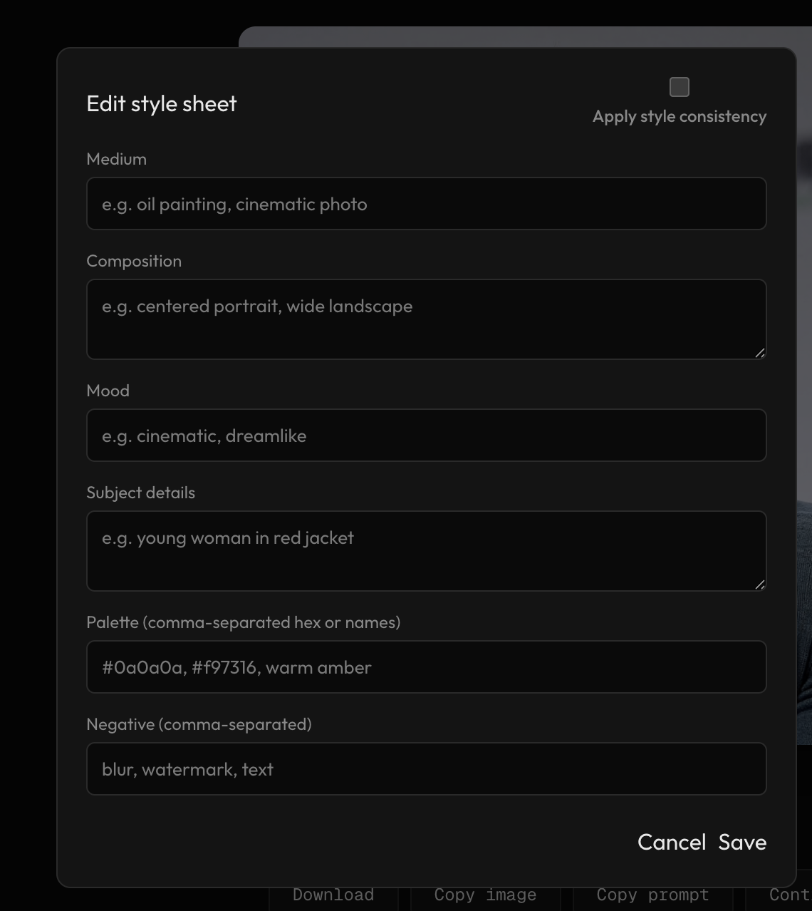

# ima2-gen

[](https://www.npmjs.com/package/ima2-gen)
[](https://nodejs.org/)
[](../LICENSE)

> 🌐 **Live site**: [lidge-jun.github.io/ima2-gen](https://lidge-jun.github.io/ima2-gen/) · [한국어 페이지](https://lidge-jun.github.io/ima2-gen/ko/)
>
> **다른 언어로 읽기**: [English](../README.md) · [日本語](README.ja.md) · [简体中文](README.zh-CN.md)

`ima2-gen`은 ChatGPT/Codex OAuth 이미지 생성 흐름을 로컬 웹앱처럼 쓸 수 있게 만든 이미지 생성 스튜디오입니다.

`npx`로 실행하고, Codex OAuth로 로그인한 뒤, 프롬프트를 입력하면서 히스토리, 레퍼런스, 스타일 시트, 노드 브랜치, 멀티모드 배치, Canvas Mode 정리 작업으로 계속 이어갈 수 있습니다. 기본 이미지 생성 경로에서는 OpenAI API 키가 필요하지 않습니다.



## 빠른 시작

```bash
npx ima2-gen serve
```

그다음 `http://localhost:3333`을 엽니다.

Codex 로그인이 아직 없다면:

```bash
npx @openai/codex login
npx ima2-gen serve
```

`3333`이 이미 사용 중이면 다음 사용 가능한 포트로 열리고 실제 URL은 `~/.ima2/server.json`에 기록됩니다. 포트를 추측하지 말고 터미널에 출력된 URL이나 `ima2 open`을 사용하세요.

전역 설치도 가능합니다.

```bash
npm install -g ima2-gen
ima2 serve
```

## 무엇을 할 수 있나요?

- **Classic mode**: 빠르게 이미지를 만들고, 수정하고, 현재 결과를 다시 레퍼런스로 사용합니다.
- **Node mode**: 마음에 드는 이미지를 여러 방향으로 분기해 실험합니다.
- **Multimode batches**: 하나의 프롬프트에서 여러 후보 슬롯을 동시에 만들고, 가장 좋은 결과에서 이어갑니다.
- **Canvas Mode**: 확대/이동, 주석, 지우개, 배경 정리, 투명 체크보드 미리보기, alpha/matte export를 지원합니다.
- **Local gallery**: 생성물을 내 컴퓨터에 저장하고 세션별 히스토리로 봅니다.
- **Reference images**: 레퍼런스를 드래그, 붙여넣기, 파일 선택으로 추가합니다. 큰 이미지는 업로드 전에 자동 압축됩니다.
- **Prompt library imports**: 로컬 prompt pack, GitHub folder, curated GPT-image hint를 내장 prompt library로 가져옵니다.
- **Style sheets**: 한 번 잡은 시각적 방향을 classic/node 프롬프트에 재사용합니다.
- **Mobile shell**: 작은 화면에서는 app bar, compose sheet, compact settings toggle로 조작합니다.
- **Observable jobs**: 진행 중인 작업과 최근 완료된 작업을 request ID로 추적합니다.

## 이미지 생성은 OAuth 전용입니다

현재 이미지 생성은 로컬 Codex/ChatGPT OAuth 경로로 실행됩니다.

API 키가 env/config에 있어도 billing 확인이나 style-sheet 추출 같은 보조 기능에만 쓰일 수 있습니다. 생성 엔드포인트에서 `provider: "api"`를 보내면 `APIKEY_DISABLED`가 반환됩니다.

설정 화면에 **Configured but disabled**가 보이면, API 키는 감지됐지만 이미지 생성은 여전히 OAuth로 실행된다는 뜻입니다.



## 모델 안내

앱 기본값은 빠른 로컬 작업(테스트)에 맞춘 **`gpt-5.4-mini`**입니다. 안정적인 균형을 원하면 **`gpt-5.4`**로 전환하는 것을 권장합니다.

- `gpt-5.4` — 추천 균형 선택지.
- `gpt-5.4-mini` — 현재 앱 기본값이며 빠른 초안에 적합합니다.
- `gpt-5.5` — 지원되는 환경에서는 가장 강한 품질 선택지입니다. 다만 더 많은 할당량을 쓸 수 있고, Codex CLI 업데이트가 필요하거나 계정/백엔드별 이미지 capability가 다를 수 있습니다.

품질은 `low`, `medium`, `high`, 모더레이션은 `auto`, `low`를 지원합니다.

## 주요 흐름

### Classic mode

한 장을 빠르게 뽑고 다듬고 싶을 때 사용합니다.

1. 프롬프트를 씁니다.
2. 필요하면 레퍼런스를 붙입니다.
3. 모델, 품질, 크기, 포맷, 모더레이션을 고릅니다.
4. 한 장을 만들거나, multimode를 켜서 같은 프롬프트에서 여러 후보 슬롯을 만듭니다.
5. 생성 후 복사, 다운로드, 이어서 작업, Canvas Mode 정리를 선택합니다.



### Node mode

아이디어를 가지치기하면서 비교하고 싶을 때 사용합니다.



각 노드는 자기 프롬프트와 결과를 가집니다. 루트 노드는 로컬 레퍼런스를 붙일 수 있고, 자식 노드는 부모 이미지를 소스로 사용합니다. 완료된 작업은 request ID로 다시 매칭되므로 새로고침이나 그래프 버전 충돌 뒤에도 결과를 복구할 수 있습니다.

### Canvas Mode

이미지가 거의 맞지만 부분 정리가 필요할 때 Canvas Mode를 사용합니다.

- 확대된 이미지에서 viewport 이동과 선택 도구가 분리되어 실수로 annotation을 바꾸지 않고 화면을 이동할 수 있습니다.
- annotation, eraser, multiselect, group, undo/redo, sticky note를 사용할 수 있습니다.
- 배경 정리용 시드(seed)를 지정하여 마스크를 미리 본 뒤 canvas version으로 저장할 수 있습니다.
- 투명 이미지에는 checkerboard preview를 보여주고, export는 alpha 유지 또는 matte 색상 합성 중 선택할 수 있습니다.
- 저장된 canvas version은 Gallery/HistoryStrip에는 보이지 않지만, Canvas Mode에서는 재사용하거나 다음 reference로 붙일 수 있습니다.


### Prompt library와 Import

Prompt library는 로컬 파일, GitHub folder, curated source, GPT-image hint pack에서 가져올 수 있습니다. 가져온 prompt는 로컬 index에 저장되어 매 세션 다시 import하지 않아도 검색과 ranking에 사용할 수 있습니다.



### Experimental Card News Mode

Card News는 아직 개발 전용 실험 기능입니다. 기본 공개 런타임에서는 명시적으로 개발용으로 켜지 않는 한 숨겨져 있으며, 아직 안정적인 공개 기능으로 보면 안 됩니다.

### Settings와 Style sheets

Settings 워크스페이스는 계정, 모델, 테마, 언어 설정을 생성 패널에서 독립시켜 관리합니다.



Style sheet는 반복해서 쓰고 싶은 시각적 방향을 저장하는 기능입니다.



## CLI 명령어

### 서버

| 명령어 | 설명 |
|---|---|
| `ima2 serve [--dev]` | 로컬 웹 서버 시작. `--dev`는 서버 진단 로그를 자세히 표시 |
| `ima2 setup` | 인증 설정 다시 구성 |
| `ima2 status` | config와 OAuth 상태 확인 |
| `ima2 doctor` | Node, 패키지, config, auth 진단 |
| `ima2 open` | 웹 UI 열기 |
| `ima2 reset` | 저장된 config 삭제 |

### 클라이언트

아래 명령어는 `ima2 serve`가 실행 중이어야 합니다.

| 명령어 | 설명 |
|---|---|
| `ima2 gen <prompt>` | CLI에서 이미지 생성 |
| `ima2 edit <file> --prompt <text>` | 기존 이미지 수정 |
| `ima2 ls` | 로컬 히스토리 보기 |
| `ima2 show <name>` | 생성 파일 열기 |
| `ima2 ps` | 진행 중 작업 보기 |
| `ima2 cancel <requestId>` | 진행 중 작업을 취소 상태로 표시 |
| `ima2 ping` | 실행 중인 서버 확인 |

서버 포트는 `~/.ima2/server.json`에 기록됩니다. `3333`이 사용 중이면 `3334+`로 fallback할 수 있으니 터미널에 출력된 URL이나 `ima2 open`을 우선 사용하세요. `--server <url>` 또는 `IMA2_SERVER=http://localhost:3333`로 직접 지정할 수도 있습니다.

## 설정

우선순위:

```text
environment variables > ~/.ima2/config.json > built-in defaults
```

| 변수 | 기본값 | 설명 |
|---|---:|---|
| `IMA2_PORT` / `PORT` | `3333` | 웹 서버 포트 |
| `IMA2_HOST` | `127.0.0.1` | 웹 서버 bind host |
| `IMA2_OAUTH_PROXY_PORT` / `OAUTH_PORT` | `10531` | OAuth 프록시 포트 |
| `IMA2_SERVER` | — | CLI 대상 서버 직접 지정 |
| `IMA2_CONFIG_DIR` | `~/.ima2` | config와 SQLite 저장 위치 |
| `IMA2_ADVERTISE_FILE` | `~/.ima2/server.json` | 실행 중 서버 discovery 파일 |
| `IMA2_GENERATED_DIR` | `~/.ima2/generated` | 생성 이미지 저장 위치 |
| `IMA2_IMAGE_MODEL_DEFAULT` | `gpt-5.4-mini` | 서버 fallback 이미지 모델 |
| `IMA2_NO_OAUTH_PROXY` | — | `1`이면 OAuth 프록시 자동 시작 비활성화 |
| `IMA2_LOG_LEVEL` | `warn` | 일반 `serve`는 `warn`, dev 모드는 `debug`. `debug`, `info`, `warn`, `error`, `silent` 지원 |
| `IMA2_INFLIGHT_TERMINAL_TTL_MS` | `30000` | 디버그용 최근 작업 보존 시간 |
| `OPENAI_API_KEY` | — | 보조 기능용 API 키. 이미지 생성용은 아님 |

### 로그 모드

`ima2 serve`는 일반 사용자 기준으로 터미널 출력을 조용하게 유지합니다. 시작 URL, 경고, 오류는 보이지만 요청/노드/OAuth structured log는 기본적으로 숨깁니다.

요청 ID, 노드 생성 단계, OAuth stream 진단, inflight 상태 전환을 봐야 하면 `ima2 serve --dev`, `npm run dev`, 또는 `IMA2_LOG_LEVEL=debug ima2 serve`를 사용하세요. 명시한 `IMA2_LOG_LEVEL`과 `~/.ima2/config.json` 값은 기본값보다 우선합니다.

## API 문서

엔드포인트 목록은 [API Reference](API.md)로 분리했습니다.

자주 묻는 질문은 [FAQ](FAQ.ko.md)에 정리했습니다. 업데이트 후 예전 이미지가 안 보이면 [예전 이미지 복구 안내](RECOVER_OLD_IMAGES.md)를 먼저 확인하세요.

## 문제 해결

**`ima2 ping`이 서버에 연결하지 못한다고 나와요**
`ima2 serve`를 먼저 실행하고 `~/.ima2/server.json`을 확인하세요. `ima2 ping --server http://localhost:3333`도 사용할 수 있습니다.

**OAuth 로그인이 안 돼요**
`npx @openai/codex login`을 실행하고, `ima2 status`를 확인한 뒤 `ima2 serve`를 다시 시작하세요.

**프록시/VPN 환경에서 `fetch failed`가 반복돼요**
로컬 OAuth 프록시가 접근 가능한지 확인하세요. 프록시가 필요한 네트워크라면 프록시 클라이언트의 TUN/TURN류 모드를 켠 뒤 `npx openai-oauth --port 10531`을 다시 시도하세요. 그래도 실패하면 `ima2 serve` 또는 `openai-oauth`를 실행하는 같은 터미널에 `HTTP_PROXY`와 `HTTPS_PROXY`를 설정하세요.

**이미지 생성이 `APIKEY_DISABLED`로 실패해요**
현재 빌드에서는 OAuth로 생성해야 합니다. API-key 이미지 생성은 의도적으로 비활성화되어 있습니다.

**큰 레퍼런스 이미지가 실패해요**
JPEG/PNG는 업로드 전에 자동 압축됩니다. 그래도 실패하면 해상도를 낮춘 JPEG/PNG로 바꿔 다시 시도하세요. HEIC/HEIF는 브라우저 경로에서 지원하지 않습니다.

**업데이트 후 예전 갤러리 이미지가 안 보여요**
최근 버전에서 생성 이미지 위치가 설치 폴더에서 `~/.ima2/generated`로 이동했습니다. `ima2 doctor`를 실행하고 [예전 이미지 복구 안내](RECOVER_OLD_IMAGES.md)를 확인하세요.

**`gpt-5.5`만 실패해요**
먼저 Codex CLI를 최신으로 업데이트한 뒤 다시 시도해보세요. 그래도 실패하면 현재 계정이나 백엔드 경로에서 `gpt-5.5` 이미지 capability 또는 할당량이 아직 다르게 적용되는 상황일 수 있으니, 안정적인 대안으로 `gpt-5.4`를 사용하세요.

**포트가 갑자기 `3457`로 떠요**
다른 로컬 도구에서 `PORT=3457`이 상속됐을 수 있습니다. `unset PORT`를 실행하거나 `IMA2_PORT=3333 ima2 serve`로 시작하세요.

더 자세한 답변은 [FAQ](FAQ.ko.md)를 확인하세요.

## 개발

```bash
git clone https://github.com/lidge-jun/ima2-gen.git
cd ima2-gen
npm install
npm run dev
npm run typecheck
npm test
npm run build
```

`npm run dev`는 UI를 빌드한 뒤 TypeScript 서버 entry를 `--watch`로 실행하고, 서버 진단 로그를 자세히 표시합니다. `npm run typecheck`, `npm run build:server`, `npm run build:cli`로 TypeScript migration과 package emit 경로를 확인할 수 있습니다.

## 라이선스

MIT
