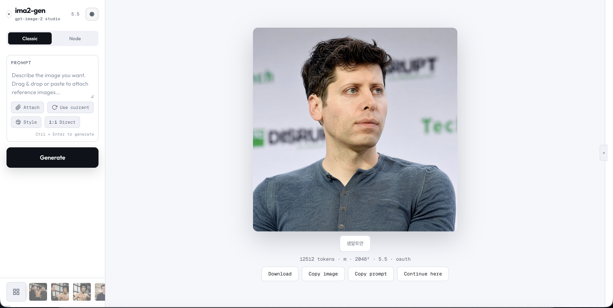
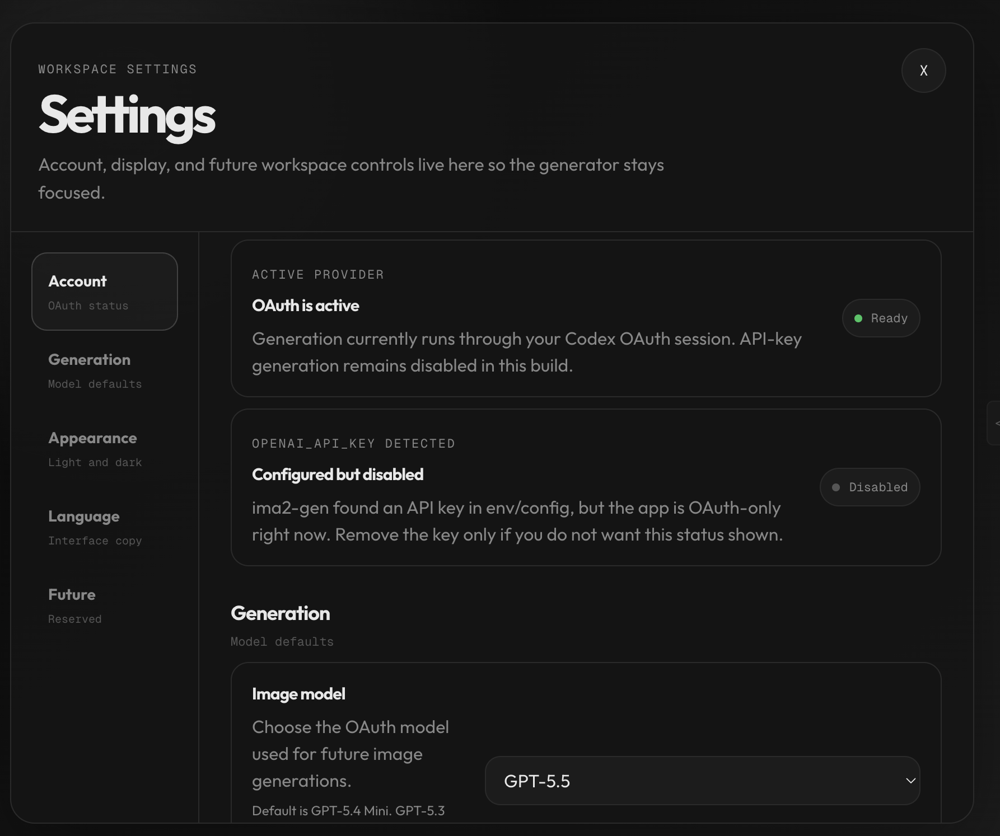
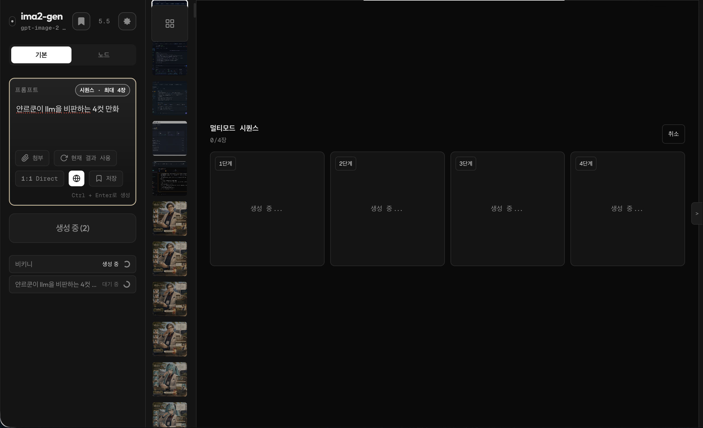
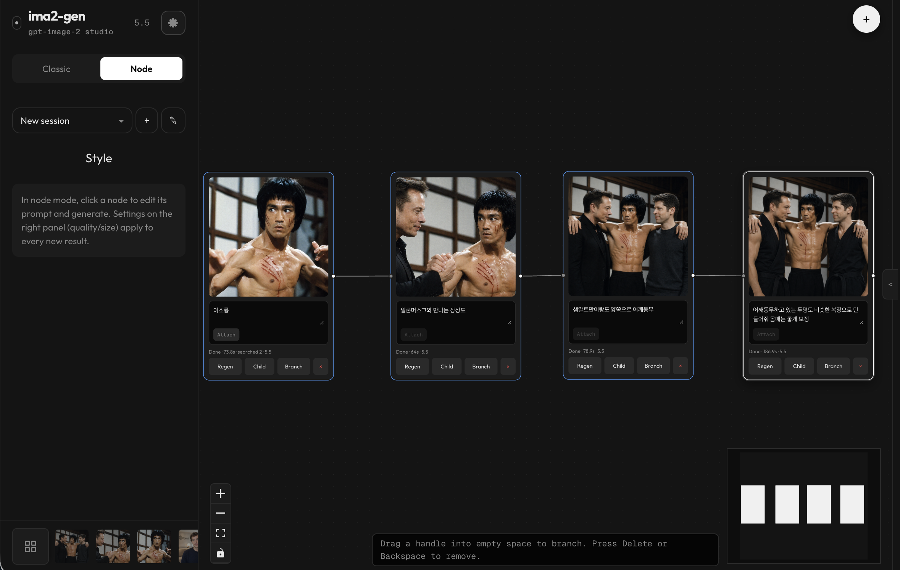
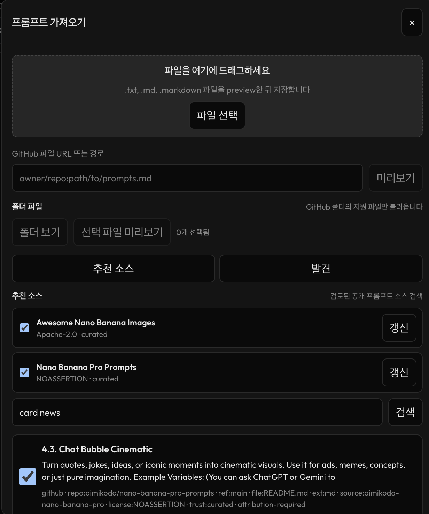
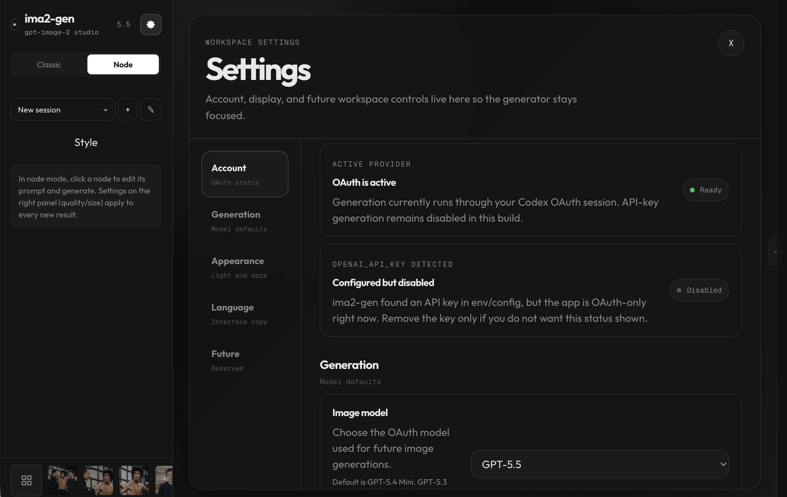

# ima2-gen

<p align="center">
  
</p>

[](https://www.npmjs.com/package/ima2-gen)
[](https://nodejs.org/)
[](../LICENSE)

> 🌐 **現場直播**: [lidge-jun.github.io/ima2-gen](https://lidge-jun.github.io/ima2-gen/) · [한국어](https://lidge-jun.github.io/ima2-gen/ko/)
>
> 📖 **開發者文檔**: [文件站點](https://lidge-jun.github.io/ima2-gen/docs) · [한국어](https://lidge-jun.github.io/ima2-gen/ko/docs)
>
> **閱讀其他語言版本**：[English](../README.md) · [한국어](README.ko.md) · [日本語](README.ja.md) · [正體中文](README.zh-TW.md) · [简体中文](README.zh-CN.md)

`ima2-gen`是一個本地圖像生成工作室，為那些想要ChatGPT/Codex類似桌面的小型 Web 應用程式中的圖像工作流程。

全域安裝，登入ChatGPT OAuth或者Grok OAuth，並開始生成圖像和視頻。使用歷史記錄、引用、節點分支、多模式批次、畫布模式清理等進行迭代Grok影片生成。預設OAuth路徑不需要API鑰匙;選修的API-關鍵提供者（`api`, `grok-api`, `gemini-api`, `agy`）也受支持。



## 快速入門

```bash
npm install -g ima2-gen
ima2 setup
ima2 serve
```

然後打開`http://localhost:3333`.

### Docker

```bash
docker build -t ima2-gen .
docker run -d -p 3333:3333 -e IMA2_LAN_TOKEN=change-me -v ima2-data:/data ima2-gen
```

看[docs/DOCKER.md](DOCKER.md)了解 compose 的用法、所需的環境和限制。

生成自CLI，檢查即時車道目錄並選擇顯式影像/視訊預設值一次：

```bash
ima2 models
ima2 defaults set image oauth/gpt-5.6-luna
ima2 defaults set video grok/grok-imagine-video-1.5
ima2 gen "a clean product photo of a red guitar pedal"
ima2 video "a cat playing piano" --duration 5 --resolution 720p
ima2 video "animate this scene" --ref photo.png --duration 10
```

`ima2 gen`和生成模式`ima2 video`失敗關閉`NO_DEFAULT_MODEL`直到一個CLI目標已配置，除非該呼叫通過`--model <lane>/<model>`或明確的`--provider <lane>`。這可以防止升級時默默地切換提供者或計費通道。

如果`3333`已經被佔用了，`ima2-gen`綁定下一個可用連接埠並寫入實際的URL到`~/.ima2/server.json`。使用`ima2 open`或URL在終端中列印而不是假設連接埠。

> **使用npx？**看[docs/NPX_QUICKSTART.md](NPX_QUICKSTART.md)為`npx ima2-gen serve`工作流程。

### 一鍵安裝（無npm必需的）

沒有Node.js或者npm？使用平台安裝腳本 — 它會偵測您的環境，根據需要安裝 Node LTS，然後安裝ima2-gen.

**蘋果系統：**
```bash
curl -fsSL https://lidge-jun.github.io/ima2-gen/install-mac.sh | bash
```

**Windows（PowerShell）：**
```powershell
irm https://lidge-jun.github.io/ima2-gen/install-windows.ps1 | iex
```

**Linux/WSL：**
```bash
curl -fsSL https://lidge-jun.github.io/ima2-gen/install-linux.sh | bash
```

每個腳本都會檢查 nvm/fnm/brew/winget，透過最佳可用方法安裝 Node LTS，並自動處理過時進程清理。

### 設定

`ima2 setup`提供四種身份驗證選擇：

1. **GPT OAuth**— 登入方式ChatGPT帳戶（免費，僅圖像）
2. **Grok OAuth**— 登入方式xAI/Grok帳戶（圖片+影​​片）
3. **兩個都** — GPT OAuth + Grok OAuth（全功能存取）
4. **網頁設定**— 設定網路中的所有內容UI

視訊生成需要Grok OAuth（選項 2 或 3）。跑步`ima2 grok login`如果您已經有，請單獨GPT OAuth配置並想要添加視訊支援；它預設為手動貼上流程。

### 更新中

使用 Ctrl+C 停止正在執行的伺服器，然後：

```bash
npm install -g ima2-gen@latest
```

Ctrl+C 現在執行乾淨關閉 — 關閉資料庫、停止子程序並釋放檔案鎖定。在舊版 (< 1.1.22) 上或如果您看到`EBUSY`在 Windows 上，使用自動處理過時進程清理的安裝腳本。

## 它的作用

- **經典模式**：產生、編輯、重複使用目前影像、貼上引用並從歷史記錄繼續。
- **節點模式**：將好的影像分支到多個方向，而不遺失原始影像。
- **多模式批次**：從一個提示啟動多個經典輸出，逐一觀察插槽進度，然後從最佳結果繼續。
- **影片生成**：透過文字、單一圖像或多個參考圖像建立短視頻Grok視訊模型。SSE串流顯示計畫→提交→進度％→完成。視訊幀複製按鈕（第一個/中間/最後一個）可讓您從生成的影片中提取和複製關鍵影格。
- **分鏡模式**：在編輯器中切換故事板模式，以保持連續幀之間的角色和場景連續性。適用於影像和影片生成 - 為影片製作組合影像關鍵幀，影片剪輯繼承角色/環境鎖定規則。
- **畫布模式**：縮放、平移、註釋、擦除、清理背景、保持透明預覽以及匯出 Alpha 或遮罩版本。
- **當地畫廊**：將產生的資產保留在您的電腦上並具有會話感知歷史記錄。預設情況下，圖庫顯示目前會話，所有影像切換顯示完整歷史記錄；預設範圍是跨會話的黏性。每個圖像都會在結果元資料中記錄其生成時間和推理工作，因此它們在重新加載後仍然存在。
- **參考圖片**：拖放、貼上和附加最多 5 個參考文獻（圖像）或最多 7 個參考文獻（影片）；大圖像在上傳之前會被壓縮。
- **提示庫導入**：匯入本機提示包，GitHub文件夾和策劃GPT-圖像提示提示進入內建提示庫。
- **手機殼**：在較小的螢幕上使用應用程式列、撰寫表格和緊湊設定切換。
- **可觀察的職位**：使用安全日誌和請求 ID 追蹤活動的和最近的作業。

### 代理技巧

ima2-gen為 AI 編碼代理提供了三種打包技能。這些是 Markdown
代理程式載入的指令檔案以獲得圖像/影片的結構化工作流程
生成、前端資產生產和設計方向發現。

|技能|命令|它涵蓋什麼|
|-------|---------|----------------|
| **核** | `ima2 skill` | CLI參考、提示協定、提供者路由、韓文文字、影片工作流程|
| **前端** | `ima2 skill front` |資產管道（並行生成、變體選擇、提供者路由）、網路運動/視訊、響應式、a11y、防傾斜、30 多個參考文件|
| **UI/UX設計** | `ima2 skill uiux` |影像優先的設計方向發現，UX狀態、設計主義、產品個性、DESIGN.md工作流程，18 個參考文件|

```bash
ima2 skill ls            # list available skills
ima2 skill front         # print the frontend skill
ima2 skill uiux          # print the design skill
ima2 skill front path    # print file path (for agents)
ima2 skill front --json  # JSON wrapper (for agents)
ima2 skill front refs    # list reference modules (35 files)
ima2 skill front ref motion        # load one reference module
ima2 skill install --dir <path>     # install skills to agent's skill dir
ima2 skill install --tmp            # install to temp dir (fallback)
```

前端和UI/UX技能是生產級設計工程指南
適應於ima2工作流程。它們涵蓋版式、色彩系統、佈局
紀律, 韓語UX模式、動作編排和視覺驗證，
每個資產生成步驟都會對應到`ima2 gen`, `ima2 video`， 和
`ima2 multimode`命令。

### SSE多路復用

網路UI使用單一`GET /api/events`所有產生進度的伺服器發送事件連線。多模式、節點和視訊請求作為非同步 POST 提交（`202 { requestId }`）和進度事件透過共享事件匯流排進行多路復用。這消除了先前在並發生成期間導致圖庫掛起的瀏覽器 6 個連線限制。CLI不發送的客戶`async: true`仍然收到每個請求SSE流以實現向後相容性。

## 提供者路徑

圖像生成可以透過本地運行Codex/ChatGPT OAuth路徑，配置的OpenAI API鍵，捆綁的Grok提供者，或Gemini提供者透過Antigravity CLI.

- `provider: "oauth"`使用本地的Codex OAuth代理人。
- `provider: "api"`稱為OpenAI回應API與託管的`image_generation`工具。
- `provider: "grok"`開始捆綁`progrok`在`127.0.0.1:18645`, 強制運行xAI網路搜尋加上規劃者通行證（預設：`grok-4.5`，可在設定中配置或透過`--planner-model`），然後調用xAI圖片API透過本地代理。`grok-4.3`仍然可以作為顯式相容性覆蓋使用。
- `provider: "grok-api"`稱為xAI圖片API直接與`XAI_API_KEY`（無捆綁progrok OAuth代理人）。
- `provider: "agy"`產生Antigravity CLI (`agy -p`）透過Google生成圖像Gemini's `default_api:generate_image`工具（型號：`nano-banana-2`）。輸出固定為1024×1024JPEG，最多 3 個參考影像。沒有網路搜尋、品質或大小控制。
- `provider: "gemini-api"`呼叫 Google 生成語言API直接地。支援兩種型號：`nano-banana-2` (Gemini3.1 Flash 影像）和`nano-banana-pro` (Gemini3 專業圖像）。身份驗證是透過`GEMINI_API_KEY`環境變數、網絡UI密鑰管理，或Vertex AI服務帳戶JSON (`VERTEX_SERVICE_ACCOUNT_JSON`）。當兩者都APIkey 和 Vertex 憑證已配置，Vertex 優先。支援可變寬高比（1:1 至 21:9）和四個解析度等級（512px、1K、2K、4K）；這些控制僅在直接上受到尊重API路徑——Vertex AI端點忽略方面/大小，因為它不接受`response_format`場地。每個型號的成本不同：`nano-banana-2`（快閃記憶體）：512=0.001 美元、1K=0.003 美元、2K=0.004 美元、4K=0.006 美元；`nano-banana-pro`：1K=0.007 美元，2K=0.007 美元，4K=0.013 美元。沒有網路搜尋或遮罩控制。
- API-金鑰產生支援經典生成、編輯、遮罩引導編輯、多模式和節點產生。
- Grok產生支援經典流、節點流和代理流。如果存在經典參考、節點父映像或代理程式目前映像，ima2切換最後的Grok打電話給xAI圖像編輯，以便保留圖像到圖像的上下文。

如果未指定提供者，應用程式將保留目前的GPT OAuth/預設行為。GPT OAuth和API-金鑰產生預設為`gpt-5.6-luna`;這API-key路徑也預設為`low`推理和`1024x1024`除非請求通過了經過驗證的選項。Grok影像生成預設為`grok-imagine-image-quality`.

Grok圖像生成公開了模型選擇器（`grok-imagine-image` / `grok-imagine-image-quality`）和尺寸選擇器（長寬比 + 1k/2k 解析度）。設定頁面更喜歡Grok建立每週積分百分比並重置時間`GET /v1/billing?format=credits`;如果該來源不可用，則會退回到傳統的每月計費窗口，並且`$used/$limit`. A **切換帳戶**按鈕啟動設備代碼OAuth流動 （`POST /api/auth/switch`）無需離開應用程式即可重新進行身份驗證。

Grok影片產生預設為規範`grok-imagine-video-1.5`; `grok-imagine-video`仍可用於僅限基本型號的 Ref2V、V2V 編輯和擴展路徑，以及舊版本`grok-imagine-video-1.5-preview`字串被接受作為別名。根據引用計數自動偵測三種模式：文字到影片（0 引用）、圖像到影片（1 引用）和引用到影片（2-7 引用，最長 10 秒持續時間）。 1080p 可用於`grok-imagine-video-1.5`僅提示文字到影片和單圖像/幀圖像到影片；僅提示 1.5 在上游請求之前使用內部白色畫布 I2V 填充程式。視訊控制包括持續時間（1-15秒）、解析度（480p、720p、1080p（如果支援））和寬高比（1:1、16:9、9:16、4:3、3:4、3:2、2:3、自動）。



## 型號指導

該應用程式預設為**`gpt-5.6-luna`**用於影像生成和 Prompt Builder 規劃。較舊的受支援型號仍保留明確的兼容性選擇。

- `gpt-5.6-luna`— 目前影像和提示產生器預設值。
- `gpt-5.6-terra` / `gpt-5.6-sol`- 目前的GPT-5.6當您的帳戶暴露它們時的替代方案。
- `gpt-5.5`, `gpt-5.4`, `gpt-5.4-mini`- 支援的相容性選擇。

該應用程式還暴露了品質（`low`, `medium`, `high`）和適度（`auto`, `low`）控制。

## 工作流程

### 經典模式

當您想要快速獲得強大的結果時，請使用經典。

1. 寫一個提示。
2. 如有需要，附加或貼上參考文獻。
3. 選擇型號、品質、尺寸、格式和審核。
4. 產生一個影像，或啟用多模式以從相同提示中扇出多個候選插槽。
5. 複製、下載、繼續結果或將其傳送至畫布模式。

有關 Prompt Studio、多模式配方、直接模式的逐一控制指南，
推理努力和畫廊最喜歡的行為，請參閱
[提示工作室手冊](PROMPT_STUDIO.md).



### 節點模式

當您想要探索分支時，請使用節點模式。



每個節點都有自己的提示和結果。根節點可以附加本地引用；子節點使用父圖像作為其來源。已完成的作業透過請求 ID 與節點匹配，因此重新載入和圖形版本衝突可以恢復完成的結果。

### 畫布模式

當產生的影像已接近但需要在下一個提示之前進行有針對性的清理時，請使用畫布模式。

- 將視窗平移與選擇分開，以便您可以在縮放影像中移動而不會意外變更註釋。
- 使用註釋、橡皮擦、多選、分組、撤消/重做和便簽，同時保持原始圖庫圖像可用。
- 選擇背景清理種子，預覽蒙版，並將清理儲存為畫布版本。
- 偵測透明影像並顯示棋盤預覽；使用保留的 alpha 或選擇的霧面顏色匯出。
- 儲存的畫布版本對 Gallery 和 HistoryStrip 保持隱藏狀態，但 Canvas 模式可以重複使用它們並附加畫布版本作為下一個參考。


### 提示庫和導入

現在可以從本機檔案填充提示庫，GitHub文件夾、精選資源以及GPT-圖像提示包。匯入的提示在本機建立索引，因此搜尋和排名無需在每個會話中重新匯入相同的來源。



### 實驗卡新聞模式

Card News 仍處於開發階段且處於實驗階段。預設是隱藏的
除非明確啟用開發，否則發布運行時，且不應該
尚未被視為穩定的公共功能。

### 設定

設定工作區可使帳戶、模型、外觀和語言控制項遠離生成側邊欄。



## CLI命令

### 伺服器

|命令|描述|
|---|---|
| `ima2 serve [--dev]` |啟動本地網路伺服器；`--dev`啟用詳細的伺服器診斷|
| `ima2 setup` |重新配置已儲存的身份驗證|
| `ima2 status` |顯示配置和OAuth地位|
| `ima2 doctor` |診斷節點、套件、配置和身份驗證|
| `ima2 doctor image-probe [--json]` |運行經過淨化的影像探針進行無影像診斷|
| `ima2 open` |開啟網路UI |
| `ima2 reset` |刪除已儲存的配置|

### 客戶

這些都需要運行`ima2 serve`。這CLI覆蓋每條伺服器路線。最常見的如下 -[滿的CLI參考](CLI.md)列出所有內容（生成、歷史、會話、提示庫、註釋、卡片新聞、可觀察性、配置）。

|命令|描述|
|---|---|
| `ima2 models [--kind image\|video] [--lane <lane>] [--json]` |列出即時車道、狀態、型號 ID 和功能|
| `ima2 defaults set image\|video <lane>/<model>` |堅持失敗關閉CLI影像或影片生成目標|
| `ima2 defaults reset image\|video` |刪除一個持久化的CLI世代目標|
| `ima2 gen <prompt> [--model <lane>/<model>]` |生成自CLI;需要明確的目標或已儲存的影像預設值|
| `ima2 edit <file> --prompt <text>` |編輯現有影像|
| `ima2 multimode <prompt>` |多影像SSE世代|
| `ima2 video <prompt> [--model <lane>/<model>]` |透過生成視頻Grok或者MCP車道;需要明確的目標或已儲存的視訊預設值|
| `ima2 ls [--session <id>] [--favorites]` |列出最近的歷史記錄|
| `ima2 show <name> [--metadata]` |顯示產生的資產|
| `ima2 prompt ls -q <search>` |搜尋提示庫|
| `ima2 inflight ls [--terminal]` |列出目前和最近的工作（別名`ps`) |
| `ima2 config set <key> <value>` |寫信給`~/.ima2/config.json` |
| `ima2 ping` |健康檢查正在運行的伺服器|

伺服器公佈其實際連接埠為`~/.ima2/server.json`。如果`3333`正忙，後端回落到`3334+`和CLI命令遵循廣告URL。覆蓋發現`--server <url>`或者`IMA2_SERVER=http://localhost:3333`.

```bash
ima2 models --kind image
ima2 gen "poster" --model oauth/gpt-5.6-luna --reasoning-effort high
ima2 edit input.png --prompt "make it rainy" --web-search
ima2 multimode "two cats playing" -n 2
ima2 video "a cat playing piano" --model grok/grok-imagine-video-1.5 --duration 5 --resolution 720p
ima2 video "animate this" --model grok/grok-imagine-video-1.5 --ref photo.png --aspect-ratio 16:9
ima2 inflight ls --terminal
ima2 config set imageModels.reasoningEffort high
```

完整參考：[docs/CLI.md](CLI.md).

## 配置

配置優先權：

```text
environment variables > ~/.ima2/config.json > built-in defaults
```

|多變的|預設|描述|
|---|---:|---|
| `IMA2_PORT` / `PORT` | `3333` |網路伺服器連接埠|
| `IMA2_HOST` | `127.0.0.1` |Web伺服器綁定主機|
| `IMA2_OAUTH_PROXY_PORT` / `OAUTH_PORT` | `10531` | OAuth代理端口|
| `IMA2_SERVER` | — | CLI目標覆蓋|
| `IMA2_CONFIG_DIR` | `~/.ima2` |配置和 SQLite 位置|
| `IMA2_ADVERTISE_FILE` | `~/.ima2/server.json` |運行時發現文件|
| `IMA2_GENERATED_DIR` | `~/.ima2/generated` |產生的圖片目錄|
| `IMA2_IMAGE_MODEL_DEFAULT` | `gpt-5.6-luna` |伺服器後備映像模型|
| `IMA2_REASONING_EFFORT` | `medium` |默認的默認推理工作（GPT OAuth） 小路;之一`none`, `low`, `medium`, `high`, `xhigh` |
| `IMA2_NO_OAUTH_PROXY` | — |放`1`停用自動啟動OAuth代理人|
| `IMA2_LOG_LEVEL` | `info` |正常服務預設為`info`;開發模式預設為`debug`;支持`debug`, `info`, `warn`, `error`， 或者`silent` |
| `IMA2_INFLIGHT_TERMINAL_TTL_MS` | `300000` |調試視圖的最近終端作業保留|
| `OPENAI_API_KEY` | — | API的關鍵`provider: "api"`回應API影像路徑和輔助API- 主要特點|
| `XAI_API_KEY` | — | API關鍵是`provider: "grok-api"`直接的xAI圖片API小路|
| `IMA2_API_IMAGE_MODEL_DEFAULT` | `gpt-5.6-luna` |預設影像模型`provider: "api"` |
| `IMA2_API_REASONING_EFFORT` | `low` |默認推理工作`provider: "api"` |
| `IMA2_API_IMAGE_SIZE` | `1024x1024` |預設尺寸為`provider: "api"` |
| `IMA2_API_ALLOW_WEB_SEARCH` | `true` |切換網路搜尋`provider: "api"` |
| `IMA2_GROK_PROXY_HOST` | `127.0.0.1` |捆綁主機progrok代理人|
| `IMA2_GROK_PROXY_PORT` | `18645` |捆綁端口progrok代理人|
| `IMA2_NO_GROK_PROXY` | — |放`1`停用自動progrok啟動|
| `IMA2_GROK_PLANNER_MODEL` | `grok-4.5` | Grok搜尋/規劃器模型（也可透過設定進行配置UI或者`--planner-model` CLI旗幟）|
| `IMA2_GROK_PLANNER_TIMEOUT_MS` | `60000` |超時時間為Grok搜尋和規劃呼叫|
| `IMA2_GROK_IMAGE_MODEL_DEFAULT` | `grok-imagine-image-quality` |預設最終Grok影像模型|
| `IMA2_GROK_VIDEO_MODEL_DEFAULT` | `grok-imagine-video-1.5` |預設Grok視訊模型|
| `IMA2_GROK_GENERATION_TIMEOUT_MS` | `120000` |決賽暫停Grok圖片API稱呼|
| `IMA2_OAUTH_MASKED_EDIT_ENABLED` | `false` |針對屏蔽編輯請求的選擇加入功能標誌OAuth路徑（#31，僅基礎）|
| `GEMINI_API_KEY` | — | API關鍵是`provider: "gemini-api"`直接生成語言API小路|
| `VERTEX_SERVICE_ACCOUNT_JSON` | — |谷歌服務帳戶JSON為了Vertex AI授權與`provider: "gemini-api"`;優先於`GEMINI_API_KEY`當兩者都設定時|
| `IMA2_AGY_BIN` | `agy`在路徑上|顯式路徑Antigravity CLI二進制為`provider: "agy"` |
| `IMA2_MAX_PARALLEL` | `24` |伺服器範圍的平行產生上限|

### 記錄模式

`ima2 serve`故意保持終端輸出安靜：啟動 URL、警告和錯誤保持可見，而 request/node/OAuth結構化日誌預設隱藏。

使用`ima2 serve --dev`, `npm run dev`， 或者`IMA2_LOG_LEVEL=debug ima2 serve`當您需要請求 ID、節點產生階段時，OAuth流診斷或飛行狀態轉換。顯式的`IMA2_LOG_LEVEL`和`~/.ima2/config.json`值仍然會覆蓋內建預設值。

## API參考

端點清單移至[docs/API.md](API.md)因此本自述文件可以集中於首次運作使用。

有用的參考：

- [開發者文件網站](https://lidge-jun.github.io/ima2-gen/docs)— 概述、快速入門、架構、模式、提供者、CLI、設定和伺服器API
- [CLI參考](CLI.md)
- [API參考](API.md)
- [提示工作室手冊](PROMPT_STUDIO.md)
- [常問問題](FAQ.md)
- [恢復舊影像](RECOVER_OLD_IMAGES.md)
- [韓文自述文件](README.ko.md)
- [日文自述文件](README.ja.md)
- [中文自述文件](README.zh-CN.md)

## 故障排除

**`ima2 ping`說伺服器無法存取**
開始`ima2 serve`，然後檢查`~/.ima2/server.json`。你也可以運行`ima2 ping --server http://localhost:3333`.

**GPT OAuth登入不起作用**
重新運行`ima2 setup`（選項1），確認`ima2 status`，然後重新啟動`ima2 serve`.

**`fetch failed`在代理/VPN 網路上重複**
檢查本地OAuth代理可達。在需要代理的網路上，啟用代理客戶端的 TUN/TURN 式模式，然後重試`openai-oauth --port 10531`。如果仍然失敗，請設定`HTTP_PROXY`和`HTTPS_PROXY`在運作的同一個終端中`ima2 serve`或者`openai-oauth`。在 Windows 上，也要檢查自動啟動的網路攔截工具，包括 SecretDNS 等 DNS/碎片繞過工具，因為它們可能會破壞OAuth或串流圖像回應，即使瀏覽器顯示為已連線。

**影像失敗`API_KEY_REQUIRED`**
放`OPENAI_API_KEY`或配置一個API使用前按鍵`provider: "api"`。預設GPT OAuth路徑仍然有效，無需API鑰匙。

**圖像生成返回`EMPTY_RESPONSE`或沒有影像數據**
跑步`ima2 doctor image-probe --json > ima2-image-probe.json`並附上保險箱JSON打開問題時。為了GPT OAuth案例，也捕獲`ima2 gen "고양이" --model oauth/gpt-5.6-luna --no-web-search --json`和`ima2 gen "고양이" --model oauth/gpt-5.6-luna --json`儘管`ima2 serve`正在運行。請勿分享ChatGPT餅乾,OAuth令牌文件，API鍵、原始上游回應、提示歷史記錄或產生的 base64。請參閱[常見問題支援包](FAQ.md#what-should-i-share-when-oauth-image-generation-returns-no-image).

**大參考影像失敗**
該應用程式壓縮較大JPEG/PNG上傳前參考。如果文件仍然失敗，請將其轉換為JPEG或者PNG降低解析度並重試。瀏覽器路徑不支援 HEIC/HEIF 檔案。

**更新後舊圖庫影像遺失**
最新版本將產生的映像從已安裝的套件資料夾移至`~/.ima2/generated`。跑步`ima2 doctor`並看到[恢復舊影像](RECOVER_OLD_IMAGES.md).

**`gpt-5.5`失敗但其他模型可以工作**
更新Codex CLI首先，然後重試。如果仍然失敗，您的帳戶或後端路由可能無法公開相同的映像能力或配額`gpt-5.5`然而;使用`gpt-5.4`作為穩定的後備。

**該應用程式在不同的連接埠上打開**
如果請求的伺服器連接埠繁忙，`ima2-gen`回退到下一個可用連接埠並將其記錄在`~/.ima2/server.json`。如果連接埠意外`3457`，你的shell也可能繼承了`PORT=3457`來自另一個本地工具。跑步`unset PORT`或開始於`IMA2_PORT=3333 ima2 serve`.

**港口`10531`已經在 Windows 上使用**
一些 Windows 安全性工具，包括`AnySign4PC.exe`，可以佔用預設值OAuth代理端口。當前版本追蹤實際的回退OAuth港口。如果您仍然需要手動超控，請從`IMA2_OAUTH_PROXY_PORT=11531 ima2 serve`並檢查`ima2 doctor`.

有關更多適合初學者的答案，請參閱[常問問題](FAQ.md).

## 發展

```bash
git clone https://github.com/lidge-jun/ima2-gen.git
cd ima2-gen
npm install
npm run dev
npm run typecheck
npm test
npm run build
```

`npm run dev`建立UI並開始TypeScript伺服器條目與`--watch`和詳細的伺服器診斷。`npm run typecheck`, `npm run build:server`， 和`npm run build:cli`驗證TypeScript遷移和包發出路徑。 Node模式和Canvas模式是打包的一部分UI預設情況下。

## 貢獻者

- [@lidge-jun](https://github.com/lidge-jun)— 維護者
- [@ree9622](https://github.com/ree9622)— 審核控制、Windows 修復、結構化日誌記錄
- [@Charley-Peng](https://github.com/Charley-Peng) — API快取修復（#74）
- [@philiptaron](https://github.com/philiptaron)— 尼克斯薄片 (#81)
- [@傲英](https://github.com/aorying)— 上游驗證錯誤浮出水面（告知 TS 遷移方向）
- [@樸正民](https://github.com/PARKJONGMlN)— 批次比較矩陣設計 (#80)

## 執照

麻省理工學院
