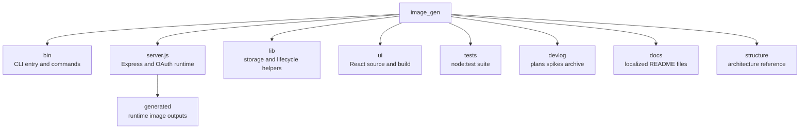

# File And Function Map

This document is a fast map of the current `ima2-gen` file layout. Use it to understand which files own which responsibilities before making changes.

The map matters because the repository looks small, but runtime responsibility is split across several areas. `server.js` is still a large central file. The CLI is split into `bin/commands/*`, and the UI is split across `ui/src/components/*`, `ui/src/lib/*`, and `ui/src/store/useAppStore.ts`. Reading responsibilities and line counts together helps reveal both impact radius and refactor targets.

Before adding a feature, choose the surface first. For CLI work, read `bin/` and `[[02-command-reference]]`. For API work, read `server.js`, `lib/*`, and `[[03-server-api]]`. For UI work, read `ui/src/` and `[[04-frontend-architecture]]`. For graph workflow work, also read `[[05-node-mode]]`.

---

## Top-Level Tree

## Core File Line Counts

| File | Lines | Responsibility |
|---|---:|---|
| `server.js` | 1124 | Express API, OAuth proxy, history, generation, edit, node mode, sessions, billing, static serving |
| `bin/ima2.js` | 346 | CLI setup, serve, status, doctor, open, reset, command dispatch |
| `bin/commands/gen.js` | 136 | CLI image-generation client |
| `bin/commands/edit.js` | 70 | CLI image-edit client |
| `bin/commands/ls.js` | 49 | History list client |
| `bin/commands/ps.js` | 46 | Inflight job list client |
| `bin/commands/show.js` | 48 | Single history item display/reveal client |
| `bin/commands/ping.js` | 28 | Server health probe client |
| `bin/lib/client.js` | 97 | Server discovery, HTTP request wrapper, response normalization |
| `bin/lib/platform.js` | 97 | Browser-open and binary-resolution helpers |
| `bin/lib/args.js` | 73 | Dependency-free argv parser |
| `bin/lib/files.js` | 39 | Data URI file conversion and output naming |
| `bin/lib/output.js` | 48 | Terminal output, JSON, exit-code mapping |
| `lib/sessionStore.js` | 231 | SQLite session and graph persistence; lightweight session-title lookup |
| `lib/assetLifecycle.js` | 120 | Soft delete, restore, node asset-missing marking |
| `lib/db.js` | 92 | SQLite bootstrap and migrations |
| `lib/nodeStore.js` | 66 | Node image and metadata load/save |
| `lib/inflight.js` | 121 | Active job registry and short-lived terminal job snapshots |
| `lib/logger.js` | 116 | Safe structured logging and redaction helpers |
| `lib/codexDetect.js` | 69 | Codex OAuth session detection helper |

## UI File Map

| Area | File | Lines | Responsibility |
|---|---|---:|---|
| App shell | `ui/src/App.tsx` | 61 | Initial hydration, polling, classic/node canvas switch |
| Entry | `ui/src/main.tsx` | 10 | React mount |
| Types | `ui/src/types.ts` | 91 | Provider, quality, size, response types |
| Store | `ui/src/store/useAppStore.ts` | 1320 | Zustand state, history, in-flight jobs, graph, session actions |
| API client | `ui/src/lib/api.ts` | 365 | Browser-side REST client |
| Style | `ui/src/index.css` | 1580 | App layout, canvas, components, node-mode styling |
| Components | `ui/src/components/*.tsx` | 1703 | Sidebar, canvas, modal, node cards, panels, controls |
| Hooks | `ui/src/hooks/*.ts` | 57 | Billing and OAuth status polling |
| i18n | `ui/src/i18n/*` | 551 | English/Korean translations and locale runtime |

## Major Components

| Component | Lines | Role |
|---|---:|---|
| `GalleryModal.tsx` | 353 | History gallery modal |
| `PromptComposer.tsx` | 182 | Prompt input and reference handling |
| `NodeCanvas.tsx` | 132 | React Flow graph canvas |
| `RightPanel.tsx` | 129 | Quality, size, format, moderation, count controls |
| `ImageNode.tsx` | 123 | Node-mode image card |
| `ProviderSelect.tsx` | 103 | OAuth/API provider display and disabled-state handling |
| `SessionPicker.tsx` | 89 | Node-mode session picker |
| `SizePicker.tsx` | 80 | Preset/custom size picker |

## Test Map

| Test | Lines | Contract covered |
|---|---:|---|
| `tests/health.test.js` | 206 | `/api/health`, advertisement, generate provider payload, terminal inflight |
| `tests/history-tombstone.test.js` | 161 | History soft delete, restore, pagination, session-title grouping |
| `tests/inflight.test.js` | 54 | Active/terminal inflight registry behavior |
| `tests/logging.test.js` | 51 | Safe log redaction and structured format |
| `tests/oauth-proxy-error-safety.test.js` | 36 | OAuth upstream error body log-safety regression |
| `tests/cli-commands.test.js` | 130 | Live CLI command behavior |
| `tests/bin.test.js` | 117 | CLI entry behavior |
| `tests/cli-lib.test.js` | 111 | Client, args, files, output helpers |
| `tests/server.test.js` | 94 | Basic server API contracts |
| `tests/size-presets.test.js` | 57 | Size preset validation |

## Refactor Signals

| Signal | Current state | Recommended docs to update |
|---|---|---|
| `server.js` is 1124 lines | API, OAuth, storage, sessions, and billing share one file | `03-server-api`, `06-infra-operations` |
| `ui/src/index.css` is 1580 lines | Layout and component styles are concentrated | `04-frontend-architecture` |
| `useAppStore.ts` is the central store | Classic, node, session, history, and toast state are together | `04-frontend-architecture`, `05-node-mode` |
| `public/index.html.legacy` remains | Active UI is `ui/dist`; legacy HTML is only an artifact | `04-frontend-architecture`, `07-devlog-map` |

## Change Checklist

- [ ] Add new files to the relevant table with their responsibilities.
- [ ] If server routes are split, update line counts and API docs together.
- [ ] If UI components are split, update the component table and frontend doc.
- [ ] If tests are added, update the test map and `06-infra-operations`.

## Change Log

- 2026-04-23: Created the first working-tree file and responsibility map.
- 2026-04-23: Translated this document from Korean to English.
- 2026-04-24: Added safe logger, terminal inflight, gallery title grouping, and related tests.

Previous document: `[[00-structure-hub]]`

Next document: `[[02-command-reference]]`
