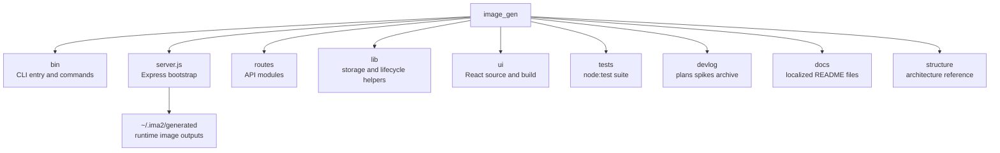

# File And Function Map

This document is a fast map of the current `ima2-gen` file layout. Use it to understand which files own which responsibilities before making changes.

The map matters because the repository looks small, but runtime responsibility is split across several areas. `server.js` is now a small bootstrap file, API ownership lives in `routes/*`, and runtime helpers live in `lib/*`. The CLI is split into `bin/commands/*`, and the UI is split across `ui/src/components/*`, `ui/src/lib/*`, and `ui/src/store/useAppStore.ts`. Reading responsibilities and line counts together helps reveal both impact radius and refactor targets.

Before adding a feature, choose the surface first. For CLI work, read `bin/` and `[[02-command-reference]]`. For API work, read `server.js`, `lib/*`, and `[[03-server-api]]`. For UI work, read `ui/src/` and `[[04-frontend-architecture]]`. For graph workflow work, also read `[[05-node-mode]]`.

---

## Top-Level Tree

## Core File Line Counts

| File | Lines | Responsibility |
|---|---:|---|
| `server.js` | 235 | Express bootstrap, middleware wiring, OAuth startup, runtime advertisement, port fallback, route registration, static serving |
| `config.js` | 253 | Centralized runtime config (env > `~/.ima2/config.json` > defaults), prompt import caps, and backward-compatible flat re-exports |
| `routes/index.js` | 33 | Route registration hub: health, storage, metadata, history, sessions, edit, nodes, generate, prompts, prompt import, and (when `features.cardNews`) cardNews |
| `routes/generate.js` | 294 | Classic generation API, model validation, reference validation, upstream validation pass-through, sidecar save |
| `routes/edit.js` | 165 | Edit API, parent image path, OAuth edit response save |
| `routes/nodes.js` | 432 | Node generation API, explicit context/search policy, SSE partial/error streaming, child references, safe retry diagnostics, node sidecar save, node fetch |
| `routes/sessions.js` | 292 | SQLite-backed session list/load/save/rename/delete, style-sheet get/put/enable/extract, graph save |
| `routes/history.js` | 143 | History list, grouped gallery, soft delete, restore, gallery favorite toggle |
| `routes/health.js` | 113 | Providers, health, OAuth status, inflight list/cancel, billing |
| `routes/storage.js` | 39 | Gallery storage status and generated-folder open action |
| `routes/metadata.js` | 71 | `/api/metadata/read` for embedded XMP image metadata extraction |
| `routes/prompts.js` | 379 | Prompt library CRUD, favorites, import/export, and folder management |
| `routes/promptImport.js` | 175 | Prompt library preview/commit import API for local/GitHub `.md`, `.markdown`, and `.txt` files |
| `routes/cardNews.js` | 183 | Dev-gated card-news templates, sets, drafts, jobs, regenerate, export (only registered when `config.features.cardNews`) |
| `bin/ima2.js` | 406 | CLI setup, serve, status, doctor, open, reset, command dispatch (`serve --dev` enables verbose diagnostics) |
| `bin/commands/gen.js` | 160 | CLI image-generation client with model, mode, moderation, and session options |
| `bin/commands/edit.js` | 100 | CLI image-edit client with model, mode, moderation, and session options |
| `bin/commands/cancel.js` | 45 | Inflight cancel client |
| `bin/commands/ls.js` | 49 | History list client |
| `bin/commands/ps.js` | 78 | Inflight job list client, including optional terminal job snapshots |
| `bin/commands/show.js` | 48 | Single history item display/reveal client |
| `bin/commands/ping.js` | 28 | Server health probe client |
| `bin/lib/client.js` | 100 | Server discovery, HTTP request wrapper, response normalization |
| `bin/lib/platform.js` | 97 | Browser-open and binary-resolution helpers |
| `bin/lib/args.js` | 73 | Dependency-free argv parser |
| `bin/lib/files.js` | 39 | Data URI file conversion and output naming |
| `bin/lib/output.js` | 58 | Terminal output, JSON, exit-code mapping |
| `bin/lib/error-hints.js` | 23 | CLI error hint formatting |
| `bin/lib/star-prompt.js` | 97 | CLI GitHub star prompt helper |
| `bin/lib/storage-doctor.js` | 38 | CLI storage doctor formatting |
| `lib/sessionStore.js` | 272 | SQLite session and graph persistence, graph parent normalization, style-sheet helpers, session-title lookup |
| `lib/styleSheet.js` | 128 | Session style-sheet extraction and prefix composition |
| `lib/assetLifecycle.js` | 123 | Soft delete, restore, node asset-missing marking |
| `lib/db.js` | 152 | SQLite bootstrap and migrations: sessions, nodes, edges, inflight, prompts, prompt folders |
| `lib/nodeStore.js` | 81 | Node image and metadata load/save |
| `lib/inflight.js` | 204 | SQLite-backed active job registry, cancel state, and short-lived terminal job snapshots |
| `lib/logger.js` | 150 | Safe structured logging, redaction, level filtering, and test sink helpers |
| `lib/requestLogger.js` | 48 | API-only request lifecycle logging and sanitized request ID middleware |
| `lib/codexDetect.js` | 69 | Codex OAuth session detection helper |
| `lib/errorClassify.js` | 100 | Upstream/OAuth error classifier for stable error codes, including provider validation errors |
| `lib/generationErrors.js` | 121 | Generation error normalization, retry classification, status mapping |
| `lib/historyList.js` | 155 | History reconstruction from generated assets, sidecars, embedded XMP metadata fallback, session-aware rows |
| `lib/storageMigration.js` | 284 | Legacy generated-folder scan and migration support |
| `lib/runtimePorts.js` | 93 | Port probing, fallback binding, and OAuth ready URL parsing |
| `lib/oauthLauncher.js` | 64 | OAuth proxy child process startup and actual ready-port capture |
| `lib/oauthProxy.js` | 600 | OAuth Responses proxy helpers, generate/edit streaming, upstream 4xx parsing, optional edit search, safe stream diagnostics |
| `lib/oauthNormalize.js` | 30 | Upstream OAuth response field normalization |
| `lib/openDirectory.js` | 45 | Cross-platform open of the generated directory (used by `/api/storage/open-generated-dir`) |
| `lib/refs.js` | 98 | Reference image validation, count/size limits |
| `lib/referenceImageCompress.js` | 75 | Sharp-based reference image compression below the configured byte cap |
| `lib/imageModels.js` | 32 | Image model allowlist and `normalizeImageModel(ctx, raw)` helper |
| `lib/imageMetadata.js` | 107 | `ima2.generation.v1` payload schema, XMP build/parse, embed limits |
| `lib/imageMetadataStore.js` | 67 | Sharp-based embed/read of XMP metadata into PNG/JPEG/WebP |
| `lib/cardNewsTemplateStore.js` | 210 | Card-news image template registry and preview reads |
| `lib/cardNewsRoleTemplateStore.js` | 47 | Built-in role-template list (`mid-5`, etc.) |
| `lib/cardNewsManifestStore.js` | 112 | Per-set manifest and sidecar persistence under `~/.ima2/generated/cardnews/` |
| `lib/cardNewsJobStore.js` | 107 | In-memory card-news job/card status, retry/finish helpers |
| `lib/cardNewsPlanner.js` | 180 | Deterministic and planner-driven card-news draft creation |
| `lib/cardNewsPlannerClient.js` | 112 | OAuth-Responses JSON planner request wrapper |
| `lib/cardNewsPlannerPrompt.js` | 60 | Card-news planner prompt builder |
| `lib/cardNewsPlannerSchema.js` | 259 | Card-news planner JSON schema, validation, and repair |
| `lib/cardNewsGenerator.js` | 162 | Card-by-card image assembly orchestrator |
| `lib/promptImport/errors.js` | 16 | Prompt import error type and detection helpers |
| `lib/promptImport/githubSource.js` | 205 | GitHub prompt source normalization, host/path validation, redirect validation, and remote text fetch |
| `lib/promptImport/parsePromptCandidates.js` | 140 | Conservative Markdown/TXT prompt candidate extraction with length and count caps |

## UI File Map

| Area | File | Lines | Responsibility |
|---|---|---:|---|
| App shell | `ui/src/App.tsx` | 116 | Initial hydration, polling, classic/node/card-news canvas switch, theme attributes, prompt library overlay |
| Entry | `ui/src/main.tsx` | 10 | React mount |
| Types | `ui/src/types.ts` | 163 | Provider, quality, size, image model, theme family, embedded metadata, response types |
| Store | `ui/src/store/useAppStore.ts` | 3374 | Zustand state for classic, node, sessions, history, in-flight jobs, errors, storage, themes, custom size, node batch selection, directional edge handles, edge disconnect, node references, node regeneration, prompt library, metadata restore |
| Card-news store | `ui/src/store/cardNewsStore.ts` | 416 | Card-news plan, role/image template selection, planner draft, job polling, regenerate actions |
| Mode/dev gates | `ui/src/lib/devMode.ts` | 10 | `IS_DEV_UI`, `ENABLE_NODE_MODE`, `ENABLE_CARD_NEWS_MODE` build-time flags |
| API client | `ui/src/lib/api.ts` | 764 | Browser-side REST client: generate, edit, history, sessions, storage, prompts, prompt folders, prompt import preview/commit, image metadata read |
| Card-news API client | `ui/src/lib/cardNewsApi.ts` | 275 | Card-news templates, draft, jobs, regenerate, set/manifest helpers |
| Node API client | `ui/src/lib/nodeApi.ts` | 148 | Node generation JSON/SSE client and node error status propagation |
| Node graph helpers | `ui/src/lib/nodeGraph.ts` | 41 | Visual-edge parent derivation and incoming-edge conflict helpers |
| Node selection | `ui/src/lib/nodeSelection.ts` | 64 | Component-based selection toggling utilities |
| Node batch | `ui/src/lib/nodeBatch.ts` | 99 | Sequential batch generation queue and stale-downstream rewiring |
| Node layout | `ui/src/lib/nodeLayout.ts` | 29 | Position-based child node placement |
| Node ref storage | `ui/src/lib/nodeRefStorage.ts` | 54 | Browser-local node reference persistence outside SQLite graph payloads |
| Custom size slots | `ui/src/lib/customSizeSlots.ts` | 62 | User-defined custom size slot persistence |
| Size helpers | `ui/src/lib/size.ts` | 280 | Preset/custom size validation, max-edge clamps |
| Image helpers | `ui/src/lib/image.ts` | 31 | Browser image utilities |
| Compression | `ui/src/lib/compress.ts` | 145 | Browser-side image compression for references and uploads |
| Cost | `ui/src/lib/cost.ts` | 55 | Quality/size cost estimation |
| Error codes | `ui/src/lib/errorCodes.ts` | 126 | Stable error code → translation key mapping |
| Error handler | `ui/src/lib/errorHandler.ts` | 23 | Routes errors to toast or persistent `ErrorCard` |
| Image models | `ui/src/lib/imageModels.ts` | 30 | UI-side image model labels |
| Storage | `ui/src/lib/storage.ts` | 25 | localStorage helpers |
| Gallery utils | `ui/src/lib/galleryUtils.ts` | 17 | Gallery navigation helpers |
| Style | `ui/src/index.css` | 5250 | App layout, canvas, components, node-mode, settings, themes, error, node batch, compact node footer, directional node handle, prompt library, prompt import dialog, card-news, gallery double-rail styling |
| Components | `ui/src/components/*.tsx` | 5263 | Sidebar, canvas, modal, node cards, batch bar, panels, controls, settings, themes, error surfaces, prompt library, prompt import dialog, gallery tiles, metadata restore, card-news workspace |
| Hooks | `ui/src/hooks/*.ts` | 57 | Billing and OAuth status polling |
| i18n | `ui/src/i18n/*` | 1599 | English/Korean translations and locale runtime |

## Major Components

| Component | Lines | Role |
|---|---:|---|
| `GalleryModal.tsx` | 542 | History gallery modal, storage recovery banner, open-folder action, gallery favorite toggle |
| `GalleryImageTile.tsx` | 67 | Per-image gallery thumbnail and selection state |
| `CardNewsGalleryTile.tsx` | 58 | Card-news set tile in the gallery |
| `PromptComposer.tsx` | 250 | Prompt input, reference handling, style-sheet entry, save-to-library |
| `PromptLibraryPanel.tsx` | 152 | Prompt library overlay/embedded panel with favorites, search, insert/load, and dialog-first import entry |
| `PromptImportDialog.tsx` | 247 | Prompt import modal/dropzone with local file preview, GitHub file preview, candidate selection, and commit |
| `PromptLibraryRow.tsx` | 75 | Single prompt-library row with actions |
| `PromptDetailModal.tsx` | 81 | Prompt detail/edit modal |
| `SavePromptPopover.tsx` | 82 | Save-current-prompt popover |
| `NodeCanvas.tsx` | 168 | React Flow graph canvas, directional handle connection routing, edge disconnect routing |
| `NodeBatchBar.tsx` | 80 | Selection-mode batch action bar inside the canvas |
| `RightPanel.tsx` | 114 | Quality, size, format, moderation, count controls |
| `ImageNode.tsx` | 355 | Node-mode image card, four-direction source/target handles, fixed-height preview, partial preview, node-local references, compact footer, regenerate/new-variant actions |
| `ProviderSelect.tsx` | 103 | OAuth/API provider display and disabled-state handling |
| `ApiDisabledModal.tsx` | 47 | Modal for the API-key-disabled policy |
| `SessionPicker.tsx` | 89 | Node-mode session picker |
| `SettingsWorkspace.tsx` | 218 | Workspace-style settings page |
| `SettingsButton.tsx` | 24 | Sidebar settings entry |
| `SizePicker.tsx` | 280 | Preset/custom size picker with custom slot management and keyboard draft |
| `ImageModelSelect.tsx` | 101 | Shared Settings/sidebar image model selector |
| `CountPicker.tsx` | 97 | Generation count picker (1–8 plus manual entry) |
| `ThemeToggle.tsx` | 117 | Theme mode and theme family selector |
| `LanguageToggle.tsx` | 26 | Locale switcher |
| `UIModeSwitch.tsx` | 47 | Classic/node/card-news mode switcher |
| `ErrorCard.tsx` | 70 | Persistent CTA error surface |
| `MetadataRestoreDialog.tsx` | 78 | Drag/drop metadata restore prompt |
| `CustomSizeConfirmModal.tsx` | 85 | Blocking confirmation for adjusted custom sizes |
| `card-news/CardNewsWorkspace.tsx` | n/a | Dev-only card-news workspace shell |

## Test Map

| Test | Lines | Contract covered |
|---|---:|---|
| `tests/health.test.js` | 245 | `/api/health`, advertisement, generate provider payload, terminal inflight |
| `tests/history-tombstone.test.js` | 159 | History soft delete, restore, pagination, session-title grouping |
| `tests/history-metadata-fallback.test.js` | 82 | History rebuild from embedded XMP metadata when sidecars are missing |
| `tests/inflight.test.js` | 68 | Active/terminal inflight registry behavior |
| `tests/inflight-persistence.test.js` | 68 | SQLite-backed inflight job recovery |
| `tests/logging.test.js` | 109 | Safe log redaction and structured format |
| `tests/request-logging.test.js` | 157 | API-only request lifecycle logging and request-id propagation |
| `tests/oauth-proxy-error-safety.test.js` | 158 | OAuth upstream error body log-safety regression |
| `tests/oauth-normalize.test.js` | 51 | OAuth response normalization |
| `tests/cli-commands.test.js` | 209 | Live CLI command behavior |
| `tests/cli-default-output-dir-contract.test.js` | 18 | CLI default `out-dir` contract |
| `tests/cli-error-hints.test.js` | 21 | CLI error hint formatting |
| `tests/cli-lib.test.js` | 111 | Client, args, files, output helpers |
| `tests/bin.test.js` | 121 | CLI entry behavior |
| `tests/server.test.js` | 94 | Basic server API contracts |
| `tests/server-fallback-contract.test.js` | 55 | Server static/SPA fallback contract |
| `tests/runtime-ports.test.js` | 51 | Server/OAuth port fallback contract |
| `tests/vite-dev-port-contract.test.js` | 39 | Vite dev proxy discovery contract |
| `tests/size-presets.test.js` | 57 | Size preset validation |
| `tests/size-custom-input-contract.test.js` | 232 | Custom size keyboard and confirmation contract |
| `tests/image-model.test.js` | 89 | Image model allowlist and route rejection contract |
| `tests/error-classify.test.js` | 72 | Error string classifier contract |
| `tests/generation-errors.test.js` | 96 | Generation error normalization, status mapping, retry classification |
| `tests/generate-route-validation-error.test.js` | 74 | Classic generate route validation error contract |
| `tests/generation-controls-ux-contract.test.js` | 116 | Right-panel generation controls UX contract |
| `tests/billing-source.test.js` | 108 | `/api/billing` `apiKeySource` contract |
| `tests/config.test.js` | 192 | Centralized config priority and shape |
| `tests/refs-size.test.js` | 70 | Reference size and count limits |
| `tests/reference-image-compress.test.js` | 52 | Sharp-based reference compression |
| `tests/style-sheet.test.js` | 88 | Session style-sheet extract/save/enable |
| `tests/style-feature-removal-contract.test.js` | 64 | Style feature removal/relocation contract |
| `tests/star-prompt.test.js` | 77 | CLI GitHub star prompt helper |
| `tests/storage-migration.test.js` | 248 | Legacy generated-folder migration scan |
| `tests/storage-open-generated-dir.test.js` | 11 | Open-generated-dir endpoint contract |
| `tests/open-directory.test.js` | 138 | Cross-platform open-directory helper |
| `tests/session-conflict.test.js` | 80 | Graph version conflict semantics |
| `tests/gallery-navigation-ux-contract.test.js` | 125 | Gallery navigation UX contract |
| `tests/ui-error-code-contract.test.js` | 32 | UI error code contract surface |
| `tests/prompt-fidelity.test.js` | 71 | Prompt fidelity contract |
| `tests/prompt-library-ui-contract.test.js` | 171 | Prompt library UI/API contract |
| `tests/prompt-import-github-contract.test.js` | 161 | Prompt import GitHub normalization, redirect safety, parser, config, and route registration contract |
| `tests/prompt-import-dialog-ui-contract.test.js` | 53 | Prompt import dialog-first UI and `.markdown` support contract |
| `tests/image-metadata-route.test.js` | 111 | `/api/metadata/read` route contract |
| `tests/image-metadata-xmp.test.js` | 74 | XMP build/parse round trip |
| `tests/image-metadata-ui-contract.test.js` | 89 | Drag/drop metadata restore UI contract |
| `tests/card-news-contract.test.js` | 478 | Card-news API and store contract |
| `tests/card-news-frontend-contract.test.js` | 209 | Card-news workspace frontend contract |
| `tests/card-news-smoke.test.js` | 107 | Card-news end-to-end smoke |
| `tests/card-news-42-43-contract.test.js` | 96 | Card-news editor polish and gallery export contract |
| `tests/node-batch-contract.test.js` | 73 | Node graph selection and batch generation contracts |
| `tests/node-edge-disconnect-contract.test.js` | 94 | Edge-only disconnect, parent metadata cleanup, reconnectable target-handle contracts |
| `tests/node-regen-actions-contract.test.js` | 40 | Ready-node regenerate/new-variant and custom-size continuation contracts |
| `tests/node-layout-contract.test.js` | 21 | Position-based node placement contract |
| `tests/node-diagnostics-contract.test.js` | 47 | Safe node retry/SSE stream diagnostics contract |
| `tests/node-child-refs-contract.test.js` | 37 | Child/edit node reference attachment contract |
| `tests/node-route-refs.test.js` | 71 | Node route reference validation and child/edit acceptance |
| `tests/node-parent-source-contract.test.js` | 69 | Graph-edge source-of-truth and server graph normalization contract |
| `tests/node-child-refs-payload.test.js` | 37 | Child reference payload and browser-local ref persistence contract |
| `tests/node-context-policy.test.js` | 28 | Node context/search policy and safe logging contract |
| `tests/node-footer-compact-contract.test.js` | 31 | Compact one-line node footer contract |
| `tests/node-streaming-sse.test.js` | 151 | Node SSE partial/done/error stream contract |
| `tests/node-pending-recovery-contract.test.js` | 72 | Pending node recovery via requestId / clientNodeId fallback |
| `tests/node-ui-contract.test.js` | 213 | Node UI handles, connection, and reconnect contract |
| `tests/node-validation-error-contract.test.js` | 101 | Upstream validation error → `INVALID_REQUEST` contract |
| `tests/package-smoke.test.js` | 88 | Publish manifest dry-run contract |
| `tests/package-install-smoke.mjs` | 202 | Optional tarball install smoke |

## Refactor Signals

| Signal | Current state | Recommended docs to update |
|---|---|---|
| `server.js` is split | Route files own API surfaces; keep route map current | `03-server-api`, `06-infra-operations` |
| `ui/src/index.css` is 5250 lines | Layout and component styles are concentrated; card-news, prompt library, prompt import dialog, gallery rail share the same file | `04-frontend-architecture` |
| `useAppStore.ts` is the central store at 3374 lines | Classic, node, session, history, prompt-library, metadata-restore, and toast state are together | `04-frontend-architecture`, `05-node-mode` |
| `cardNewsStore.ts` is a separate dev-only store at 416 lines | Card-news plan/job state is isolated from `useAppStore` | `04-frontend-architecture`, `06-infra-operations` |
| `lib/oauthProxy.js` is 600 lines | OAuth Responses streaming is the largest single helper; further split candidates | `03-server-api`, `05-node-mode` |
| `routes/prompts.js` is 379 lines | Prompt library CRUD + folders + import/export grew beyond a single concern | `03-server-api`, `04-frontend-architecture` |
| `lib/promptImport/*` cluster | Prompt source validation and parsing are split from prompt CRUD to keep PR1 import logic isolated | `03-server-api`, `04-frontend-architecture` |
| `lib/cardNews*.js` cluster | Dev-only feature isolated behind `config.features.cardNews`; not on the publish path by default | `06-infra-operations`, `07-devlog-map` |

## Change Checklist

- [ ] Add new files to the relevant table with their responsibilities.
- [ ] If server routes are split, update line counts and API docs together.
- [ ] If UI components are split, update the component table and frontend doc.
- [ ] If tests are added, update the test map and `06-infra-operations`.

## Change Log

- 2026-04-23: Created the first working-tree file and responsibility map.
- 2026-04-23: Translated this document from Korean to English.
- 2026-04-24: Added safe logger, terminal inflight, gallery title grouping, and related tests.
- 2026-04-25: Updated line counts and ownership after route decomposition, model/error/custom-size/storage work, and package smoke tests.
- 2026-04-25: Added node graph/ref helper files and contract tests for parent source-of-truth, reference payloads, context/search policy, and compact footer.
- 2026-04-26: Refreshed CLI, runtime port fallback, node layout, and test-map ownership after the 0.09.20.1 and runtime binding work.
- 2026-04-27: Updated node mode counts and responsibilities after four-direction React Flow handle support and handle-id session persistence.
- 2026-04-28: Added prompt import route/helper cluster, dialog-first prompt import UI, related tests, and refreshed line counts after PR1 GitHub/local `.md`/`.markdown`/`.txt` import.
- 2026-04-28: Added prompt library (`routes/prompts.js`, `lib/db.js` migrations, prompt UI), image metadata embed/restore (`lib/imageMetadata*.js`, `routes/metadata.js`), card-news cluster (`routes/cardNews.js`, `lib/cardNews*.js`, `ui/src/components/card-news/*`, `ui/src/store/cardNewsStore.ts`), and refreshed line counts/test map for ima2-gen 1.1.5.

Previous document: `[[00-structure-hub]]`

Next document: `[[02-command-reference]]`
