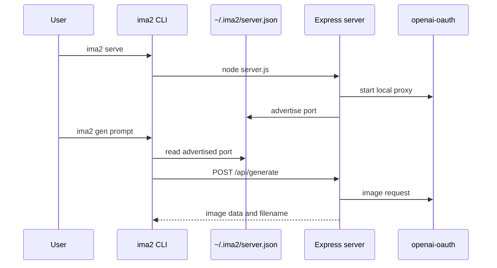

# Command Reference

The `ima2` CLI lets users configure the server, generate images, edit images, inspect history, and list active jobs without opening the browser UI. Server commands and server-client commands share the same entrypoint.

This matters because `ima2-gen` is both a browser app and an automation tool. Users can run `npx ima2-gen serve` for an instant local app, while scripts can call `ima2 gen` or `ima2 edit` against the same server. If the CLI contract drifts, README examples, tests, server discovery, and API response handling drift with it.

Before using client commands, make sure a server is running. `ima2 serve` starts the server and OAuth proxy, then advertises the actual bound URL in `~/.ima2/server.json`. Client commands such as `ima2 gen`, `ima2 edit`, `ima2 ls`, `ima2 ps`, and `ima2 ping` use that advertisement file or an override to find the server, including fallback ports when the default is busy.

---

## Execution Flow

## Server Commands

| Command | Alias | Role | Main files |
|---|---|---|---|
| `ima2 serve` | none | Run setup if needed and start the server | `bin/ima2.js`, `server.js` |
| `ima2 setup` | `login` | Configure API key or OAuth interactively | `bin/ima2.js` |
| `ima2 status` | none | Show config, provider, and OAuth session state | `bin/ima2.js`, `lib/codexDetect.js` |
| `ima2 doctor` | none | Check Node, package, node_modules, and config state | `bin/ima2.js` |
| `ima2 open` | none | Open the web UI at the default port | `bin/ima2.js`, `bin/lib/platform.js` |
| `ima2 reset` | none | Reset `~/.ima2/config.json` to an empty object | `bin/ima2.js` |
| `ima2 --version` | `-v` | Print the package version | `bin/ima2.js`, `package.json` |
| `ima2 --help` | `-h` | Print top-level help | `bin/ima2.js` |

## Client Commands

| Command | Server API | Role |
|---|---|---|
| `ima2 gen <prompt>` | `POST /api/generate` | Generate image(s) from a prompt and optional references |
| `ima2 edit <file>` | `POST /api/edit` | Edit an existing image with a prompt |
| `ima2 ls` | `GET /api/history` | List recent generations |
| `ima2 show <name>` | `GET /api/history` plus file path | Show or reveal one history item |
| `ima2 ps` | `GET /api/inflight` | List running classic/node jobs |
| `ima2 cancel <requestId>` | `DELETE /api/inflight/:requestId` | Mark a running/known job as canceled in the server registry |
| `ima2 ping` | `GET /api/health` | Check server reachability and health |

## `gen` Options

| Option | Default | Description |
|---|---|---|
| `-q`, `--quality` | `low` | Passes `low`, `medium`, `high`, or `auto` |
| `-s`, `--size` | `1024x1024` | Passes `WxH` or `auto` |
| `-n`, `--count` | `1` | Generation count; CLI clamps from 1 to 8 |
| `--ref <file>` | none | Attach a reference image; max 5 |
| `-o`, `--out <file>` | generated name | Save path for one image |
| `-d`, `--out-dir <dir>` | current directory | Save directory for multiple images |
| `--json` | false | Print machine-readable JSON |
| `--no-save` | false | Print base64 to stdout without writing files |
| `--force` | false | Allow large base64 output to a TTY |
| `--stdin` | false | Read extra prompt text from stdin |
| `--timeout <sec>` | `180` | HTTP request timeout |
| `--server <url>` | auto-discovered | Override server discovery |
| `--model <id>` | server default | Image model: `gpt-5.5`, `gpt-5.4`, `gpt-5.4-mini`, or server-rejected `gpt-5.3-codex-spark` |
| `--mode <auto|direct>` | `auto` | Prompt handling mode |
| `--moderation <auto|low>` | `low` | OAuth moderation level |
| `--session <id>` | none | Apply enabled session style sheet |

## `edit` Options

| Option | Default | Description |
|---|---|---|
| `-p`, `--prompt` | required | Edit instruction |
| `-q`, `--quality` | `low` | Edit quality |
| `-s`, `--size` | `1024x1024` | Output size |
| `-o`, `--out <file>` | generated name | Save path |
| `--json` | false | Print machine-readable JSON |
| `--timeout <sec>` | `180` | HTTP request timeout |
| `--server <url>` | auto-discovered | Target server URL |
| `--model <id>` | server default | Image model: `gpt-5.5`, `gpt-5.4`, `gpt-5.4-mini`, or server-rejected `gpt-5.3-codex-spark` |
| `--mode <auto|direct>` | `auto` | Prompt handling mode |
| `--moderation <auto|low>` | `low` | OAuth moderation level |
| `--session <id>` | none | Apply enabled session style sheet |

## `ps` Options

| Option | Default | Description |
|---|---|---|
| `--kind <classic|node>` | all | Filter running jobs by kind |
| `--session <id>` | all | Filter running jobs by session |
| `--terminal` | false | Include recently completed/error/canceled jobs |
| `--json` | false | Print machine-readable JSON |
| `--server <url>` | auto-discovered | Target server URL |

## `cancel`

`ima2 cancel <requestId>` calls `DELETE /api/inflight/:requestId`. It marks the job as canceled in the local server registry; it does not guarantee that an upstream provider request was physically killed.

## Server Discovery Priority

| Priority | Source | Description |
|---:|---|---|
| 1 | `--server <url>` | Strongest per-command override |
| 2 | `IMA2_SERVER` | Environment override for client commands |
| 3 | `~/.ima2/server.json` | URL/port advertisement written by the running server |
| 4 | `http://localhost:3333` | Default fallback |

## Exit Codes

| Code | Meaning |
|---:|---|
| 0 | Success |
| 2 | Bad CLI arguments |
| 3 | Server unreachable |
| 4 | `APIKEY_DISABLED` |
| 5 | 4xx response |
| 6 | 5xx response |
| 7 | Safety refusal |
| 8 | Timeout |

## Sync Checklist

- [ ] If top-level commands in `bin/ima2.js` change, update the server-command table.
- [ ] If `bin/commands/*.js` options change, update the option tables and README.
- [ ] If `bin/lib/client.js` discovery order changes, update this doc and `[[06-infra-operations]]`.
- [ ] If API response shape changes, update `[[03-server-api]]` and CLI normalization logic.
- [ ] If exit-code mapping changes, update README and tests.

## Change Log

- 2026-04-23: Documented the current CLI command surface and discovery contract.
- 2026-04-23: Translated this document from Korean to English.
- 2026-04-26: Added classic CLI parity options, cancel command, terminal inflight listing, and actual-port discovery notes.

Previous document: `[[01-file-function-map]]`

Next document: `[[03-server-api]]`
