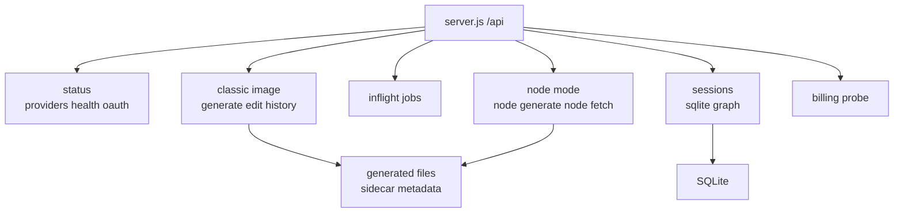

# Server API

`server.js` is the runtime center of `ima2-gen`. The browser UI and CLI both call its `/api/*` endpoints. The server manages the OAuth proxy, stores generated image files, reconstructs history, and exposes graph sessions.

This document matters because the UI and CLI share the same server contract. For example, `/api/generate` returns a different shape for single-image and multi-image responses. `/api/history` supports both a flat list and session grouping. Node mode uses separate `/api/node/generate` and `/api/sessions/*` contracts. If those differences are not documented, clients can break quietly.

When changing an API, find the endpoint here first. Then check the CLI usage in `[[02-command-reference]]`, the browser client in `[[04-frontend-architecture]]`, and the graph workflow in `[[05-node-mode]]`.

---

## API Map

## Status And Provider Endpoints

| Method | Path | Response | Description |
|---|---|---|---|
| `GET` | `/api/providers` | `{ apiKey, oauth, oauthPort, apiKeyDisabled }` | Reports available providers to the UI |
| `GET` | `/api/health` | `{ ok, version, provider, uptimeSec, activeJobs, pid, startedAt }` | Used by CLI discovery and health checks |
| `GET` | `/api/oauth/status` | `{ status, models? }` | Checks whether the OAuth proxy is ready |
| `GET` | `/api/billing` | `{ oauth, apiKeyValid, apiKeySource, credits?, costs? }` | Probes billing/model state when an API key exists |

`/api/billing` reports `apiKeySource` as `"none"`, `"env"`, or `"config"`. The UI uses this as a status signal only: an env/config API key may be detected and shown as configured, but API-key generation stays disabled unless the provider policy changes.

The live generation/edit provider is OAuth. Sending `provider: "api"` returns `403` with `APIKEY_DISABLED`. README may still mention the API-key path, but live generation endpoints hard-block API-key generation.

## Classic Generate And Edit

| Method | Path | Body | Success response |
|---|---|---|---|
| `POST` | `/api/generate` | `{ prompt, quality?, size?, format?, moderation?, provider?, n?, references?, sessionId?, clientNodeId?, requestId? }` | For `n=1`: `{ image, elapsed, filename, requestId, usage, provider, webSearchCalls, quality, size, moderation }` |
| `POST` | `/api/generate` | same body | For `n>1`: `{ images, elapsed, count, requestId, usage, provider, webSearchCalls, quality, size, moderation }` |
| `POST` | `/api/edit` | `{ prompt, image, mask?, quality?, size?, moderation?, provider?, sessionId?, requestId? }` | `{ image, elapsed, filename, usage, provider, moderation }` |

`/api/generate` accepts up to 5 `references`. `n` is clamped from 1 to 8. Result files are written to `generated/`, and sidecar JSON stores prompt, quality, size, format, moderation, provider, usage, and web search counts.

## History And Asset Lifecycle

| Method | Path | Query or body | Response |
|---|---|---|---|
| `GET` | `/api/history` | `limit`, `since`, `before`, `beforeFilename`, `sessionId` | `{ items, total, nextCursor }` |
| `GET` | `/api/history` | `groupBy=session` | `{ sessions, loose, total, nextCursor }` |
| `DELETE` | `/api/history/:filename` | none | `{ ok, trashId, filename, unlinkAt, sessionsTouched, nodesTouched }` |
| `POST` | `/api/history/:filename/restore` | `{ trashId }` | `{ ok }` |

History is reconstructed from image files and sidecar JSON under `generated/`. Delete is a soft-delete into `.trash/`, not an immediate permanent removal. Restore uses the returned `trashId`.

When `groupBy=session` is used, session groups include `title` and `label` when the session still exists in SQLite. The gallery should prefer the title and only fall back to the short server session id.

## Inflight Jobs

| Method | Path | Query | Response |
|---|---|---|---|
| `GET` | `/api/inflight` | `kind`, `sessionId` | `{ jobs }` |
| `GET` | `/api/inflight` | `kind`, `sessionId`, `includeTerminal=1` | `{ jobs, terminalJobs }` |
| `DELETE` | `/api/inflight/:requestId` | none | `204 No Content` |

The inflight registry tracks both classic and node jobs. The default response is active-only so the UI never renders completed jobs as still running. `includeTerminal=1` is an opt-in debug surface that keeps recent completed/error/canceled jobs briefly for request tracing.

## Node Mode API

| Method | Path | Body or query | Response |
|---|---|---|---|
| `POST` | `/api/node/generate` | `{ parentNodeId?, prompt, quality?, size?, format?, moderation?, references?, externalSrc?, sessionId?, clientNodeId?, requestId?, provider? }` | `{ nodeId, parentNodeId, requestId, image, filename, url, elapsed, usage, webSearchCalls, provider, moderation }` |
| `GET` | `/api/node/:nodeId` | none | `{ nodeId, meta, url }` |

When `parentNodeId` is present, the server reads the stored parent image and uses the edit path. Without a parent node, it generates a new image. `externalSrc` is a controlled fallback for promoting an existing history asset into a node workflow.

## Session DB API

| Method | Path | Body or header | Response |
|---|---|---|---|
| `GET` | `/api/sessions` | none | `{ sessions }` |
| `POST` | `/api/sessions` | `{ title }` | `{ session }` |
| `GET` | `/api/sessions/:id` | none | `{ session }` |
| `PATCH` | `/api/sessions/:id` | `{ title }` | `{ ok: true }` |
| `DELETE` | `/api/sessions/:id` | none | `{ ok: true }` |
| `PUT` | `/api/sessions/:id/graph` | `If-Match` header, `{ nodes, edges }` | `{ ok, nodes, edges, graphVersion }` |

Graph saving uses optimistic concurrency. Missing `If-Match` returns `428`. Version mismatch returns an error payload with the current version.

## Error States

| Case | Status | Code or message |
|---|---:|---|
| Missing prompt | 400 | `Prompt is required` |
| Invalid or too many references | 400 | `INVALID_REFS` or string error |
| Invalid moderation | 400 | `INVALID_MODERATION` or string error |
| API-key provider requested | 403 | `APIKEY_DISABLED` |
| Safety refusal | 422 | `SAFETY_REFUSAL` |
| Missing graph version header | 428 | `GRAPH_VERSION_REQUIRED` |
| Graph too large | 413 | `GRAPH_TOO_LARGE` |
| Missing node metadata | 404 | `NODE_NOT_FOUND` |

## Observability Contract

Server logs use compact structured lines such as `[node.request] requestId="..." quality="medium"`. Generation, edit, node, OAuth stream, inflight, history, and session graph saves should carry the same `requestId` where available.

Logs must never include raw prompts, effective prompts, revised prompts, OAuth/API tokens, authorization headers, cookies, raw request bodies, reference data URLs, generated base64, or raw upstream response bodies. Use counts and sizes instead: `promptChars`, `refs`, `imageChars`, `durationMs`, `httpStatus`, and `errorCode`.

## Sync Checklist

- [ ] If an endpoint is added, update this doc and `ui/src/lib/api.ts`.
- [ ] If a CLI-called endpoint changes, update `[[02-command-reference]]`.
- [ ] If error shape is standardized, check all error tables and UI toast handling.
- [ ] If the session graph contract changes, update `[[05-node-mode]]`.
- [ ] If `server.js` is split into route files, update line counts in `[[01-file-function-map]]`.

## Change Log

- 2026-04-23: Documented the current `server.js` endpoint surface and response shapes.
- 2026-04-23: Translated this document from Korean to English.
- 2026-04-24: Added observability, terminal inflight, and gallery session-title response notes.

Previous document: `[[02-command-reference]]`

Next document: `[[04-frontend-architecture]]`
