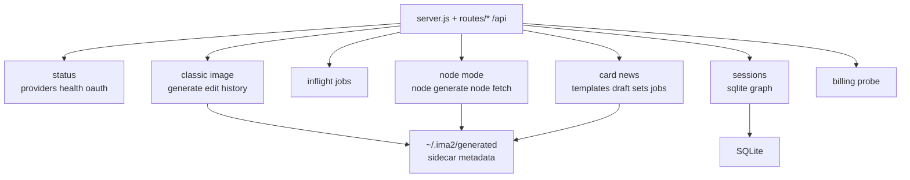

# Server API

`server.js` is the runtime bootstrap for `ima2-gen`. The browser UI and CLI both call `/api/*` endpoints registered from `routes/*`. The server starts the OAuth proxy, serves the built UI, wires route modules, stores generated image files under the configured generated directory, reconstructs history, and exposes graph sessions.

This document matters because the UI and CLI share the same server contract. For example, `/api/generate` returns a different shape for single-image and multi-image responses. `/api/history` supports both a flat list and session grouping. Node mode uses separate `/api/node/generate` and `/api/sessions/*` contracts. If those differences are not documented, clients can break quietly.

When changing an API, find the endpoint here first. Then check the CLI usage in `[[02-command-reference]]`, the browser client in `[[04-frontend-architecture]]`, and the graph workflow in `[[05-node-mode]]`.

---

## API Map

## Status And Provider Endpoints

| Method | Path | Response | Description |
|---|---|---|---|
| `GET` | `/api/providers` | `{ apiKey, oauth, oauthPort, apiKeyDisabled }` | Reports available providers to the UI |
| `GET` | `/api/health` | `{ ok, version, provider, uptimeSec, activeJobs, pid, startedAt }` | Used by CLI discovery and health checks |
| `GET` | `/api/oauth/status` | `{ status, models? }` | Checks whether the OAuth proxy is ready |
| `GET` | `/api/billing` | `{ oauth, apiKeyValid, apiKeySource, credits?, costs? }` | Probes billing/model state when an API key exists |
| `GET` | `/api/storage/status` | `{ ok, data: { generatedDirLabel, generatedCount, legacyCandidatesScanned, legacySourcesFound, legacyFilesFound, state, messageKind, recoveryDocsPath, doctorCommand, overrides } }` | Summarizes gallery storage and legacy recovery state for UI support banners |
| `POST` | `/api/storage/open-generated-dir` | `{ ok }` | Opens only the configured generated image folder in the local OS file manager |

`/api/billing` reports `apiKeySource` as `"none"`, `"env"`, or `"config"`. The UI uses this as a status signal only: an env/config API key may be detected and shown as configured, but API-key generation stays disabled unless the provider policy changes.

The live generation/edit provider is OAuth. Sending `provider: "api"` returns `403` with `APIKEY_DISABLED`. README may still mention the API-key path, but live generation endpoints hard-block API-key generation.

Storage endpoints are local-support helpers. `/api/storage/open-generated-dir` never accepts a browser-supplied path; it opens `ctx.config.storage.generatedDir` only.

## Classic Generate And Edit

| Method | Path | Body | Success response |
|---|---|---|---|
| `POST` | `/api/generate` | `{ prompt, quality?, size?, format?, moderation?, model?, provider?, n?, references?, sessionId?, clientNodeId?, requestId? }` | For `n=1`: `{ image, elapsed, filename, requestId, usage, provider, webSearchCalls, quality, size, moderation, model }` |
| `POST` | `/api/generate` | same body | For `n>1`: `{ images, elapsed, count, requestId, usage, provider, webSearchCalls, quality, size, moderation }` |
| `POST` | `/api/edit` | `{ prompt, image, mask?, quality?, size?, moderation?, model?, provider?, sessionId?, requestId? }` | `{ image, elapsed, filename, usage, provider, moderation, model }` |

`/api/generate` accepts up to 5 `references`. `n` is clamped from 1 to 8. Result files are written to the configured generated directory, usually `~/.ima2/generated`, and sidecar JSON stores prompt, quality, size, format, moderation, model, provider, usage, and web search counts.

Image generation model selection is explicit. If omitted, the server defaults to `gpt-5.4-mini`. Supported image models are `gpt-5.4-mini`, `gpt-5.4`, and `gpt-5.5`. `gpt-5.3-codex-spark` can appear in OAuth model status, but it does not support the `image_generation` tool, so generation endpoints reject it with `IMAGE_MODEL_UNSUPPORTED` before calling OAuth.

## History And Asset Lifecycle

| Method | Path | Query or body | Response |
|---|---|---|---|
| `GET` | `/api/history` | `limit`, `since`, `before`, `beforeFilename`, `sessionId` | `{ items, total, nextCursor }` |
| `GET` | `/api/history` | `groupBy=session` | `{ sessions, loose, total, nextCursor }` |
| `DELETE` | `/api/history/:filename` | none | `{ ok, trashId, filename, unlinkAt, sessionsTouched, nodesTouched }` |
| `POST` | `/api/history/:filename/restore` | `{ trashId }` | `{ ok }` |

History is reconstructed from image files and sidecar JSON under the configured generated directory. Delete is a soft-delete into `.trash/`, not an immediate permanent removal. Restore uses the returned `trashId`.

When `groupBy=session` is used, session groups include `title` and `label` when the session still exists in SQLite. The gallery should prefer the title and only fall back to the short server session id.

## Inflight Jobs

| Method | Path | Query | Response |
|---|---|---|---|
| `GET` | `/api/inflight` | `kind`, `sessionId` | `{ jobs }` |
| `GET` | `/api/inflight` | `kind`, `sessionId`, `includeTerminal=1` | `{ jobs, terminalJobs }` |
| `DELETE` | `/api/inflight/:requestId` | none | `204 No Content` |

The inflight registry tracks both classic and node jobs. The default response is active-only so the UI never renders completed jobs as still running. `includeTerminal=1` is an opt-in debug surface that keeps recent completed/error/canceled jobs briefly for request tracing.

## Node Mode API

| Method | Path | Body or query | Response |
|---|---|---|---|
| `POST` | `/api/node/generate` | `{ parentNodeId?, prompt, quality?, size?, format?, moderation?, model?, references?, externalSrc?, sessionId?, clientNodeId?, requestId?, provider? }` | `{ nodeId, parentNodeId, requestId, image, filename, url, elapsed, usage, webSearchCalls, provider, moderation, model, refsCount }` |
| `GET` | `/api/node/:nodeId` | none | `{ nodeId, meta, url }` |

When `parentNodeId` is present, the server reads the stored parent image and uses the edit path. Without a parent node, it generates a new image and may pass root-node `references` to OAuth generation. `refsCount` is stored as numeric metadata only; reference image base64 is not written to sidecars. `externalSrc` is a controlled fallback for promoting an existing history asset into a node workflow.

`/api/node/generate` also supports an SSE response when the client sends `Accept: text/event-stream`. In that mode validation still happens before headers are opened. After the stream opens, the server may emit `phase`, `partial`, `done`, and `error` events. Root generation opts into OAuth `partial_images: 2`; child/edit generation stays final-only for now. Clients must treat partial events as progressive previews only and use the `done` payload as the canonical saved node.

Node sidecars include `requestId` as recovery metadata. `/api/history` exposes the same field so a reloaded graph can match completed assets by request id before falling back to `(sessionId, clientNodeId, createdAt)`.

## Card News Dev API

Card News is a dev-gated MVP surface. It is intended for `npm run dev` product-flow validation before packaging and global install concerns are solved.

| Method | Path | Body or query | Response |
|---|---|---|---|
| `GET` | `/api/cardnews/image-templates` | none | `{ templates }` |
| `GET` | `/api/cardnews/image-templates/:templateId/preview` | none | PNG preview |
| `GET` | `/api/cardnews/role-templates` | none | `{ templates }` |
| `POST` | `/api/cardnews/draft` | `{ topic, audience?, goal?, contentBrief?, imageTemplateId, roleTemplateId, size }` | `{ plan: CardNewsPlan, planner? }` |
| `POST` | `/api/cardnews/generate` | `CardNewsPlan & { quality, moderation, model?, sessionId? }` | `{ setId, manifest, cards }` |
| `POST` | `/api/cardnews/cards/:cardId/regenerate` | `{ setId, card, cards?, quality, moderation, model? }` | set-level `{ setId, manifest, cards }` |
| `GET` | `/api/cardnews/sets` | none | `{ sets }` |
| `GET` | `/api/cardnews/sets/:setId` | none | `{ plan: CardNewsPlan }` |
| `POST` | `/api/cardnews/jobs` | `CardNewsPlan` | `202 { jobId, setId, status, total, generated, errors, cards }` |
| `GET` | `/api/cardnews/jobs/:jobId` | none | job summary or `404 CARD_NEWS_JOB_NOT_FOUND` |
| `POST` | `/api/cardnews/jobs/:jobId/retry` | `{ cardIds }` | `202` job summary or `404 CARD_NEWS_JOB_NOT_FOUND` |

`/api/cardnews/draft` is text-only. It first tries Responses Structured Outputs when enabled. If the local OAuth-compatible endpoint rejects that format, it falls back to chat-completions JSON mode, then validates and repairs the JSON locally. It returns `PLANNER_*` errors unless deterministic fallback is explicitly enabled in config. It never calls image-generation tools.

Card News generation is template-guided parallel i2i. The template PNG is a style/reference input; output size is supplied separately by the UI. One card failure does not reject the whole set. Failed cards are returned with `status: "error"` and a sidecar; successful cards write `card-XX.png` plus `card-XX.json`. The set writes `manifest.json` with `kind: "card-news-set"`.

History reconstruction recognizes both `card-news-card` sidecars and `card-news-set` manifests. Gallery clients can show individual card rows or open a set through `GET /api/cardnews/sets/:setId`.

## Session DB API

| Method | Path | Body or header | Response |
|---|---|---|---|
| `GET` | `/api/sessions` | none | `{ sessions }` |
| `POST` | `/api/sessions` | `{ title }` | `{ session }` |
| `GET` | `/api/sessions/:id` | none | `{ session }` |
| `PATCH` | `/api/sessions/:id` | `{ title }` | `{ ok: true }` |
| `DELETE` | `/api/sessions/:id` | none | `{ ok: true }` |
| `PUT` | `/api/sessions/:id/graph` | `If-Match` header, `{ nodes, edges }` | `{ ok, nodes, edges, graphVersion }` |

Graph saving uses optimistic concurrency. Missing `If-Match` returns `428`. Version mismatch returns an error payload with the current version.

`GRAPH_VERSION_CONFLICT` only means the client saved against a stale `If-Match` graph version. It is not proof that another browser tab edited the graph; a delayed debounce, recovered node save, or session switch flush can also surface the same response. The UI should therefore use source-neutral language such as "graph version changed" unless a separate tab identity protocol proves otherwise.

Graph saves may include observability headers: `X-Ima2-Graph-Save-Id`, `X-Ima2-Graph-Save-Reason`, and `X-Ima2-Tab-Id`. The server logs these values for `graph_save` and `graph_conflict` events but must not treat them as authorization or correctness inputs.

## Error States

| Case | Status | Code or message |
|---|---:|---|
| Missing prompt | 400 | `Prompt is required` |
| Invalid or too many references | 400 | `INVALID_REFS` or string error |
| Invalid moderation | 400 | `INVALID_MODERATION` or string error |
| Invalid image model | 400 | `INVALID_IMAGE_MODEL` |
| Unsupported OAuth model for image generation | 400 | `IMAGE_MODEL_UNSUPPORTED` |
| API-key provider requested | 403 | `APIKEY_DISABLED` |
| Safety refusal | 422 | `SAFETY_REFUSAL` |
| Moderation/content refusal | 422 or upstream mapped error | `MODERATION_REFUSED` |
| OAuth session expired | upstream mapped error | `AUTH_CHATGPT_EXPIRED` |
| Network/proxy failure | upstream mapped error | `NETWORK_FAILED` or `OAUTH_UNAVAILABLE` |
| Missing graph version header | 428 | `GRAPH_VERSION_REQUIRED` |
| Graph too large | 413 | `GRAPH_TOO_LARGE` |
| Missing node metadata | 404 | `NODE_NOT_FOUND` |
| Missing Card News job | 404 | `CARD_NEWS_JOB_NOT_FOUND` |
| Planner upstream failure | 502 or mapped status | `PLANNER_UPSTREAM_FAILED` |
| Planner invalid JSON/schema | 422 | `PLANNER_INVALID_JSON` or `PLANNER_SCHEMA_INVALID` |

## Observability Contract

Server logs use compact structured lines such as `[node.request] requestId="..." quality="medium"`. Every `/api/*` request receives a sanitized `X-Request-Id` response header. If the client sends a safe `X-Request-Id` (`A-Z`, `a-z`, `0-9`, `.`, `_`, `:`, `-`, max 128 chars), the server echoes it; otherwise the server replaces it with `req_<uuid>`. Non-API static files and `/generated/*` assets are not mutated by the request logger.

Generation, edit, node, OAuth stream, inflight, history, and session graph saves should carry the same `requestId` where available. Classic and node generation routes fall back to `req.id` when the JSON body does not provide a `requestId`.

Logs must never include raw prompts, effective prompts, revised prompts, OAuth/API tokens, authorization headers, cookies, raw request bodies, reference data URLs, generated base64, or raw upstream response bodies. Use counts and sizes instead: `promptChars`, `refs`, `imageChars`, `durationMs`, `httpStatus`, and `errorCode`.

## Sync Checklist

- [ ] If an endpoint is added, update this doc and `ui/src/lib/api.ts`.
- [ ] If a CLI-called endpoint changes, update `[[02-command-reference]]`.
- [ ] If error shape is standardized, check all error tables and UI toast handling.
- [ ] If the session graph contract changes, update `[[05-node-mode]]`.
- [ ] If `server.js` is split into route files, update line counts in `[[01-file-function-map]]`.

## Change Log

- 2026-04-23: Documented the current `server.js` endpoint surface and response shapes.
- 2026-04-23: Translated this document from Korean to English.
- 2026-04-24: Added node SSE partial streaming, requestId sidecar/history recovery, observability, terminal inflight, and gallery session-title response notes.
- 2026-04-24: Added explicit image model selection contract for classic, edit, and node generation.
- 2026-04-24: Clarified source-neutral `GRAPH_VERSION_CONFLICT` semantics and graph save metadata headers.
- 2026-04-25: Updated server ownership after route decomposition and clarified generated-directory storage plus error-code UX contracts.
- 2026-04-25: Documented sanitized API request IDs and API-only request logging.
- 2026-04-25: Added Card News dev API, planner JSON, set manifest history, and job summary contracts.

Previous document: `[[02-command-reference]]`

Next document: `[[04-frontend-architecture]]`
