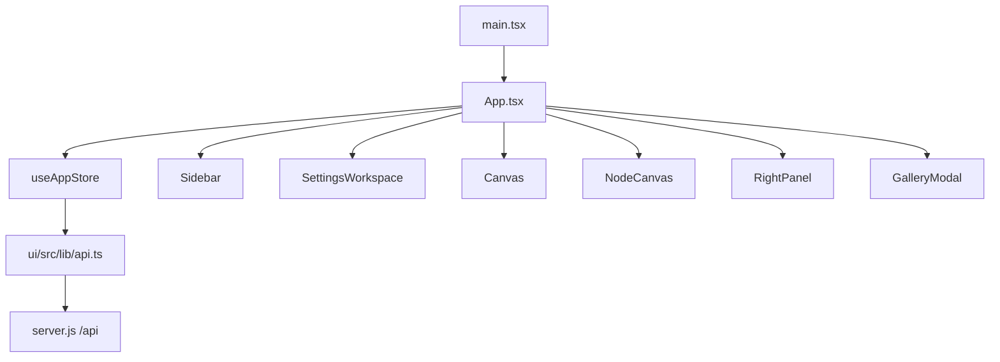

# Frontend Architecture

The current `ima2-gen` web UI is the React app under `ui/src/`. The server serves the built bundle under `ui/dist/`. The old single-file HTML UI remains as `public/index.html.legacy`, but it is not the active entrypoint.

This matters because README and older devlog entries still contain traces of the vanilla HTML UI. Actual UI work should target React components, the Zustand store, `ui/src/lib/api.ts`, and `ui/src/index.css`. Fixing the legacy HTML file will not change the active app.

Start UI work at `App.tsx` to understand how classic canvas and node canvas diverge. Server calls are in `ui/src/lib/api.ts`. State is centralized in `ui/src/store/useAppStore.ts`. For screen-level structure, start with `Sidebar`, `Canvas`, `NodeCanvas`, `RightPanel`, and `GalleryModal`.

---

## Render Flow

`App.tsx` hydrates history, loads sessions, reconciles inflight jobs, starts polling on mount, and syncs theme preference. If settings are open, it renders `SettingsWorkspace` in the center slot. Otherwise, if UI mode is `classic`, it renders `Canvas`; if node mode is enabled and UI mode is `node`, it renders `NodeCanvas`. Node mode is enabled in packaged builds by default and can be hidden only by building with `VITE_IMA2_NODE_MODE=0`. Before unload or visibility changes, it flushes the graph save beacon.

Settings are a workspace replacement, not a modal overlay. `SettingsButton` lives next to the `ima2-gen` title in the sidebar. The compact image model selector also lives in this header as a fast switcher, while Settings shows the same choice with full model names. `SettingsWorkspace` keeps the outer shell fixed so the header and `X` close button do not scroll away; only the section index and content pane scroll. Selecting an item jumps the center document to that section instead of replacing the content panel. `SettingsWorkspace` closes with `X` or Escape and returns to the previous canvas path without mutating generation state.

## Major Areas

| Area | Main files | Responsibility |
|---|---|---|
| App shell | `ui/src/App.tsx` | Initialization, storage sync, beforeunload save, canvas/settings switch |
| Left panel | `Sidebar.tsx`, `PromptComposer.tsx`, `SettingsButton.tsx` | Focused generation entry plus settings access |
| Center workspace | `Canvas.tsx`, `NodeCanvas.tsx`, `SettingsWorkspace.tsx`, `ImageNode.tsx` | Classic image display, graph canvas, or settings workspace |
| Right panel | `RightPanel.tsx`, `SizePicker.tsx`, `CostEstimate.tsx` | Quality, size, format, moderation, count |
| History | `HistoryStrip.tsx`, `GalleryModal.tsx`, `ResultActions.tsx` | Saved image browsing and actions |
| Status | `InFlightList.tsx`, `Toast.tsx`, `BillingBar.tsx`, `AccountSettings.tsx` | Pending jobs, notifications, billing/provider status |
| i18n | `ui/src/i18n/index.ts`, `ko.json`, `en.json` | Locale load/save and translation lookup |

## State Model

| State group | Location | Description |
|---|---|---|
| Generation options | `useAppStore.ts` | Provider, quality, size, format, moderation, image model, count |
| Prompt/reference | `useAppStore.ts` | Prompt, reference images, add/remove/clear helpers |
| Classic history | `useAppStore.ts` plus `/api/history` | Current image, history, gallery |
| Inflight | `useAppStore.ts` plus `/api/inflight` | localStorage-backed pending jobs and polling |
| Node graph | `useAppStore.ts` plus sessions API | Nodes, edges, graphVersion, session actions |
| Settings workspace | `useAppStore.ts` | `settingsOpen` and active settings section |
| UI preferences | `localStorage` | Right panel state, UI mode, selected filename, locale, theme |

The image model preference is stored in `localStorage` as `ima2.imageModel`. Sidebar compact labels (`5.4m`, `5.4`, `5.5`) and Settings full labels (`GPT-5.4 Mini`, `GPT-5.4`, `GPT-5.5`) both read/write the same store field, so the next classic or node request sends the selected `model` instead of falling back to the default. The sidebar selector is intentionally tiny: the closed state shows only the compact label, opens a custom menu on click, and closes on outside click or Escape.

Visible metadata should carry the selected model too. Current result metadata, hydrated history items, and ready node status labels use the server-returned or sidecar-restored `model` so UI debugging matches backend logs. The visible metadata uses compact aliases to preserve elapsed time: model aliases are `5.4m`/`5.4`/`5.5`, and quality aliases are `l`/`m`/`h`.

## API Client

| Function | Endpoint | Used by |
|---|---|---|
| `postGenerate` | `POST /api/generate` | Classic generation |
| `postEdit` | `POST /api/edit` | Edit flow |
| `getHistory` | `GET /api/history` | History strip and gallery |
| `getHistoryGrouped` | `GET /api/history?groupBy=session` | Session-grouped history |
| `deleteHistoryItem` | `DELETE /api/history/:filename` | Asset delete |
| `restoreHistoryItem` | `POST /api/history/:filename/restore` | Undo/restore |
| `getInflight` | `GET /api/inflight` | Pending reconciliation |
| `postNodeGenerate` | `POST /api/node/generate` | Node-mode generation |
| `postNodeGenerateStream` | `POST /api/node/generate` with `Accept: text/event-stream` | Node-mode partial preview streaming |
| Session helpers | `/api/sessions/*` | Graph session list/load/save |
| `getOAuthStatus` | `GET /api/oauth/status` | Provider readiness |
| `getBilling` | `GET /api/billing` | Billing bar and API status |

## Classic UI And Node UI

| Mode | Condition | Main component | State flow |
|---|---|---|---|
| Classic | Default UI | `Canvas.tsx` | Sends prompt to `/api/generate`, then updates current image/history |
| Node | Product feature enabled | `NodeCanvas.tsx` | Calls `/api/node/generate` per node, renders partial previews when streamed, and saves the graph to the session |

Node mode uses `@xyflow/react`. Empty canvas creates a root node. Dragging an edge from an existing node can create a child node. Session loading displays a canvas overlay.

Node generation uses SSE first through `postNodeGenerateStream()`. Partial images are stored only in transient `ImageNodeData.partialImageUrl`; they are deleted from the graph save payload. The final `done` payload replaces the preview with the canonical saved file URL. If the server returns JSON instead of SSE, the client falls back to the final-only behavior.

## Style And Layout

| File | Current signal | Caution |
|---|---|---|
| `ui/src/index.css` | 1580 lines | Large structural changes can easily create CSS drift |
| `ui/src/components/*.tsx` | 1703 lines | Component class names and CSS are tightly coupled |
| `ui/dist/` | Build output | Do not edit directly |
| `public/index.html.legacy` | Legacy artifact | Do not use it as the source for new active UI behavior |

## Change Checklist

- [ ] If a new API call is added, update `ui/src/lib/api.ts` and `[[03-server-api]]`.
- [ ] If store shape changes, check classic, node, and localStorage migration paths.
- [ ] If node-mode UI changes, update `[[05-node-mode]]`.
- [ ] Record major CSS changes alongside component ownership.
- [ ] If a change references legacy HTML, re-check it against the active UI.

## Change Log

- 2026-04-23: Documented the active React UI architecture.
- 2026-04-23: Translated this document from Korean to English.
- 2026-04-24: Documented node SSE partial preview rendering and JSON fallback.
- 2026-04-24: Documented shared sidebar/settings image model selection.

Previous document: `[[03-server-api]]`

Next document: `[[05-node-mode]]`
