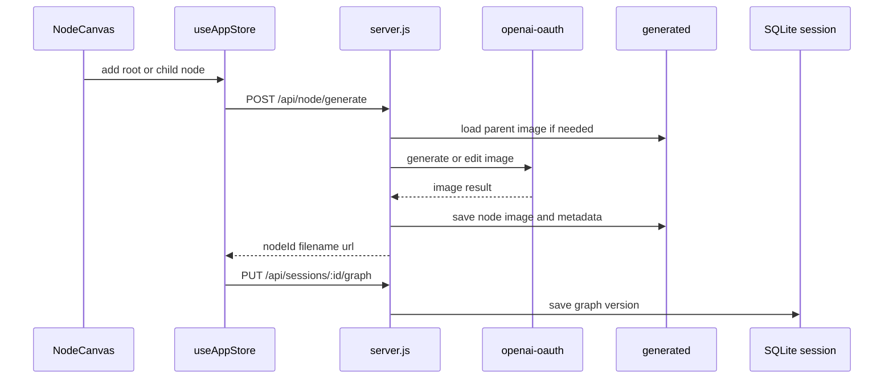

# Node Mode

Node mode extends `ima2-gen` from a single-image generator into a graph-based image workspace. Users can create a root image, branch from it, and generate or edit child images. The UI is based on `@xyflow/react`, while the server provides node-level generation and session graph persistence.

This mode matters because it is the likely center of future workflows. Classic UI revolves around one prompt and a list of image results. Node mode can represent lineage, retries, comparisons, research mode, and card-news flows as a graph. That connects API contracts, store state, session DB, and asset lifecycle.

To understand node mode, start with three files. `NodeCanvas.tsx` owns graph interaction. `ImageNode.tsx` renders the prompt, image, pending, stale, and error state of each node. `server.js` owns `/api/node/generate` and `/api/sessions/*`, which produce node images and persist graph state.

---

## Node Generation Flow

## Key Files

| File | Role |
|---|---|
| `ui/src/components/NodeCanvas.tsx` | React Flow wrapper, node/edge changes, child-node gesture |
| `ui/src/components/ImageNode.tsx` | Node card UI, status display, image rendering |
| `ui/src/components/SessionPicker.tsx` | Session selection and creation UX |
| `ui/src/store/useAppStore.ts` | `graphNodes`, `graphEdges`, `graphVersion`, session actions |
| `ui/src/lib/graph.ts` | Client node IDs and initial-position helpers |
| `ui/src/lib/api.ts` | Node generation and session API client |
| `server.js` | `/api/node/generate`, `/api/node/:nodeId`, `/api/sessions/*` |
| `lib/nodeStore.js` | Node image and metadata storage |
| `lib/sessionStore.js` | SQLite sessions, nodes, edges, graphVersion |
| `lib/assetLifecycle.js` | Keeps node state coherent when assets are deleted |

## Node State Model

| State | Meaning | Expected UI behavior |
|---|---|---|
| `empty` | Node has no image yet | Prompt input or generation can start |
| `pending` | Generation request is running | Spinner and pending phase are shown |
| `reconciling` | UI is syncing with server inflight state after refresh | Temporary sync state is shown |
| `ready` | Image and metadata exist | Preview and child generation are available |
| `stale` | Saved graph and server asset state differ | Show warning or retry guidance |
| `asset-missing` | Graph exists but image file is gone | Offer recovery or cleanup guidance |
| `error` | Generation failed | Show error and retry entry |

## API Contract

| Endpoint | Role | Key fields |
|---|---|---|
| `POST /api/node/generate` | Generate/edit one node | `parentNodeId`, `prompt`, `quality`, `size`, `format`, `moderation`, `references`, `sessionId`, `clientNodeId`, `requestId` |
| `GET /api/node/:nodeId` | Fetch node metadata | `nodeId`, `meta`, `url` |
| `GET /api/sessions` | List sessions | `sessions` |
| `POST /api/sessions` | Create a session | `title` |
| `GET /api/sessions/:id` | Load a session and graph | `session` |
| `PUT /api/sessions/:id/graph` | Save graph snapshot | `If-Match`, `nodes`, `edges` |

`PUT /api/sessions/:id/graph` uses version-based saving. The client sends the current `graphVersion` in the `If-Match` header. The server returns the new `graphVersion` on success.

## Parent And External Source Inputs

| Input | Server behavior | Used when |
|---|---|---|
| `parentNodeId` present | Load stored parent node image and use the edit path | Generating a child node |
| `parentNodeId` absent | Generate a new image from prompt and references | Generating a root node |
| `externalSrc` present | Read an existing asset from `generated/` | Promoting a history image into the graph |

## Difference From Classic Mode

| Topic | Classic | Node mode |
|---|---|---|
| Primary unit | Current image and history | Nodes and edges |
| Generation endpoint | `/api/generate` | `/api/node/generate` |
| Storage | Sidecar JSON and flat history | Node metadata and session graph |
| Restore path | `/api/history`, localStorage selected item | `/api/sessions/:id`, graphVersion |
| Pending display | In-flight list | Per-node status |

## Change Checklist

- [ ] If `ImageNodeData` shape changes, check session save, restore, and API types.
- [ ] If `/api/node/generate` response changes, update `ui/src/lib/api.ts` and this doc.
- [ ] If graph save policy changes, check `If-Match` version behavior and tests.
- [ ] If asset delete/restore changes, review `asset-missing` state and history docs.
- [ ] If node mode becomes part of npm-published UI, update build/package rules in `[[06-infra-operations]]`.

## Change Log

- 2026-04-23: Documented the implemented node canvas, node API, and session persistence structure.
- 2026-04-23: Translated this document from Korean to English.

Previous document: `[[04-frontend-architecture]]`

Next document: `[[06-infra-operations]]`
