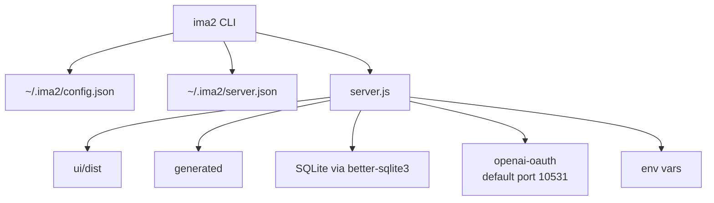

# Infrastructure And Operations

`ima2-gen` operates as an npm package, local Node server, OAuth proxy, SQLite-backed graph store, image file store, and React build artifact. Users see one CLI, but internally the server, UI bundle, local config, and runtime data move together.

This document matters because development mode and packaged mode take different paths. Developers run `npm run dev`, which builds the UI with a dev flag and launches the watched server. Users run `ima2 serve`, which checks for `ui/dist` and starts the server. CLI clients read `~/.ima2/server.json` to find the running server. Config and generated data are split between the repo and the user's home directory.

For operations work, choose the layer first. Auth and provider changes touch config and the OAuth proxy. Release work touches `package.json`, `files`, and `prepublishOnly`. Test work touches `scripts/run-tests.mjs` and `tests/*.test.js`. UI build work touches `ui/package.json` and `ui/dist`.

---

## Runtime Layout

## Package Contract

| Item | Current value |
|---|---|
| package name | `ima2-gen` |
| version | `1.0.5` |
| type | `module` |
| bin | `ima2` -> `./bin/ima2.js` |
| package engine | `node >=20` |
| publish files | `bin/`, `lib/`, `ui/dist/`, `assets/`, `server.js`, `.env.example`, `README.md` |
| major dependencies | `express`, `openai`, `openai-oauth`, `better-sqlite3`, `dotenv`, `ulid` |

README may still mention a different Node baseline. The operational baseline is the current `engines.node` field in `package.json`.

## Script Surface

| Script | Runs | Purpose |
|---|---|---|
| `npm start` | `node bin/ima2.js serve` | Start the server like a user would |
| `npm run dev` | `node scripts/dev.mjs` | Build UI with dev flag, then run watched server |
| `npm run dev:server` | `node --watch server.js` | Watch only the server |
| `npm run ui:install` | `cd ui && npm install` | Install UI dependencies |
| `npm run ui:dev` | `cd ui && npm run dev` | Vite dev server |
| `npm run ui:build` | `cd ui && npm run build` | TypeScript build and Vite build |
| `npm run build` | `npm run ui:build` | Build UI bundle before publish |
| `npm test` | `node scripts/run-tests.mjs` | Run `tests/*.test.js` with `node:test` |
| `npm run setup` | `node bin/ima2.js setup` | Configure provider |
| `npm run lint:pkg` | package metadata check | Validate package fields and publish file list |

`release:*` scripts include npm publish and git push. Agents must not run them unless the user explicitly asks.

## Config And Data Locations

| Location | Role | Caution |
|---|---|---|
| `~/.ima2/config.json` | Provider config and possible API key location | May contain secrets; never paste values into docs |
| `~/.ima2/server.json` | Running server port advertisement | Used by CLI discovery |
| `image_gen/.ima2/config.json` | Legacy config location | New CLI prefers the home config |
| `generated/` | Image files and sidecar metadata | Runtime output |
| `generated/.trash/` | Soft-deleted assets | Restore and purge policy target |
| SQLite DB | Session graph storage | Managed through `lib/db.js` and `lib/sessionStore.js` |
| `ui/dist/` | Active UI bundle served by server | Build output, not source |

## Environment Variables

| Variable | Default or meaning |
|---|---|
| `OPENAI_API_KEY` | May be used for billing probes and legacy provider config |
| `PORT` | Server port, default `3333` |
| `OAUTH_PORT` | OAuth proxy port, default `10531` |
| `IMA2_SERVER` | CLI target server URL override |
| `IMA2_CONFIG_DIR` | Used by tests to isolate config directory |

Generation and edit endpoints currently hard-block `provider: "api"`. Even with an API key, image generation is OAuth-centered.

## Development And Verification

| Task | Command | Expected result |
|---|---|---|
| Full test suite | `npm test` | `scripts/run-tests.mjs` runs `tests/*.test.js` |
| UI build | `npm run build` | `ui/dist` is updated |
| Dev server | `npm run dev` | UI is built, then `node --watch server.js` starts |
| Package sanity | `npm run lint:pkg` | Required `files[]`, `bin`, and version fields are checked |
| CLI health | `ima2 ping` | Checks `/api/health` on the running server |

## Pre-Release Checklist

- [ ] Run `npm test`.
- [ ] Run `npm run build` to refresh `ui/dist`.
- [ ] Run `npm run lint:pkg` to verify the publish file list.
- [ ] Check README and `structure/` docs for Node baseline, provider wording, and CLI table drift.
- [ ] Do not run release scripts automatically; they include push/publish behavior.

## Change Checklist

- [ ] If `package.json` scripts or engines change, update this doc.
- [ ] If config file locations change, update discovery flow in `[[02-command-reference]]`.
- [ ] If OAuth proxy startup changes, update `[[03-server-api]]` and provider docs.
- [ ] If `ui/dist` publish policy changes, update `[[04-frontend-architecture]]`.
- [ ] If tests are added, update the test map in `[[01-file-function-map]]`.

## Change Log

- 2026-04-23: Documented package, scripts, config, runtime data, and test/build operations.
- 2026-04-23: Translated this document from Korean to English.

Previous document: `[[05-node-mode]]`

Next document: `[[07-devlog-map]]`
