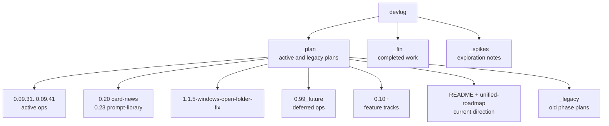

# Devlog Map

`image_gen/devlog` separates active plans, completed work, and exploratory notes. In the current working tree, `_plan` contains the active lane, `_fin` contains completed implementation and completed experiments, and `_spikes` contains older UX exploration notes. This document explains which devlog files are current references and which are only historical context.

This map matters because plans from multiple eras coexist. `_plan/README.md` and `_plan/unified-roadmap.md` now point to the same active direction. Completed `0.01`, `0.03`, `0.04`, `0.06`, `0.07`, and `0.09` implementation records have moved under `_fin/260423_*`. Structure docs should follow the current code and active roadmap rather than stale plan folders.

For planning work, read `_plan/README.md` first, then `_plan/unified-roadmap.md` for the detailed lane. Most `0.09.x` cycles up to `0.09.30` are archived under `_fin/260423_*` through `_fin/260426_*`. The active lane now spans `0.09.31`-`0.09.41` plus the parallel feature tracks `0.20-card-news`, `0.23-prompt-library`, and the `1.1.5-windows-open-folder-fix` patch lane. `_fin/260426_0.22-gallery-navigation-ux` and `_fin/260427_0.09.33-upstream-validation-errors` are the most recent archives. Security hardening and containerization remain under `_plan/0.99_future` until remote-access and packaging tradeoffs are settled.

---

## Devlog Structure

## Current Reference Docs

| Document | Status | How to use it |
|---|---|---|
| `devlog/_plan/README.md` | current | Active lane, completed moves, and next-work rules |
| `devlog/_plan/unified-roadmap.md` | current | Detailed roadmap flow |
| `devlog/_plan/0.09.31-github-pages-landing/` | active | Marketing/docs landing site planning |
| `devlog/_plan/0.09.32-final-release-closeout/` | active | Final 1.x release closeout track |
| `devlog/_plan/0.09.34-node-connect-regression/` | active | Node connection regression follow-ups |
| `devlog/_plan/0.09.35-safety-refusal-misclassification/` | active | Safety/refusal classifier corrections |
| `devlog/_plan/0.09.36-gallery-double-sidebar-rail/` | active | Gallery double-sidebar rail layout work |
| `devlog/_plan/0.09.37-generation-controls-custom-plus/` | active | Generation controls custom-size + slot UX |
| `devlog/_plan/0.09.38-image-metadata-embed-restore/` | active | Embed XMP into PNGs and restore prompt/parameters from a dropped image |
| `devlog/_plan/0.09.39-reference-4k-refusal-diagnostics/` | active | 4K reference refusal diagnostics |
| `devlog/_plan/0.09.40-multimode-sequence-generation/` | active | Multi-mode sequence generation |
| `devlog/_plan/0.09.41-censorship-bypass/` | active | Censorship/safety bypass research |
| `devlog/_plan/0.20-card-news/` | active feature | Dev-only card-news workspace and `/api/cardnews/*` |
| `devlog/_plan/0.23-prompt-library/` | active feature | Prompt library dialog and `/api/prompts/*` |
| `devlog/_plan/1.1.5-windows-open-folder-fix/` | active patch | Windows open-folder regression for ima2-gen 1.1.5 |
| `devlog/_plan/0.99_future/0.09.19-security-hardening/PRD.md` | deferred | Opt-in security hardening proposal |
| `devlog/_plan/0.99_future/0.09.20-containerization/PRD.md` | deferred | Docker/containerization proposal |
| `devlog/_plan/0.10-feature-expansion/PLAN.md` | next feature | Preset, compare, and export direction |
| `devlog/_plan/0.12-research-mode/README.md` | partial | Research-mode productization after backend support |
| `devlog/_plan/backend-node-mode.md` | reference | Original backend endpoint and cleanup planning |
| `devlog/_plan/frontend-node-mode.md` | reference | Original frontend node-mode and layout planning |
| `devlog/_fin/260426_0.22-gallery-navigation-ux/` | archived | Gallery navigation UX closeout |
| `devlog/_fin/260427_0.09.33-upstream-validation-errors/` | archived | Upstream validation error normalization to `INVALID_REQUEST` with preserved diagnostics |

## Historical Or Reference Docs

| Path | Meaning | How to treat it |
|---|---|---|
| `devlog/_plan/_legacy/phase-*` | Old phase plans | Idea reference only, not active backlog |
| `devlog/_spikes/generate-ux-notes.md` | Generation-progress UX exploration | Only carry forward ideas absorbed into node mode |
| `devlog/_spikes/image-display-notes.md` | Result display exploration | Track only lightbox, compare, and mobile fallback ideas |
| `devlog/_spikes/260425_image_creator_skill/` | Image-creator skill spike | Exploration notes for prompt/template ergonomics; not a roadmap commitment |
| `devlog/_fin/260423_*`, `260424_*`, `260425_*`, `260426_*`, `260427_*` | Completed implementation and experiments | Archive and evidence for completed work |
| `devlog/_fin/260426_0.09.20-cli-backend-parity` | Completed CLI/backend parity closeout | Historical evidence; reopen new CLI slices separately if needed |
| deleted root-level `devlog/phase-*`, `devlog/0.09*`, `devlog/0.10*` tracked paths | Old locations | Use the current `_plan` or `_fin` locations instead |

## Roadmap Summary

| Cycle | Name | Current interpretation |
|---|---|---|
| 0.09.17 / 0.09.17.1 | Structured logging + serve/dev closeout | Archived 260426 |
| 0.09.18 | Metrics observability | Deleted; not needed for local-first CLI |
| 0.09.20 | CLI/backend parity | Archived 260426 |
| 0.09.20.1 | Safe classic CLI parity | Archived 260426 |
| 0.09.22 | Session conflict false reload | Archived 260425 |
| 0.09.23 | Global storage migration audit | Archived 260425 |
| 0.09.24 | Package smoke | Archived 260425 |
| 0.09.25-0.09.28 | Node selection / edge disconnect / regen-layout-diagnostics / child references | Archived 260426 |
| 0.09.29 | Node contract repair | Archived 260426 |
| 0.09.30 | OAuth proxy / runtime port fallback | Archived 260426 |
| 0.09.31 | GitHub Pages landing | Active |
| 0.09.32 | Final release closeout | Active |
| 0.09.33 | Upstream validation errors | Archived 260427 |
| 0.09.34 | Node connect regression | Active |
| 0.09.35 | Safety refusal misclassification | Active |
| 0.09.36 | Gallery double-sidebar rail | Active |
| 0.09.37 | Generation controls custom plus | Active |
| 0.09.38 | Image metadata embed/restore | Active |
| 0.09.39 | Reference 4K refusal diagnostics | Active |
| 0.09.40 | Multimode sequence generation | Active |
| 0.09.41 | Censorship bypass research | Active |
| 0.20 | Card-news | Active feature track; dev-only `/api/cardnews/*` and UI workspace |
| 0.21 | Custom size input | Archived 260425 |
| 0.22 | Gallery navigation UX | Archived 260426 |
| 0.23 | Prompt library | Active feature track; `/api/prompts/*` and library dialog |
| 0.09.19 | Security hardening | Deferred to `0.99_future` |
| 0.09.20 (containerization) | Containerization | Deferred to `0.99_future` |
| 0.10 | Feature expansion | Preset and compare MVP after current build is green |
| 0.11 | Export polish | Future lane after 0.10 |
| 0.12 | Research mode | Backend support exists; frontend productization remains |
| 1.1.5 | Windows open-folder fix | Active patch lane bundled with the 1.1.5 release |

## Structure Docs Versus Devlog

| Category | Structure docs | Devlog |
|---|---|---|
| Purpose | Evergreen reference for current code structure | Plans, decisions, completed work |
| Update trigger | Code contracts change | Phase starts, phase completes, spike is archived |
| Style | Current-tense operational reference | Plans, reviews, experiments, retrospectives |
| Example | `03-server-api.md` | `_plan/backend-node-mode.md` |

Structure docs do not replace devlog. They normalize devlog decisions against the current code. If an older devlog contradicts current code, prefer current code and the active roadmap.

## Cleanup Checklist

- [ ] If `_plan/unified-roadmap.md` changes, update this roadmap summary.
- [ ] If a devlog folder moves to `_fin`, `_plan/_legacy`, or `_spikes`, update the reference tables.
- [ ] If a `server.js` split phase starts, update `[[01-file-function-map]]`, `[[03-server-api]]`, and `[[06-infra-operations]]`.
- [ ] If node-mode UX changes, update `[[04-frontend-architecture]]` and `[[05-node-mode]]`.
- [ ] If externally researched content is copied into structure docs, include direct `> Source:` links in the target doc.

## Change Log

- 2026-04-23: Documented the first devlog reference map.
- 2026-04-23: Updated the active lane after moving completed work into `_fin`.
- 2026-04-23: Translated this document from Korean to English.
- 2026-04-23: 0.09.4 implementation verified. Added `0.09.5-node-streaming` and `0.09.6-inflight-reliability` as queued follow-up tracks.
- 2026-04-24: Archived completed 0.09.11 through 0.09.14 work into `_fin/260424_*` and promoted 0.09.5 streaming as the next active target.
- 2026-04-24: Archived completed 0.09.5 node streaming into `_fin/260424_0.09.5-node-streaming` and promoted 0.09.6 inflight reliability as the active target.
- 2026-04-25: Updated active lane after archiving 0.09.4, 0.09.4.1, 0.09.6, 0.09.7.1, 0.09.8, 0.09.15, 0.09.16, 0.09.21, 0.09.23, and 0.09.24.
- 2026-04-25: Kept 0.09.17/0.09.18 active and moved 0.09.19/0.09.20 into `_plan/0.99_future`.
- 2026-04-25: Added new active `0.09.20-cli-backend-parity` rough plan; existing containerization 0.09.20 remains deferred under `0.99_future`.
- 2026-04-26: Refreshed `0.09.20-cli-backend-parity` into a concrete sliced plan after runtime fallback, storage recovery, sessions/style, history lifecycle, and node API changes.
- 2026-04-25: Added active `0.09.25-node-selection-batch` for node selection and batch generation.
- 2026-04-25: Marked 0.09.17 as dependency-free structured logging implementation work.
- 2026-04-25: Added active `0.09.26-edge-disconnect` for edge-only removal and parent metadata cleanup.
- 2026-04-25: Added active `0.09.27-node-regen-layout-diagnostics` and `0.09.28-child-node-references`.
- 2026-04-25: Added active `0.09.29-node-contract-repair` for node parent/ref/context/footer contract cleanup.
- 2026-04-26: Added queued `0.09.30-oauth-proxy-port-fallback` for backend/frontend/OAuth port binding and proxy error taxonomy.
- 2026-04-26: Marked `0.09.20.1` complete, reflected implemented runtime binding work, and removed dev-only lanes from the evergreen roadmap map.
- 2026-04-26: Added `0.09.17.1` serve/dev logging closeout and marked CLI parity archived under `_fin`.
- 2026-04-26: Archived `0.09.25`, `0.09.26`, `0.09.27`, and `0.09.28` node-mode work to `_fin/260426_*` after implementation verification. Removed active entries from the roadmap map.
- 2026-04-26: Archived `0.09.17`, `0.09.17.1`, `0.09.29`, and `0.09.30` to `_fin/260426_*`. Deleted `0.09.18-metrics-observability` from `_plan`. Updated roadmap summary and reference tables.
- 2026-04-28: Refreshed the active lane to span `0.09.31`-`0.09.41`, the `0.20-card-news` and `0.23-prompt-library` feature tracks, and the `1.1.5-windows-open-folder-fix` patch lane. Added `_fin/260426_0.22-gallery-navigation-ux`, `_fin/260427_0.09.33-upstream-validation-errors`, and `_spikes/260425_image_creator_skill` to the reference tables. Updated the devlog structure diagram and roadmap summary for ima2-gen 1.1.5.

Previous document: `[[06-infra-operations]]`

Next document: none
