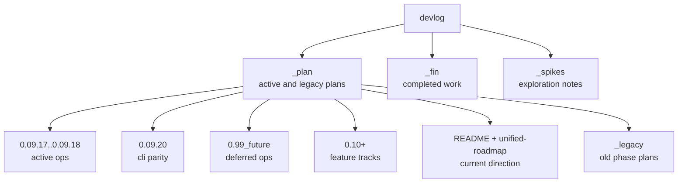

# Devlog Map

`image_gen/devlog` separates active plans, completed work, and exploratory notes. In the current working tree, `_plan` contains the active lane, `_fin` contains completed implementation and completed experiments, and `_spikes` contains older UX exploration notes. This document explains which devlog files are current references and which are only historical context.

This map matters because plans from multiple eras coexist. `_plan/README.md` and `_plan/unified-roadmap.md` now point to the same active direction. Completed `0.01`, `0.03`, `0.04`, `0.06`, `0.07`, and `0.09` implementation records have moved under `_fin/260423_*`. Structure docs should follow the current code and active roadmap rather than stale plan folders.

For planning work, read `_plan/README.md` first, then `_plan/unified-roadmap.md` for the detailed lane. `0.09.4`, `0.09.4.1`, `0.09.6`, `0.09.7.1`, `0.09.8`, `0.09.15`, `0.09.16`, `0.09.21`, `0.09.23`, and `0.09.24` are completed or closeout-archived under `_fin/260425_*`. Active `_plan` now keeps `0.09.17` and `0.09.18` as observability ops before 0.10, `0.09.20-cli-backend-parity` as a rough plan for updating the older CLI surface, and `0.09.25-node-selection-batch` for node selection batch generation. Security hardening and containerization live under `_plan/0.99_future` until remote-access and packaging tradeoffs are settled.

---

## Devlog Structure

## Current Reference Docs

| Document | Status | How to use it |
|---|---|---|
| `devlog/_plan/README.md` | current | Active lane, completed moves, and next-work rules |
| `devlog/_plan/unified-roadmap.md` | current | `0.09.6 + 0.09.15 -> 0.10 -> 0.12` flow |
| `devlog/_plan/0.09.17-structured-logging/PRD.md` | in progress | Dependency-free structured logging hardening: log levels, sanitized request IDs, API-only request logging. |
| `devlog/_plan/0.09.18-metrics-observability/PRD.md` | queued | Prometheus metrics proposal. No metrics route exists yet. |
| `devlog/_plan/0.09.20-cli-backend-parity/README.md` | rough plan | CLI/backend parity backlog for frontend/server features that outgrew old CLI commands. |
| `devlog/_plan/0.09.25-node-selection-batch/PRD.md` | in progress | Canvas-level node selection and sequential batch generation plan. |
| `devlog/_plan/0.09.27-node-regen-layout-diagnostics/PRD.md` | in progress | Ready-node action split, position-based node placement, and safe edit stream diagnostics. |
| `devlog/_plan/0.09.28-child-node-references/PRD.md` | in progress | Allow child/edit node-local references alongside the parent image. |
| `devlog/_plan/0.09.29-node-contract-repair/README.md` | in progress | Repairs node graph/backend contract: edge-derived parents, child refs, context/search policy, compact node footer. |
| `devlog/_plan/0.99_future/0.09.19-security-hardening/PRD.md` | deferred | Opt-in security hardening proposal. Defer strict localhost/origin gates until remote-user impact is decided. |
| `devlog/_plan/0.99_future/0.09.20-containerization/PRD.md` | deferred | Docker/containerization proposal. Not a 0.10 blocker. |
| `devlog/_plan/0.10-feature-expansion/PLAN.md` | next feature | Preset, compare, card-news, export direction |
| `devlog/_plan/0.12-research-mode/README.md` | partial | Research-mode productization after backend support |
| `devlog/_plan/0.20-card-news/` | WIP/dev-only | User-owned parallel card-news lane. It is not a default npm feature until intentionally promoted. |
| `devlog/_plan/backend-node-mode.md` | reference | Original backend endpoint and cleanup planning |
| `devlog/_plan/frontend-node-mode.md` | reference | Original frontend node-mode and layout planning |

## Historical Or Reference Docs

| Path | Meaning | How to treat it |
|---|---|---|
| `devlog/_plan/_legacy/phase-*` | Old phase plans | Idea reference only, not active backlog |
| `devlog/_spikes/generate-ux-notes.md` | Generation-progress UX exploration | Only carry forward ideas absorbed into node mode |
| `devlog/_spikes/image-display-notes.md` | Result display exploration | Track only lightbox, compare, and mobile fallback ideas |
| `devlog/_fin/260423_*`, `devlog/_fin/260424_*` | Completed implementation and experiments | Archive and evidence for completed work |
| deleted root-level `devlog/phase-*`, `devlog/0.09*`, `devlog/0.10*` tracked paths | Old locations | Use the current `_plan` or `_fin` locations instead |

## Roadmap Summary

| Cycle | Name | Current interpretation |
|---|---|---|
| 0.09.17 | Structured logging | In progress; dependency-free logger/requestId hardening instead of Pino dependency |
| 0.09.18 | Metrics observability | Active ops; useful for self-host and debugging |
| 0.09.20 | CLI/backend parity | Rough plan; update stale CLI surface |
| 0.09.25 | Node selection batch | In progress; canvas selection, in-place batch generation, stale downstream handling |
| 0.09.26 | Edge disconnect | Active; edge-only delete and parent metadata cleanup |
| 0.09.27 | Node regen/layout/diagnostics | Active; ready-node action split, position-based layout, safe edit retry diagnostics |
| 0.09.28 | Child node references | Active; child/edit node references are allowed alongside parent image |
| 0.09.29 | Node contract repair | Active; graph edges are parent source of truth, child refs are sent, node context/search policy is explicit |
| 0.09.19 | Security hardening | Deferred to `0.99_future`; must avoid breaking remote/hard-user flows |
| 0.09.20 | Containerization | Deferred to `0.99_future`; future packaging lane |
| 0.10 | Feature expansion | Preset and compare MVP after current build is green |
| 0.11 | Export and card-news base | Future lane after 0.10 |
| 0.12 | Research mode | Backend support exists; frontend productization remains |

## Structure Docs Versus Devlog

| Category | Structure docs | Devlog |
|---|---|---|
| Purpose | Evergreen reference for current code structure | Plans, decisions, completed work |
| Update trigger | Code contracts change | Phase starts, phase completes, spike is archived |
| Style | Current-tense operational reference | Plans, reviews, experiments, retrospectives |
| Example | `03-server-api.md` | `_plan/backend-node-mode.md` |

Structure docs do not replace devlog. They normalize devlog decisions against the current code. If an older devlog contradicts current code, prefer current code and the active roadmap.

## Cleanup Checklist

- [ ] If `_plan/unified-roadmap.md` changes, update this roadmap summary.
- [ ] If a devlog folder moves to `_fin`, `_plan/_legacy`, or `_spikes`, update the reference tables.
- [ ] If a `server.js` split phase starts, update `[[01-file-function-map]]`, `[[03-server-api]]`, and `[[06-infra-operations]]`.
- [ ] If node-mode UX changes, update `[[04-frontend-architecture]]` and `[[05-node-mode]]`.
- [ ] If externally researched content is copied into structure docs, include direct `> Source:` links in the target doc.

## Change Log

- 2026-04-23: Documented the first devlog reference map.
- 2026-04-23: Updated the active lane after moving completed work into `_fin`.
- 2026-04-23: Translated this document from Korean to English.
- 2026-04-23: 0.09.4 implementation verified. Added `0.09.5-node-streaming` and `0.09.6-inflight-reliability` as queued follow-up tracks.
- 2026-04-24: Archived completed 0.09.11 through 0.09.14 work into `_fin/260424_*` and promoted 0.09.5 streaming as the next active target.
- 2026-04-24: Archived completed 0.09.5 node streaming into `_fin/260424_0.09.5-node-streaming` and promoted 0.09.6 inflight reliability as the active target.
- 2026-04-25: Updated active lane after archiving 0.09.4, 0.09.4.1, 0.09.6, 0.09.7.1, 0.09.8, 0.09.15, 0.09.16, 0.09.21, 0.09.23, and 0.09.24.
- 2026-04-25: Kept 0.09.17/0.09.18 active, moved 0.09.19/0.09.20 into `_plan/0.99_future`, and clarified card-news as dev-only WIP.
- 2026-04-25: Added new active `0.09.20-cli-backend-parity` rough plan; existing containerization 0.09.20 remains deferred under `0.99_future`.
- 2026-04-25: Added active `0.09.25-node-selection-batch` for node selection and batch generation.
- 2026-04-25: Marked 0.09.17 as dependency-free structured logging implementation work.
- 2026-04-25: Added active `0.09.26-edge-disconnect` for edge-only removal and parent metadata cleanup.
- 2026-04-25: Added active `0.09.27-node-regen-layout-diagnostics` and `0.09.28-child-node-references`.
- 2026-04-25: Added active `0.09.29-node-contract-repair` for node parent/ref/context/footer contract cleanup.

Previous document: `[[06-infra-operations]]`

Next document: none
