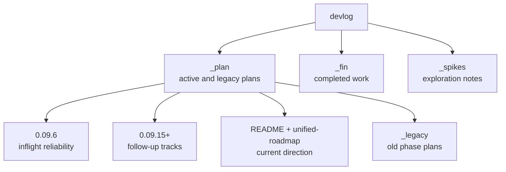

# Devlog Map

`image_gen/devlog` separates active plans, completed work, and exploratory notes. In the current working tree, `_plan` contains the active lane, `_fin` contains completed implementation and completed experiments, and `_spikes` contains older UX exploration notes. This document explains which devlog files are current references and which are only historical context.

This map matters because plans from multiple eras coexist. `_plan/README.md` and `_plan/unified-roadmap.md` now point to the same active direction. Completed `0.01`, `0.03`, `0.04`, `0.06`, `0.07`, and `0.09` implementation records have moved under `_fin/260423_*`. Structure docs should follow the current code and active roadmap rather than stale plan folders.

For planning work, read `_plan/README.md` first, then `_plan/unified-roadmap.md` for the detailed lane. The current active folder is `_plan/0.09.6-inflight-reliability` (SQLite-backed inflight + cross-tab merge). `0.09.5-node-streaming` is completed under `_fin/260424_0.09.5-node-streaming`. Completed work belongs in `_fin/`. Old phase docs are under `_plan/_legacy` and should not be treated as the active backlog.

---

## Devlog Structure

## Current Reference Docs

| Document | Status | How to use it |
|---|---|---|
| `devlog/_plan/README.md` | current | Active lane, completed moves, and next-work rules |
| `devlog/_plan/unified-roadmap.md` | current | `0.09.6 + 0.09.15 -> 0.10 -> 0.12` flow |
| `devlog/_plan/0.09.6-inflight-reliability/PRD.md` | queued | `lib/inflight.js` SQLite persistence + cross-tab `reconcileInflight` merge. |
| `devlog/_plan/0.09.15-integration-tests/PRD.md` | queued | Packaged tarball/install smoke and route packaging regression. |
| `devlog/_plan/0.10-feature-expansion/PLAN.md` | next feature | Preset, compare, card-news, export direction |
| `devlog/_plan/0.12-research-mode/README.md` | partial | Research-mode productization after backend support |
| `devlog/_plan/backend-node-mode.md` | reference | Original backend endpoint and cleanup planning |
| `devlog/_plan/frontend-node-mode.md` | reference | Original frontend node-mode and layout planning |

## Historical Or Reference Docs

| Path | Meaning | How to treat it |
|---|---|---|
| `devlog/_plan/_legacy/phase-*` | Old phase plans | Idea reference only, not active backlog |
| `devlog/_spikes/generate-ux-notes.md` | Generation-progress UX exploration | Only carry forward ideas absorbed into node mode |
| `devlog/_spikes/image-display-notes.md` | Result display exploration | Track only lightbox, compare, and mobile fallback ideas |
| `devlog/_fin/260423_*`, `devlog/_fin/260424_*` | Completed implementation and experiments | Archive and evidence for completed work |
| deleted root-level `devlog/phase-*`, `devlog/0.09*`, `devlog/0.10*` tracked paths | Old locations | Use the current `_plan` or `_fin` locations instead |

## Roadmap Summary

| Cycle | Name | Current interpretation |
|---|---|---|
| 0.09.6 | Inflight reliability | Queued; persistence + cross-tab |
| 0.09.15 | Packaged integration tests | Queued; tarball/install and route packaging regression |
| 0.10 | Feature expansion | Preset and compare MVP after 0.09.6 close |
| 0.11 | Export and card-news base | Future lane after 0.10 |
| 0.12 | Research mode | Backend support exists; frontend productization remains |

## Structure Docs Versus Devlog

| Category | Structure docs | Devlog |
|---|---|---|
| Purpose | Evergreen reference for current code structure | Plans, decisions, completed work |
| Update trigger | Code contracts change | Phase starts, phase completes, spike is archived |
| Style | Current-tense operational reference | Plans, reviews, experiments, retrospectives |
| Example | `03-server-api.md` | `_plan/backend-node-mode.md` |

Structure docs do not replace devlog. They normalize devlog decisions against the current code. If an older devlog contradicts current code, prefer current code and the active roadmap.

## Cleanup Checklist

- [ ] If `_plan/unified-roadmap.md` changes, update this roadmap summary.
- [ ] If a devlog folder moves to `_fin`, `_plan/_legacy`, or `_spikes`, update the reference tables.
- [ ] If a `server.js` split phase starts, update `[[01-file-function-map]]`, `[[03-server-api]]`, and `[[06-infra-operations]]`.
- [ ] If node-mode UX changes, update `[[04-frontend-architecture]]` and `[[05-node-mode]]`.
- [ ] If externally researched content is copied into structure docs, include direct `> Source:` links in the target doc.

## Change Log

- 2026-04-23: Documented the first devlog reference map.
- 2026-04-23: Updated the active lane after moving completed work into `_fin`.
- 2026-04-23: Translated this document from Korean to English.
- 2026-04-23: 0.09.4 implementation verified. Added `0.09.5-node-streaming` and `0.09.6-inflight-reliability` as queued follow-up tracks.
- 2026-04-24: Archived completed 0.09.11 through 0.09.14 work into `_fin/260424_*` and promoted 0.09.5 streaming as the next active target.
- 2026-04-24: Archived completed 0.09.5 node streaming into `_fin/260424_0.09.5-node-streaming` and promoted 0.09.6 inflight reliability as the active target.

Previous document: `[[06-infra-operations]]`

Next document: none
